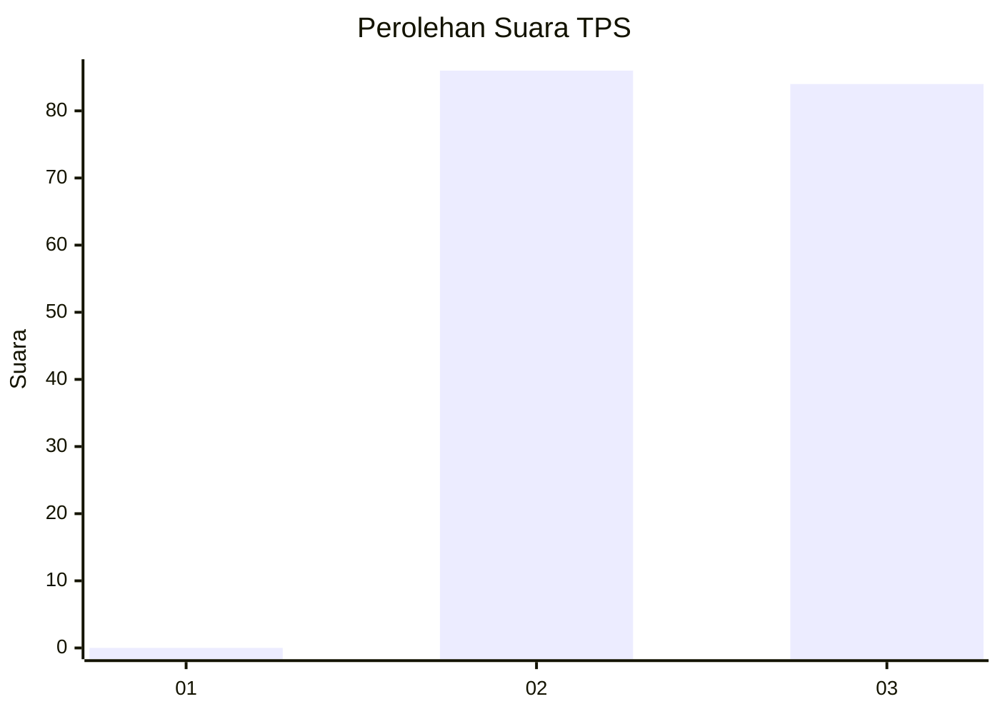
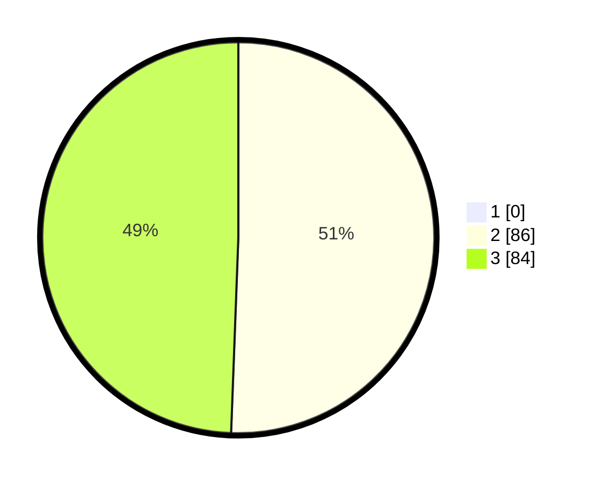

# Hasil

## Grafik

## Tabel

| No. | Nama Paslon    | Suara | Suara (raw) | Persentase |
|:--- |:-------------- | -----:| -----------:| ----------:|
| 1   | ANIES MUHAIMIN | 0     | [0][p-1]    | 0,00       |
| 2   | PRABOWO GIBRAN | 86    | [86][p-2]   | 50,59      |
| 3   | GANJAR MAHFUD  | 84    | [84][p-3]   | 49,41      |

[p-1]: https://github.com/gigit-pemilu/pemilu-2024-51-bali/blob/main/pilpres/hitung-suara/sub/51-bali/sub/02-tabanan/sub/04-kerambitan/sub/2008-samsam/sub/001-tps/sub/paslon-1.txt
[p-2]: https://github.com/gigit-pemilu/pemilu-2024-51-bali/blob/main/pilpres/hitung-suara/sub/51-bali/sub/02-tabanan/sub/04-kerambitan/sub/2008-samsam/sub/001-tps/sub/paslon-2.txt
[p-3]: https://github.com/gigit-pemilu/pemilu-2024-51-bali/blob/main/pilpres/hitung-suara/sub/51-bali/sub/02-tabanan/sub/04-kerambitan/sub/2008-samsam/sub/001-tps/sub/paslon-3.txt

## Foto C Plano

https://sirekap-obj-formc.kpu.go.id/5206/pemilu/ppwp/51/02/04/20/08/5102042008001-20240214-141007--c8fa6ee8-586a-4f13-b8f7-fcf76b41af52.jpg

https://sirekap-obj-formc.kpu.go.id/5206/pemilu/ppwp/51/02/04/20/08/5102042008001-20240214-132155--09888453-fef9-4721-8d19-067362e6902d.jpg

https://sirekap-obj-formc.kpu.go.id/5206/pemilu/ppwp/51/02/04/20/08/5102042008001-20240214-132504--55ad7609-2a46-426e-94a9-6bfb386fd69d.jpg

## Metadata

| Key        | Value               |
| ---------- | ------------------- |
| Time Stamp | 2024-02-14 21:46:01 |

## DATA PEMILIH TETAP

Jumlah pemilih dalam DPT: **195**.
 * L: **91**.
 * P: **104**.

## DATA PENGGUNA HAK PILIH

Jumlah pengguna hak pilih dalam DPT: **172**.
 * L: **80**.
 * P: **92**.

Jumlah pengguna hak pilih dalam DPTb: **1**.
 * L: **0**.
 * P: **1**.

Jumlah pengguna hak pilih dalam DPK: **1**.
 * L: **1**.
 * P: **0**.

Jumlah pengguna hak pilih: **174**.
 * L: **81**.
 * P: **93**.

## JUMLAH SUARA SAH DAN TIDAK SAH

JUMLAH SELURUH SUARA SAH: **170**.

JUMLAH SUARA TIDAK SAH: **4**.

JUMLAH SELURUH SUARA SAH DAN SUARA TIDAK SAH: **174**.

