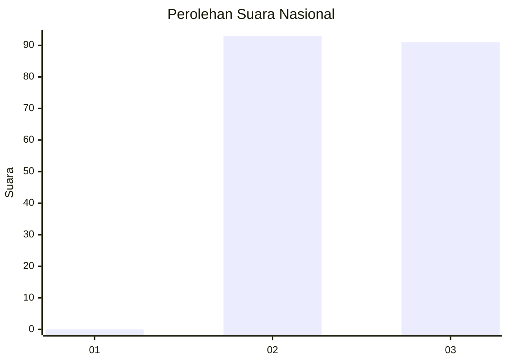
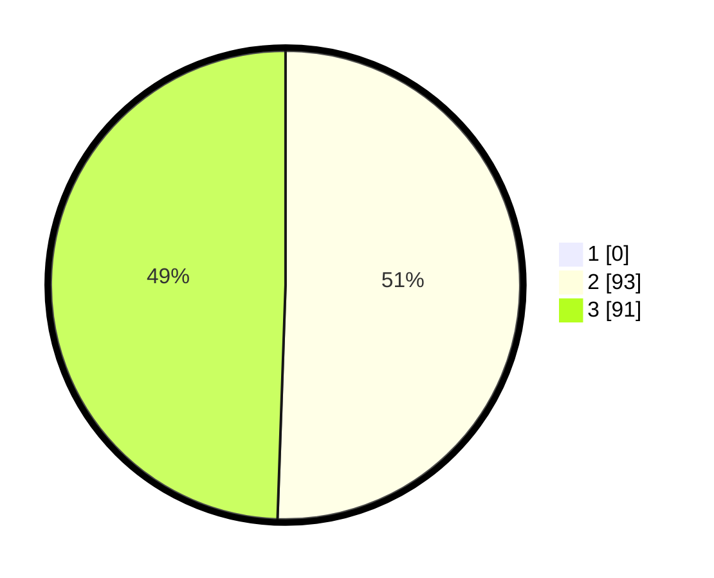

# Hasil

## Grafik

## Tabel

| No. | Nama Paslon    | Suara | Suara (raw) | Persentase |
|:--- |:-------------- | -----:| -----------:| ----------:|
| 1   | ANIES MUHAIMIN | 0     | [0][p-1]    | 0,00       |
| 2   | PRABOWO GIBRAN | 93    | [93][p-2]   | 50,54      |
| 3   | GANJAR MAHFUD  | 91    | [91][p-3]   | 49,46      |

[p-1]: https://github.com/gigit-pemilu/pemilu-2024/blob/main/pilpres/hitung-suara/sub/51-bali/sub/02-tabanan/sub/04-kerambitan/sub/2008-samsam/sub/002-tps/sub/paslon-1.txt
[p-2]: https://github.com/gigit-pemilu/pemilu-2024/blob/main/pilpres/hitung-suara/sub/51-bali/sub/02-tabanan/sub/04-kerambitan/sub/2008-samsam/sub/002-tps/sub/paslon-2.txt
[p-3]: https://github.com/gigit-pemilu/pemilu-2024/blob/main/pilpres/hitung-suara/sub/51-bali/sub/02-tabanan/sub/04-kerambitan/sub/2008-samsam/sub/002-tps/sub/paslon-3.txt

## Foto C Plano

https://sirekap-obj-formc.kpu.go.id/b95f/pemilu/ppwp/51/02/04/20/08/5102042008002-20240216-141244--99946bcf-29f6-451a-9e11-747bceddcb12.jpg

https://sirekap-obj-formc.kpu.go.id/b95f/pemilu/ppwp/51/02/04/20/08/5102042008002-20240216-141246--689b8687-9458-4f1a-8085-c5a5f96b65b2.jpg

https://sirekap-obj-formc.kpu.go.id/b95f/pemilu/ppwp/51/02/04/20/08/5102042008002-20240216-141245--2c24b3f5-d6a7-4ce3-a3a5-4742909cd767.jpg

## Metadata

| Key        | Value               |
| ---------- | ------------------- |
| Time Stamp | 2024-02-16 14:30:33 |

## DATA PEMILIH TETAP

Jumlah pemilih dalam DPT: **201**.
 * L: **96**.
 * P: **105**.

## DATA PENGGUNA HAK PILIH

Jumlah pengguna hak pilih dalam DPT: **184**.
 * L: **90**.
 * P: **94**.

Jumlah pengguna hak pilih dalam DPTb: **0**.
 * L: **0**.
 * P: **0**.

Jumlah pengguna hak pilih dalam DPK: **1**.
 * L: **0**.
 * P: **1**.

Jumlah pengguna hak pilih: **185**.
 * L: **90**.
 * P: **95**.

## JUMLAH SUARA SAH DAN TIDAK SAH

JUMLAH SELURUH SUARA SAH: **184**.

JUMLAH SUARA TIDAK SAH: **1**.

JUMLAH SELURUH SUARA SAH DAN SUARA TIDAK SAH: **185**.

