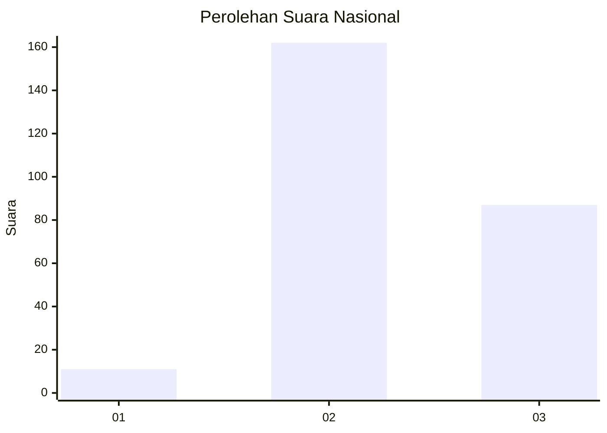
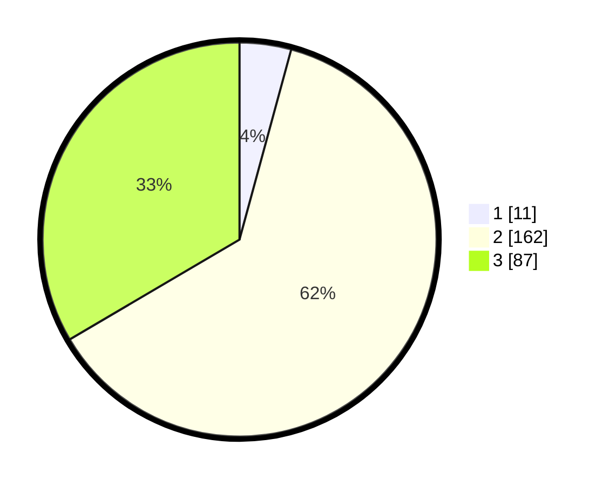

# Hasil

## Grafik

## Tabel

| No. | Nama Paslon    | Suara | Suara (raw) | Persentase |
|:--- |:-------------- | -----:| -----------:| ----------:|
| 1   | ANIES MUHAIMIN | 11    | [11][p-1]   | 4,23       |
| 2   | PRABOWO GIBRAN | 162   | [162][p-2]  | 62,31      |
| 3   | GANJAR MAHFUD  | 87    | [87][p-3]   | 33,46      |

[p-1]: https://github.com/gigit-pemilu/pemilu-2024/blob/main/pilpres/hitung-suara/sub/51-bali/sub/02-tabanan/sub/04-kerambitan/sub/2008-samsam/sub/003-tps/sub/paslon-1.txt
[p-2]: https://github.com/gigit-pemilu/pemilu-2024/blob/main/pilpres/hitung-suara/sub/51-bali/sub/02-tabanan/sub/04-kerambitan/sub/2008-samsam/sub/003-tps/sub/paslon-2.txt
[p-3]: https://github.com/gigit-pemilu/pemilu-2024/blob/main/pilpres/hitung-suara/sub/51-bali/sub/02-tabanan/sub/04-kerambitan/sub/2008-samsam/sub/003-tps/sub/paslon-3.txt

## Foto C Plano

https://sirekap-obj-formc.kpu.go.id/4e33/pemilu/ppwp/51/02/04/20/08/5102042008003-20240216-132834--1ca8592b-c73e-4343-bac7-bf85e52e25ae.jpg

https://sirekap-obj-formc.kpu.go.id/4e33/pemilu/ppwp/51/02/04/20/08/5102042008003-20240216-132836--65bae4df-b768-4082-8144-532aae8f5888.jpg

https://sirekap-obj-formc.kpu.go.id/4e33/pemilu/ppwp/51/02/04/20/08/5102042008003-20240216-132835--5dec2acc-c6b3-4612-9dd6-036f0cc7a3e8.jpg

## Metadata

| Key        | Value               |
| ---------- | ------------------- |
| Time Stamp | 2024-02-16 14:00:34 |

## DATA PEMILIH TETAP

Jumlah pemilih dalam DPT: **269**.
 * L: **126**.
 * P: **143**.

## DATA PENGGUNA HAK PILIH

Jumlah pengguna hak pilih dalam DPT: **251**.
 * L: **117**.
 * P: **134**.

Jumlah pengguna hak pilih dalam DPTb: **15**.
 * L: **11**.
 * P: **4**.

Jumlah pengguna hak pilih dalam DPK: **0**.
 * L: **0**.
 * P: **0**.

Jumlah pengguna hak pilih: **266**.
 * L: **128**.
 * P: **138**.

## JUMLAH SUARA SAH DAN TIDAK SAH

JUMLAH SELURUH SUARA SAH: **260**.

JUMLAH SUARA TIDAK SAH: **6**.

JUMLAH SELURUH SUARA SAH DAN SUARA TIDAK SAH: **266**.

