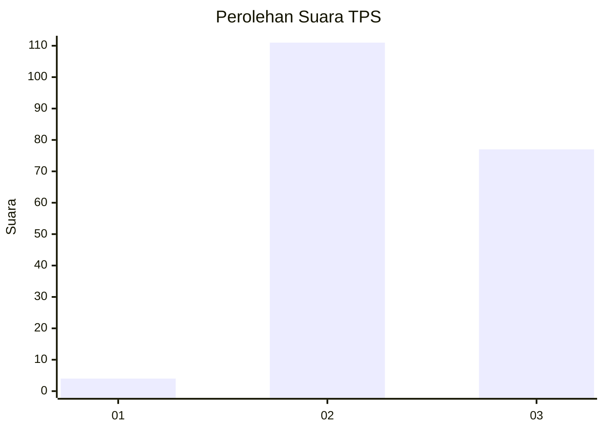
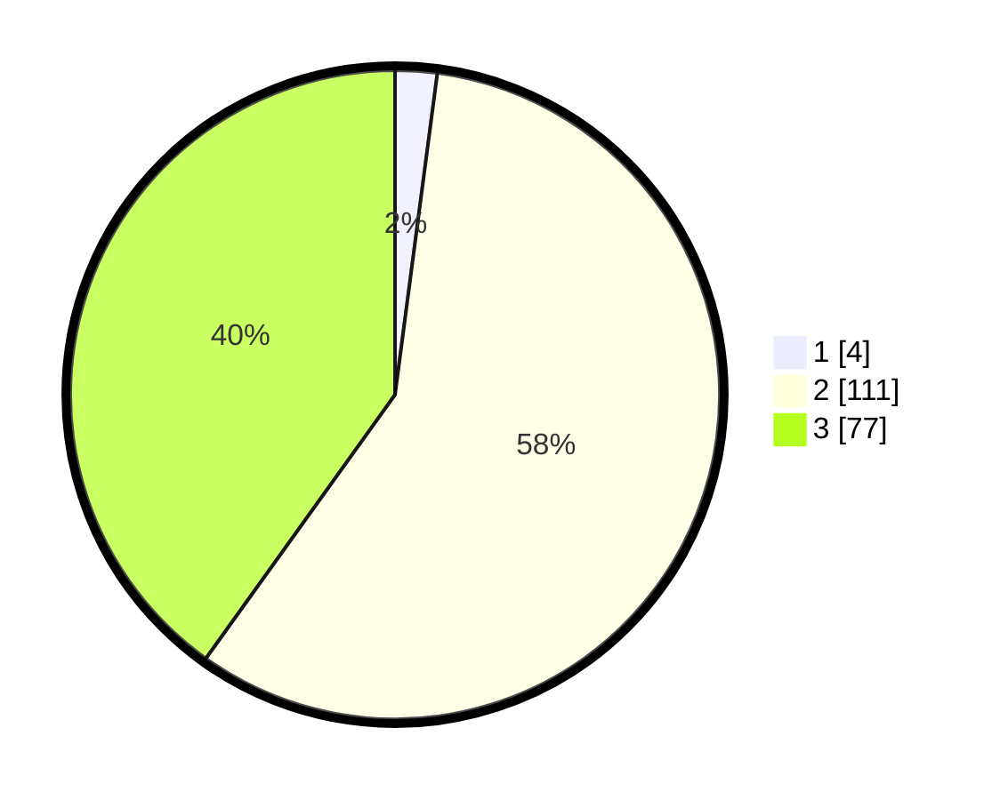

# Hasil

## Grafik

## Tabel

| No. | Nama Paslon    | Suara | Suara (raw) | Persentase |
|:--- |:-------------- | -----:| -----------:| ----------:|
| 1   | ANIES MUHAIMIN | 4     | [4][p-1]    | 2,08       |
| 2   | PRABOWO GIBRAN | 111   | [111][p-2]  | 57,81      |
| 3   | GANJAR MAHFUD  | 77    | [77][p-3]   | 40,10      |

[p-1]: https://github.com/gigit-pemilu/pemilu-2024-51-bali/blob/main/pilpres/hitung-suara/sub/51-bali/sub/02-tabanan/sub/04-kerambitan/sub/2008-samsam/sub/005-tps/sub/paslon-1.txt
[p-2]: https://github.com/gigit-pemilu/pemilu-2024-51-bali/blob/main/pilpres/hitung-suara/sub/51-bali/sub/02-tabanan/sub/04-kerambitan/sub/2008-samsam/sub/005-tps/sub/paslon-2.txt
[p-3]: https://github.com/gigit-pemilu/pemilu-2024-51-bali/blob/main/pilpres/hitung-suara/sub/51-bali/sub/02-tabanan/sub/04-kerambitan/sub/2008-samsam/sub/005-tps/sub/paslon-3.txt

## Foto C Plano

https://sirekap-obj-formc.kpu.go.id/3e3f/pemilu/ppwp/51/02/04/20/08/5102042008005-20240215-041227--d30278ce-57d0-48fc-987d-220bf066ee55.jpg

https://sirekap-obj-formc.kpu.go.id/3e3f/pemilu/ppwp/51/02/04/20/08/5102042008005-20240215-041314--6ac64bda-779b-4d2a-8b3b-890512e0c123.jpg

https://sirekap-obj-formc.kpu.go.id/3e3f/pemilu/ppwp/51/02/04/20/08/5102042008005-20240215-041450--ec37d44e-3a33-4cec-8af1-942da62f7b84.jpg

## Metadata

| Key        | Value               |
| ---------- | ------------------- |
| Time Stamp | 2024-02-15 18:30:25 |

## DATA PEMILIH TETAP

Jumlah pemilih dalam DPT: **214**.
 * L: **4**.
 * P: **110**.

## DATA PENGGUNA HAK PILIH

Jumlah pengguna hak pilih dalam DPT: **183**.
 * L: **91**.
 * P: **92**.

Jumlah pengguna hak pilih dalam DPTb: **16**.
 * L: **6**.
 * P: **10**.

Jumlah pengguna hak pilih dalam DPK: **0**.
 * L: **0**.
 * P: **0**.

Jumlah pengguna hak pilih: **199**.
 * L: **97**.
 * P: **102**.

## JUMLAH SUARA SAH DAN TIDAK SAH

JUMLAH SELURUH SUARA SAH: **192**.

JUMLAH SUARA TIDAK SAH: **7**.

JUMLAH SELURUH SUARA SAH DAN SUARA TIDAK SAH: **199**.

