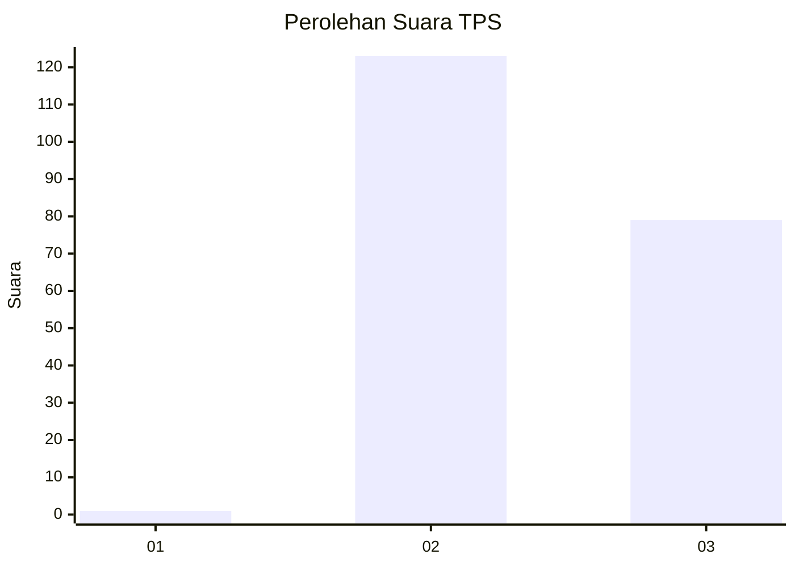
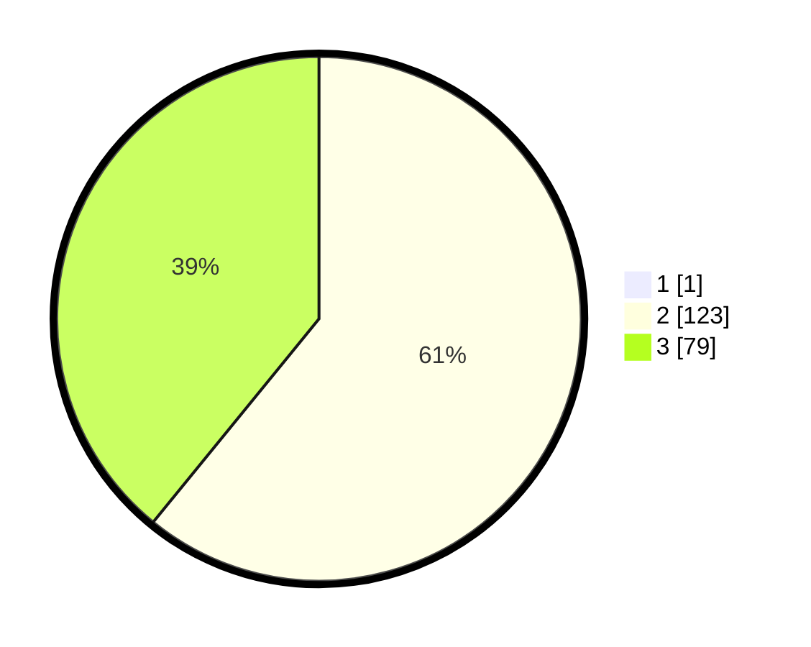

# Hasil

## Grafik

## Tabel

| No. | Nama Paslon    | Suara | Suara (raw) | Persentase |
|:--- |:-------------- | -----:| -----------:| ----------:|
| 1   | ANIES MUHAIMIN | 1     | [1][p-1]    | 0,49       |
| 2   | PRABOWO GIBRAN | 123   | [123][p-2]  | 60,59      |
| 3   | GANJAR MAHFUD  | 79    | [79][p-3]   | 38,92      |

[p-1]: https://github.com/gigit-pemilu/pemilu-2024-51-bali/blob/main/pilpres/hitung-suara/sub/51-bali/sub/02-tabanan/sub/04-kerambitan/sub/2008-samsam/sub/006-tps/sub/paslon-1.txt
[p-2]: https://github.com/gigit-pemilu/pemilu-2024-51-bali/blob/main/pilpres/hitung-suara/sub/51-bali/sub/02-tabanan/sub/04-kerambitan/sub/2008-samsam/sub/006-tps/sub/paslon-2.txt
[p-3]: https://github.com/gigit-pemilu/pemilu-2024-51-bali/blob/main/pilpres/hitung-suara/sub/51-bali/sub/02-tabanan/sub/04-kerambitan/sub/2008-samsam/sub/006-tps/sub/paslon-3.txt

## Foto C Plano

https://sirekap-obj-formc.kpu.go.id/2a99/pemilu/ppwp/51/02/04/20/08/5102042008006-20240214-141237--9516085f-c109-4619-ae7f-26404d8a5c73.jpg

https://sirekap-obj-formc.kpu.go.id/2a99/pemilu/ppwp/51/02/04/20/08/5102042008006-20240216-044006--5d309e69-9b90-4b28-a9f1-dc612f1cc68d.jpg

https://sirekap-obj-formc.kpu.go.id/2a99/pemilu/ppwp/51/02/04/20/08/5102042008006-20240216-043958--8bec21dc-132c-4095-8bdc-3e3f7ed6a2e9.jpg

## Metadata

| Key        | Value               |
| ---------- | ------------------- |
| Time Stamp | 2024-02-16 10:30:29 |

## DATA PEMILIH TETAP

Jumlah pemilih dalam DPT: **210**.
 * L: **108**.
 * P: **102**.

## DATA PENGGUNA HAK PILIH

Jumlah pengguna hak pilih dalam DPT: **192**.
 * L: **100**.
 * P: **92**.

Jumlah pengguna hak pilih dalam DPTb: **14**.
 * L: **7**.
 * P: **7**.

Jumlah pengguna hak pilih dalam DPK: **2**.
 * L: **2**.
 * P: **0**.

Jumlah pengguna hak pilih: **208**.
 * L: **109**.
 * P: **99**.

## JUMLAH SUARA SAH DAN TIDAK SAH

JUMLAH SELURUH SUARA SAH: **204**.

JUMLAH SUARA TIDAK SAH: **4**.

JUMLAH SELURUH SUARA SAH DAN SUARA TIDAK SAH: **208**.

