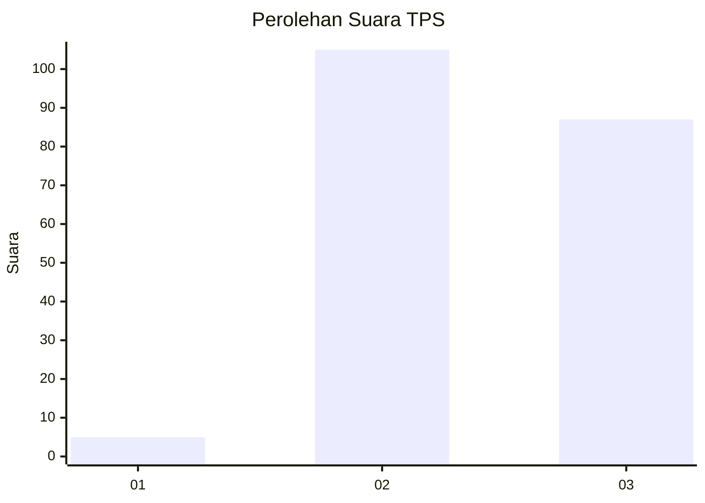
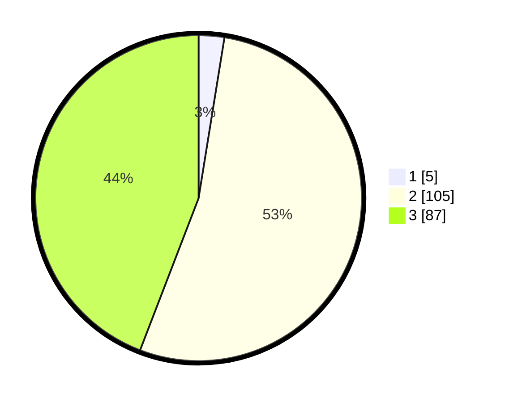

# Hasil

## Grafik

## Tabel

| No. | Nama Paslon    | Suara | Suara (raw) | Persentase |
|:--- |:-------------- | -----:| -----------:| ----------:|
| 1   | ANIES MUHAIMIN | 5     | [5][p-1]    | 2,54       |
| 2   | PRABOWO GIBRAN | 105   | [105][p-2]  | 53,30      |
| 3   | GANJAR MAHFUD  | 87    | [87][p-3]   | 44,16      |

[p-1]: https://github.com/gigit-pemilu/pemilu-2024-51-bali/blob/main/pilpres/hitung-suara/sub/51-bali/sub/02-tabanan/sub/04-kerambitan/sub/2008-samsam/sub/007-tps/sub/paslon-1.txt
[p-2]: https://github.com/gigit-pemilu/pemilu-2024-51-bali/blob/main/pilpres/hitung-suara/sub/51-bali/sub/02-tabanan/sub/04-kerambitan/sub/2008-samsam/sub/007-tps/sub/paslon-2.txt
[p-3]: https://github.com/gigit-pemilu/pemilu-2024-51-bali/blob/main/pilpres/hitung-suara/sub/51-bali/sub/02-tabanan/sub/04-kerambitan/sub/2008-samsam/sub/007-tps/sub/paslon-3.txt

## Foto C Plano

https://sirekap-obj-formc.kpu.go.id/0e75/pemilu/ppwp/51/02/04/20/08/5102042008007-20240214-203152--b7793108-3dbb-4bae-8245-51137a761ef8.jpg

https://sirekap-obj-formc.kpu.go.id/0e75/pemilu/ppwp/51/02/04/20/08/5102042008007-20240214-203159--cf344711-f73f-4db9-aa60-36ba6154c556.jpg

https://sirekap-obj-formc.kpu.go.id/0e75/pemilu/ppwp/51/02/04/20/08/5102042008007-20240214-224352--609da3d1-f23d-4f8c-ae63-c6d3b2b6c688.jpg

## Metadata

| Key        | Value               |
| ---------- | ------------------- |
| Time Stamp | 2024-02-15 22:00:27 |

## DATA PEMILIH TETAP

Jumlah pemilih dalam DPT: **206**.
 * L: **104**.
 * P: **102**.

## DATA PENGGUNA HAK PILIH

Jumlah pengguna hak pilih dalam DPT: **185**.
 * L: **94**.
 * P: **91**.

Jumlah pengguna hak pilih dalam DPTb: **13**.
 * L: **8**.
 * P: **5**.

Jumlah pengguna hak pilih dalam DPK: **1**.
 * L: **0**.
 * P: **1**.

Jumlah pengguna hak pilih: **199**.
 * L: **102**.
 * P: **97**.

## JUMLAH SUARA SAH DAN TIDAK SAH

JUMLAH SELURUH SUARA SAH: **197**.

JUMLAH SUARA TIDAK SAH: **2**.

JUMLAH SELURUH SUARA SAH DAN SUARA TIDAK SAH: **199**.

