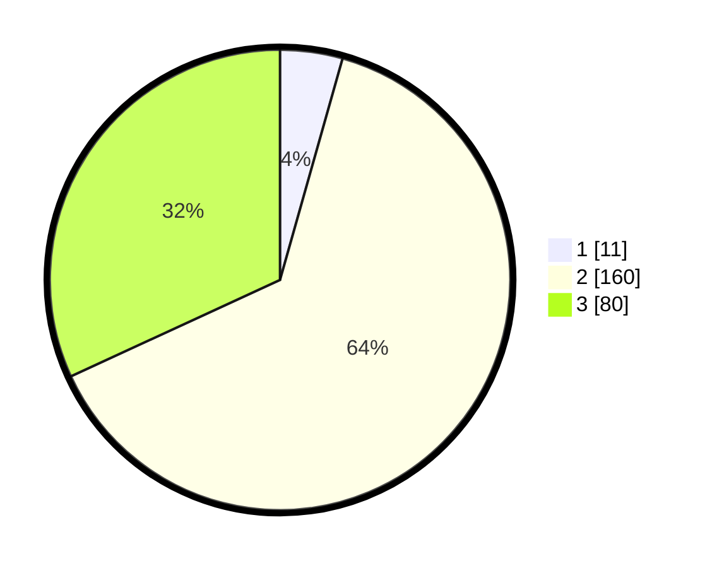

# Hasil

## Grafik

## Tabel

| No. | Nama Paslon    | Suara | Suara (raw) | Persentase |
|:--- |:-------------- | -----:| -----------:| ----------:|
| 1   | ANIES MUHAIMIN | 11    | [11][p-1]   | 4,38       |
| 2   | PRABOWO GIBRAN | 160   | [160][p-2]  | 63,75      |
| 3   | GANJAR MAHFUD  | 80    | [80][p-3]   | 31,87      |

[p-1]: https://github.com/gigit-pemilu/pemilu-2024-51-bali/blob/main/pilpres/hitung-suara/sub/51-bali/sub/02-tabanan/sub/04-kerambitan/sub/2008-samsam/sub/008-tps/sub/paslon-1.txt
[p-2]: https://github.com/gigit-pemilu/pemilu-2024-51-bali/blob/main/pilpres/hitung-suara/sub/51-bali/sub/02-tabanan/sub/04-kerambitan/sub/2008-samsam/sub/008-tps/sub/paslon-2.txt
[p-3]: https://github.com/gigit-pemilu/pemilu-2024-51-bali/blob/main/pilpres/hitung-suara/sub/51-bali/sub/02-tabanan/sub/04-kerambitan/sub/2008-samsam/sub/008-tps/sub/paslon-3.txt

## Foto C Plano

https://sirekap-obj-formc.kpu.go.id/cede/pemilu/ppwp/51/02/04/20/08/5102042008008-20240214-194538--fa374180-2021-480a-a485-ca53054d1788.jpg

https://sirekap-obj-formc.kpu.go.id/cede/pemilu/ppwp/51/02/04/20/08/5102042008008-20240214-194556--74d60964-e987-4000-a861-29b8bb65d412.jpg

https://sirekap-obj-formc.kpu.go.id/cede/pemilu/ppwp/51/02/04/20/08/5102042008008-20240214-194603--9f5a3f8d-6274-4534-b393-d05f5dadb0f0.jpg

## Metadata

| Key        | Value               |
| ---------- | ------------------- |
| Time Stamp | 2024-02-15 22:00:27 |

## DATA PEMILIH TETAP

Jumlah pemilih dalam DPT: **292**.
 * L: **136**.
 * P: **156**.

## DATA PENGGUNA HAK PILIH

Jumlah pengguna hak pilih dalam DPT: **239**.
 * L: **106**.
 * P: **133**.

Jumlah pengguna hak pilih dalam DPTb: **15**.
 * L: **7**.
 * P: **8**.

Jumlah pengguna hak pilih dalam DPK: **2**.
 * L: **1**.
 * P: **1**.

Jumlah pengguna hak pilih: **256**.
 * L: **114**.
 * P: **142**.

## JUMLAH SUARA SAH DAN TIDAK SAH

JUMLAH SELURUH SUARA SAH: **251**.

JUMLAH SUARA TIDAK SAH: **5**.

JUMLAH SELURUH SUARA SAH DAN SUARA TIDAK SAH: **256**.

