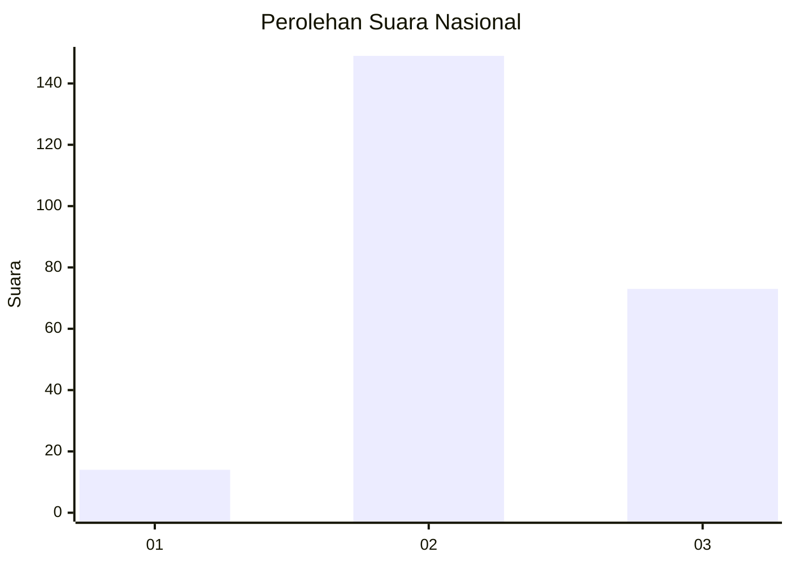
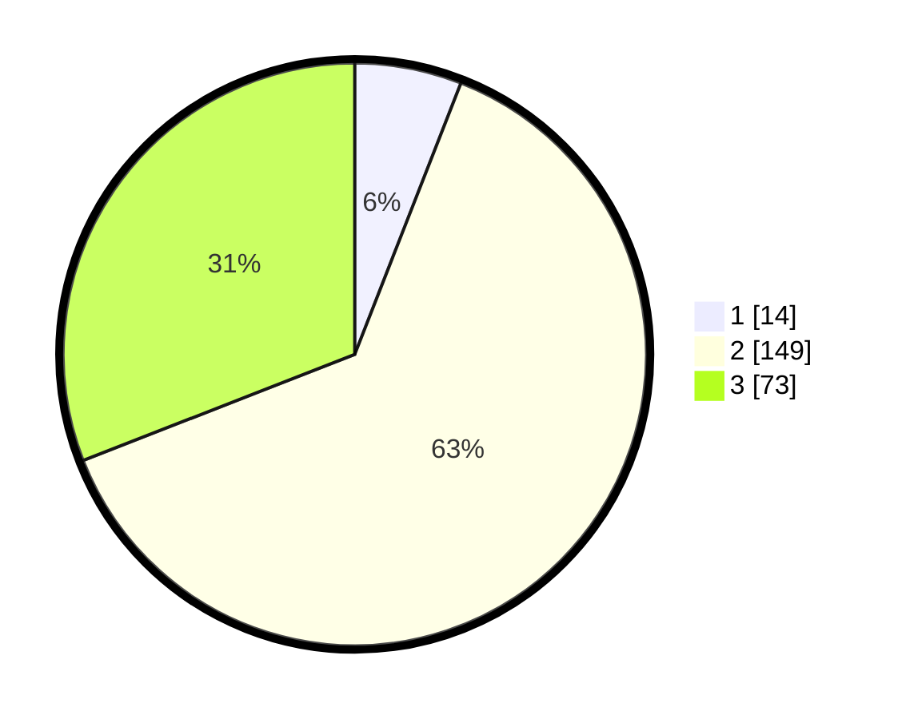

# Hasil

## Grafik

## Tabel

| No. | Nama Paslon    | Suara | Suara (raw) | Persentase |
|:--- |:-------------- | -----:| -----------:| ----------:|
| 1   | ANIES MUHAIMIN | 14    | [14][p-1]   | 5,93       |
| 2   | PRABOWO GIBRAN | 149   | [149][p-2]  | 63,14      |
| 3   | GANJAR MAHFUD  | 73    | [73][p-3]   | 30,93      |

[p-1]: https://github.com/gigit-pemilu/pemilu-2024/blob/main/pilpres/hitung-suara/sub/51-bali/sub/02-tabanan/sub/04-kerambitan/sub/2008-samsam/sub/009-tps/sub/paslon-1.txt
[p-2]: https://github.com/gigit-pemilu/pemilu-2024/blob/main/pilpres/hitung-suara/sub/51-bali/sub/02-tabanan/sub/04-kerambitan/sub/2008-samsam/sub/009-tps/sub/paslon-2.txt
[p-3]: https://github.com/gigit-pemilu/pemilu-2024/blob/main/pilpres/hitung-suara/sub/51-bali/sub/02-tabanan/sub/04-kerambitan/sub/2008-samsam/sub/009-tps/sub/paslon-3.txt

## Foto C Plano

https://sirekap-obj-formc.kpu.go.id/e12b/pemilu/ppwp/51/02/04/20/08/5102042008009-20240216-154427--be265aca-c0ed-4908-a18e-7c3beecf661b.jpg

https://sirekap-obj-formc.kpu.go.id/e12b/pemilu/ppwp/51/02/04/20/08/5102042008009-20240216-154429--d1c3135c-7af6-4b25-ae22-c169752823a3.jpg

https://sirekap-obj-formc.kpu.go.id/e12b/pemilu/ppwp/51/02/04/20/08/5102042008009-20240216-154428--ad0e96cb-388e-4dd4-8302-35f9c3a294e5.jpg

## Metadata

| Key        | Value               |
| ---------- | ------------------- |
| Time Stamp | 2024-02-21 16:00:00 |

## DATA PEMILIH TETAP

Jumlah pemilih dalam DPT: **289**.
 * L: **131**.
 * P: **158**.

## DATA PENGGUNA HAK PILIH

Jumlah pengguna hak pilih dalam DPT: **232**.
 * L: **105**.
 * P: **127**.

Jumlah pengguna hak pilih dalam DPTb: **7**.
 * L: **2**.
 * P: **5**.

Jumlah pengguna hak pilih dalam DPK: **1**.
 * L: **0**.
 * P: **1**.

Jumlah pengguna hak pilih: **240**.
 * L: **107**.
 * P: **133**.

## JUMLAH SUARA SAH DAN TIDAK SAH

JUMLAH SELURUH SUARA SAH: **236**.

JUMLAH SUARA TIDAK SAH: **4**.

JUMLAH SELURUH SUARA SAH DAN SUARA TIDAK SAH: **240**.

