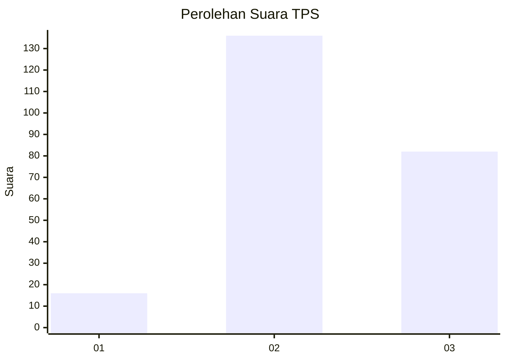
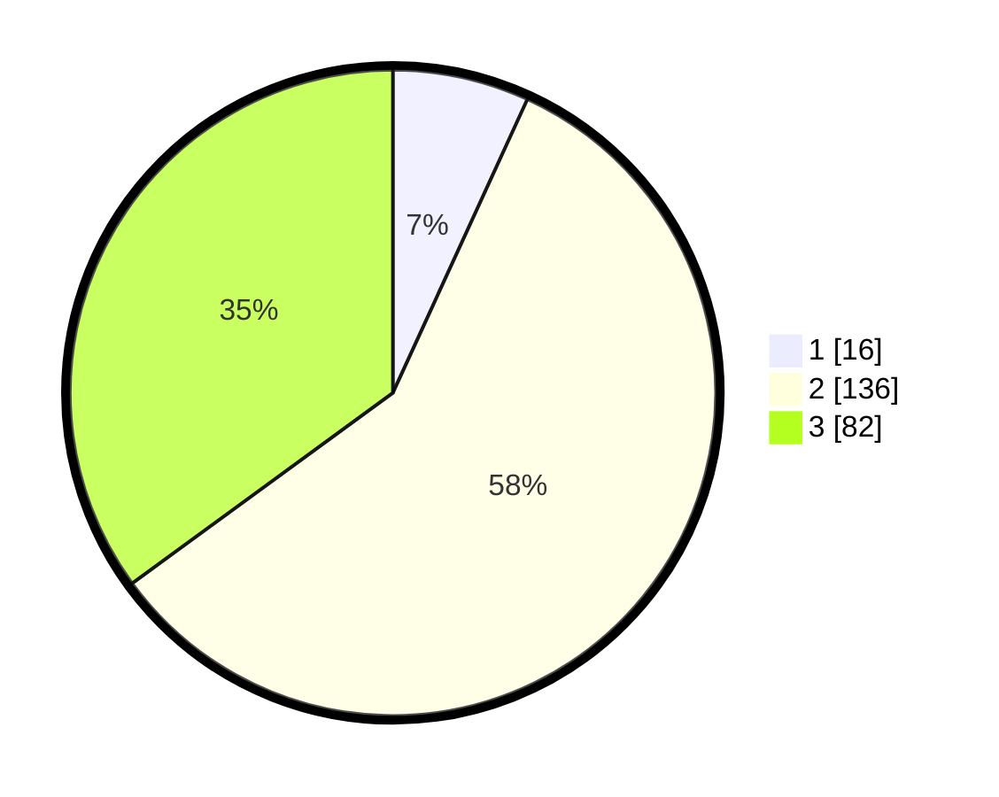

# Hasil

## Grafik

## Tabel

| No. | Nama Paslon    | Suara | Suara (raw) | Persentase |
|:--- |:-------------- | -----:| -----------:| ----------:|
| 1   | ANIES MUHAIMIN | 16    | [16][p-1]   | 6,84       |
| 2   | PRABOWO GIBRAN | 136   | [136][p-2]  | 58,12      |
| 3   | GANJAR MAHFUD  | 82    | [82][p-3]   | 35,04      |

[p-1]: https://github.com/gigit-pemilu/pemilu-2024-51-bali/blob/main/pilpres/hitung-suara/sub/51-bali/sub/02-tabanan/sub/04-kerambitan/sub/2008-samsam/sub/011-tps/sub/paslon-1.txt
[p-2]: https://github.com/gigit-pemilu/pemilu-2024-51-bali/blob/main/pilpres/hitung-suara/sub/51-bali/sub/02-tabanan/sub/04-kerambitan/sub/2008-samsam/sub/011-tps/sub/paslon-2.txt
[p-3]: https://github.com/gigit-pemilu/pemilu-2024-51-bali/blob/main/pilpres/hitung-suara/sub/51-bali/sub/02-tabanan/sub/04-kerambitan/sub/2008-samsam/sub/011-tps/sub/paslon-3.txt

## Foto C Plano

https://sirekap-obj-formc.kpu.go.id/5b6f/pemilu/ppwp/51/02/04/20/08/5102042008011-20240214-205813--17234ce9-6cd0-440d-9954-f492a93c6dd6.jpg

https://sirekap-obj-formc.kpu.go.id/5b6f/pemilu/ppwp/51/02/04/20/08/5102042008011-20240214-210046--1e3ceea4-1433-4a34-8c80-2e71773266d3.jpg

https://sirekap-obj-formc.kpu.go.id/5b6f/pemilu/ppwp/51/02/04/20/08/5102042008011-20240214-210050--307fd0db-c21b-494e-86a2-c16a4ed03cdb.jpg

## Metadata

| Key        | Value               |
| ---------- | ------------------- |
| Time Stamp | 2024-02-15 00:41:44 |

## DATA PEMILIH TETAP

Jumlah pemilih dalam DPT: **286**.
 * L: **135**.
 * P: **151**.

## DATA PENGGUNA HAK PILIH

Jumlah pengguna hak pilih dalam DPT: **231**.
 * L: **111**.
 * P: **120**.

Jumlah pengguna hak pilih dalam DPTb: **5**.
 * L: **2**.
 * P: **3**.

Jumlah pengguna hak pilih dalam DPK: **0**.
 * L: **0**.
 * P: **0**.

Jumlah pengguna hak pilih: **236**.
 * L: **113**.
 * P: **123**.

## JUMLAH SUARA SAH DAN TIDAK SAH

JUMLAH SELURUH SUARA SAH: **234**.

JUMLAH SUARA TIDAK SAH: **2**.

JUMLAH SELURUH SUARA SAH DAN SUARA TIDAK SAH: **236**.

