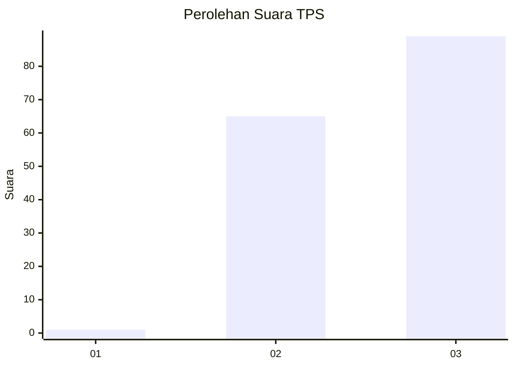
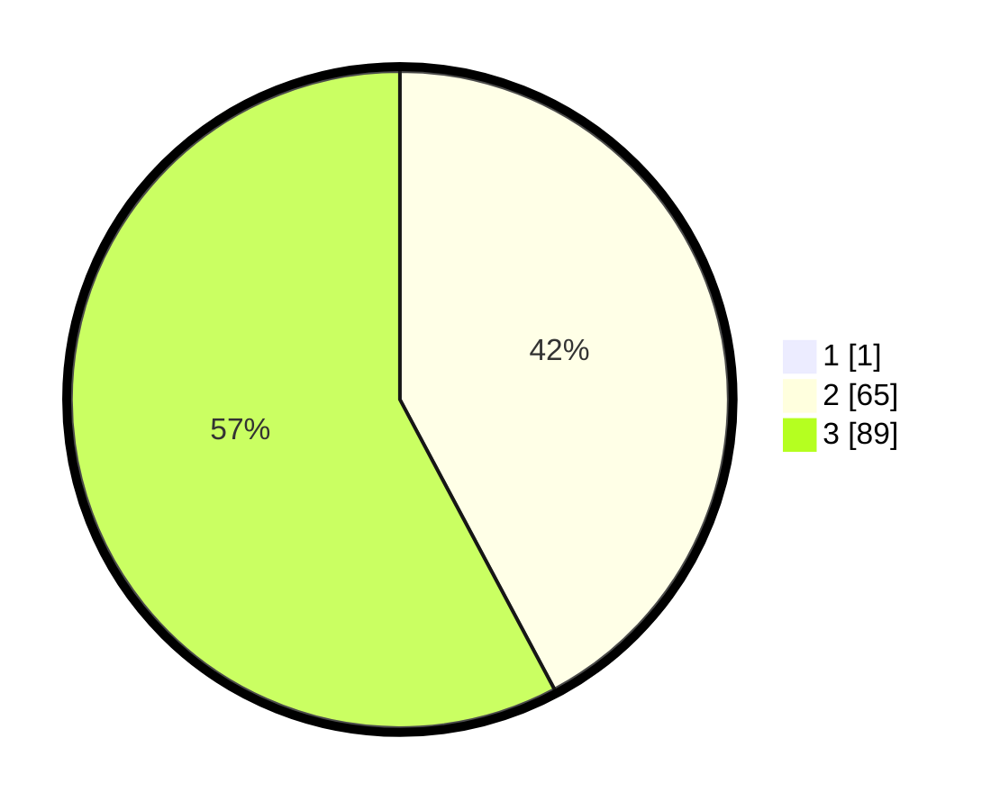

# Hasil

## Grafik

## Tabel

| No. | Nama Paslon    | Suara | Suara (raw) | Persentase |
|:--- |:-------------- | -----:| -----------:| ----------:|
| 1   | ANIES MUHAIMIN | 1     | [1][p-1]    | 0,65       |
| 2   | PRABOWO GIBRAN | 65    | [65][p-2]   | 41,94      |
| 3   | GANJAR MAHFUD  | 89    | [89][p-3]   | 57,42      |

[p-1]: https://github.com/gigit-pemilu/pemilu-2024-51-bali/blob/main/pilpres/hitung-suara/sub/51-bali/sub/02-tabanan/sub/04-kerambitan/sub/2008-samsam/sub/012-tps/sub/paslon-1.txt
[p-2]: https://github.com/gigit-pemilu/pemilu-2024-51-bali/blob/main/pilpres/hitung-suara/sub/51-bali/sub/02-tabanan/sub/04-kerambitan/sub/2008-samsam/sub/012-tps/sub/paslon-2.txt
[p-3]: https://github.com/gigit-pemilu/pemilu-2024-51-bali/blob/main/pilpres/hitung-suara/sub/51-bali/sub/02-tabanan/sub/04-kerambitan/sub/2008-samsam/sub/012-tps/sub/paslon-3.txt

## Foto C Plano

https://sirekap-obj-formc.kpu.go.id/a954/pemilu/ppwp/51/02/04/20/08/5102042008012-20240214-132428--36a58996-f0e3-41ba-aed3-68cbe9264176.jpg

https://sirekap-obj-formc.kpu.go.id/a954/pemilu/ppwp/51/02/04/20/08/5102042008012-20240214-132350--9101fee8-2e4c-4d71-9a66-1b2c60762664.jpg

https://sirekap-obj-formc.kpu.go.id/a954/pemilu/ppwp/51/02/04/20/08/5102042008012-20240214-132454--2abf29b8-3e07-496d-bc83-4f80f0812ab9.jpg

## Metadata

| Key        | Value               |
| ---------- | ------------------- |
| Time Stamp | 2024-02-15 22:00:27 |

## DATA PEMILIH TETAP

Jumlah pemilih dalam DPT: **174**.
 * L: **83**.
 * P: **91**.

## DATA PENGGUNA HAK PILIH

Jumlah pengguna hak pilih dalam DPT: **158**.
 * L: **76**.
 * P: **82**.

Jumlah pengguna hak pilih dalam DPTb: **2**.
 * L: **1**.
 * P: **1**.

Jumlah pengguna hak pilih dalam DPK: **0**.
 * L: **0**.
 * P: **0**.

Jumlah pengguna hak pilih: **160**.
 * L: **77**.
 * P: **83**.

## JUMLAH SUARA SAH DAN TIDAK SAH

JUMLAH SELURUH SUARA SAH: **155**.

JUMLAH SUARA TIDAK SAH: **5**.

JUMLAH SELURUH SUARA SAH DAN SUARA TIDAK SAH: **160**.

