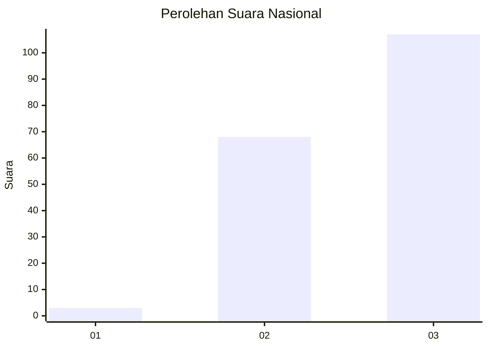
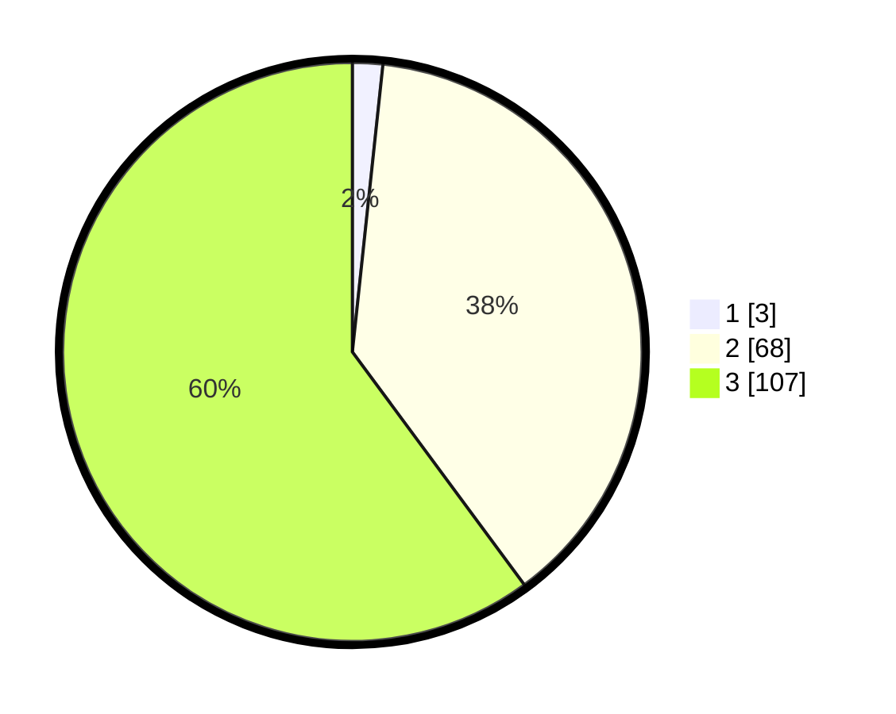

# Hasil

## Grafik

## Tabel

| No. | Nama Paslon    | Suara | Suara (raw) | Persentase |
|:--- |:-------------- | -----:| -----------:| ----------:|
| 1   | ANIES MUHAIMIN | 3     | [3][p-1]    | 1,69       |
| 2   | PRABOWO GIBRAN | 68    | [68][p-2]   | 38,20      |
| 3   | GANJAR MAHFUD  | 107   | [107][p-3]  | 60,11      |

[p-1]: https://github.com/gigit-pemilu/pemilu-2024/blob/main/pilpres/hitung-suara/sub/51-bali/sub/02-tabanan/sub/04-kerambitan/sub/2008-samsam/sub/013-tps/sub/paslon-1.txt
[p-2]: https://github.com/gigit-pemilu/pemilu-2024/blob/main/pilpres/hitung-suara/sub/51-bali/sub/02-tabanan/sub/04-kerambitan/sub/2008-samsam/sub/013-tps/sub/paslon-2.txt
[p-3]: https://github.com/gigit-pemilu/pemilu-2024/blob/main/pilpres/hitung-suara/sub/51-bali/sub/02-tabanan/sub/04-kerambitan/sub/2008-samsam/sub/013-tps/sub/paslon-3.txt

## Foto C Plano

https://sirekap-obj-formc.kpu.go.id/47d7/pemilu/ppwp/51/02/04/20/08/5102042008013-20240214-224514--c1602998-08a1-43c1-9985-33c2e8185e21.jpg

https://sirekap-obj-formc.kpu.go.id/47d7/pemilu/ppwp/51/02/04/20/08/5102042008013-20240214-224516--89d35fa9-1412-4234-adda-c9d42358369f.jpg

https://sirekap-obj-formc.kpu.go.id/47d7/pemilu/ppwp/51/02/04/20/08/5102042008013-20240214-224607--6cf44973-cbc6-4470-a155-0df321809585.jpg

## Metadata

| Key        | Value               |
| ---------- | ------------------- |
| Time Stamp | 2024-02-15 22:00:27 |

