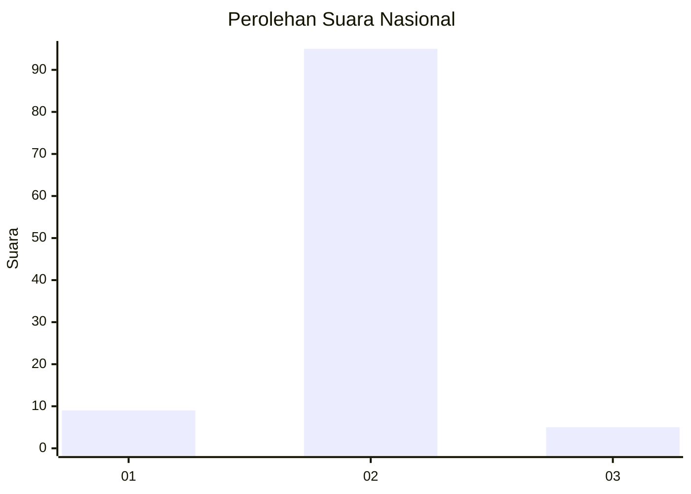
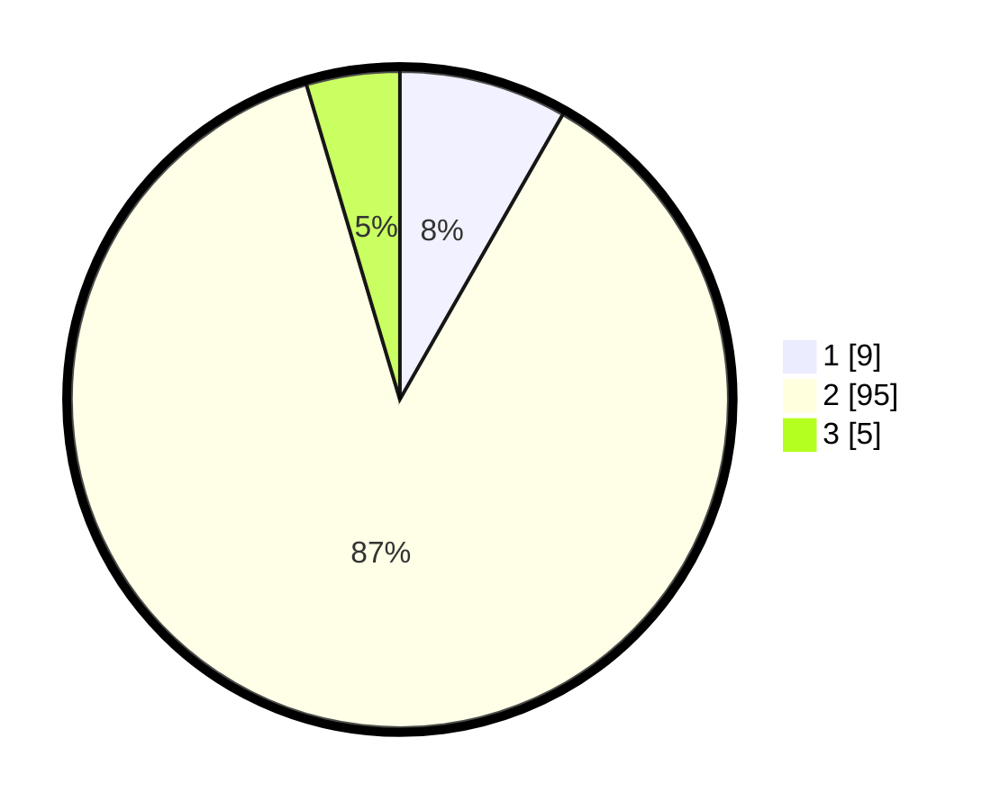

# Hasil

## Grafik

## Tabel

| No. | Nama Paslon    | Suara | Suara (raw) | Persentase |
|:--- |:-------------- | -----:| -----------:| ----------:|
| 1   | ANIES MUHAIMIN | 9     | [9][p-1]    | 8,26       |
| 2   | PRABOWO GIBRAN | 95    | [95][p-2]   | 87,16      |
| 3   | GANJAR MAHFUD  | 5     | [5][p-3]    | 4,59       |

[p-1]: https://github.com/gigit-pemilu/pemilu-2024/blob/main/pilpres/hitung-suara/sub/51-bali/sub/02-tabanan/sub/04-kerambitan/sub/2008-samsam/sub/901-tps/sub/paslon-1.txt
[p-2]: https://github.com/gigit-pemilu/pemilu-2024/blob/main/pilpres/hitung-suara/sub/51-bali/sub/02-tabanan/sub/04-kerambitan/sub/2008-samsam/sub/901-tps/sub/paslon-2.txt
[p-3]: https://github.com/gigit-pemilu/pemilu-2024/blob/main/pilpres/hitung-suara/sub/51-bali/sub/02-tabanan/sub/04-kerambitan/sub/2008-samsam/sub/901-tps/sub/paslon-3.txt

## Foto C Plano

https://sirekap-obj-formc.kpu.go.id/b806/pemilu/ppwp/51/02/04/20/08/5102042008901-20240214-132606--858937b0-5a03-42cc-805a-5e2aa3368cab.jpg

https://sirekap-obj-formc.kpu.go.id/b806/pemilu/ppwp/51/02/04/20/08/5102042008901-20240214-132209--e155d527-0d53-42da-8921-ad2b8e8a688d.jpg

https://sirekap-obj-formc.kpu.go.id/b806/pemilu/ppwp/51/02/04/20/08/5102042008901-20240214-132324--51c881d0-fa24-44f3-9741-307e07326663.jpg

## Metadata

| Key        | Value               |
| ---------- | ------------------- |
| Time Stamp | 2024-02-15 22:00:27 |

## DATA PEMILIH TETAP

Jumlah pemilih dalam DPT: **155**.
 * L: **84**.
 * P: **71**.

## DATA PENGGUNA HAK PILIH

Jumlah pengguna hak pilih dalam DPT: **92**.
 * L: **49**.
 * P: **43**.

Jumlah pengguna hak pilih dalam DPTb: **17**.
 * L: **5**.
 * P: **12**.

Jumlah pengguna hak pilih dalam DPK: **0**.
 * L: **0**.
 * P: **0**.

Jumlah pengguna hak pilih: **109**.
 * L: **54**.
 * P: **55**.

## JUMLAH SUARA SAH DAN TIDAK SAH

JUMLAH SELURUH SUARA SAH: **109**.

JUMLAH SUARA TIDAK SAH: **0**.

JUMLAH SELURUH SUARA SAH DAN SUARA TIDAK SAH: **109**.

