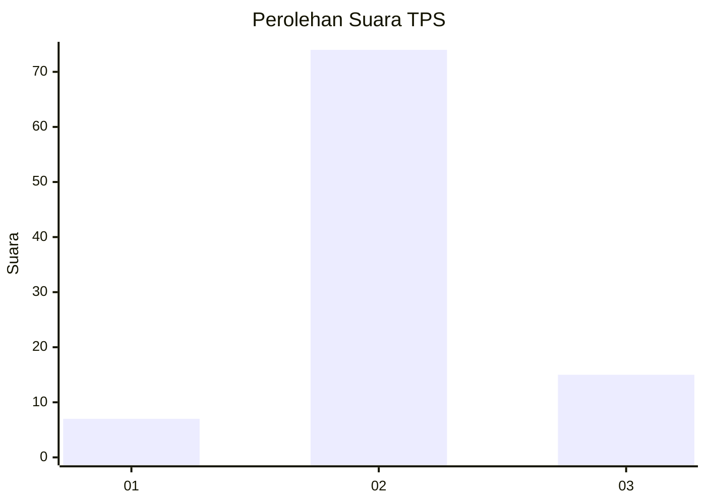
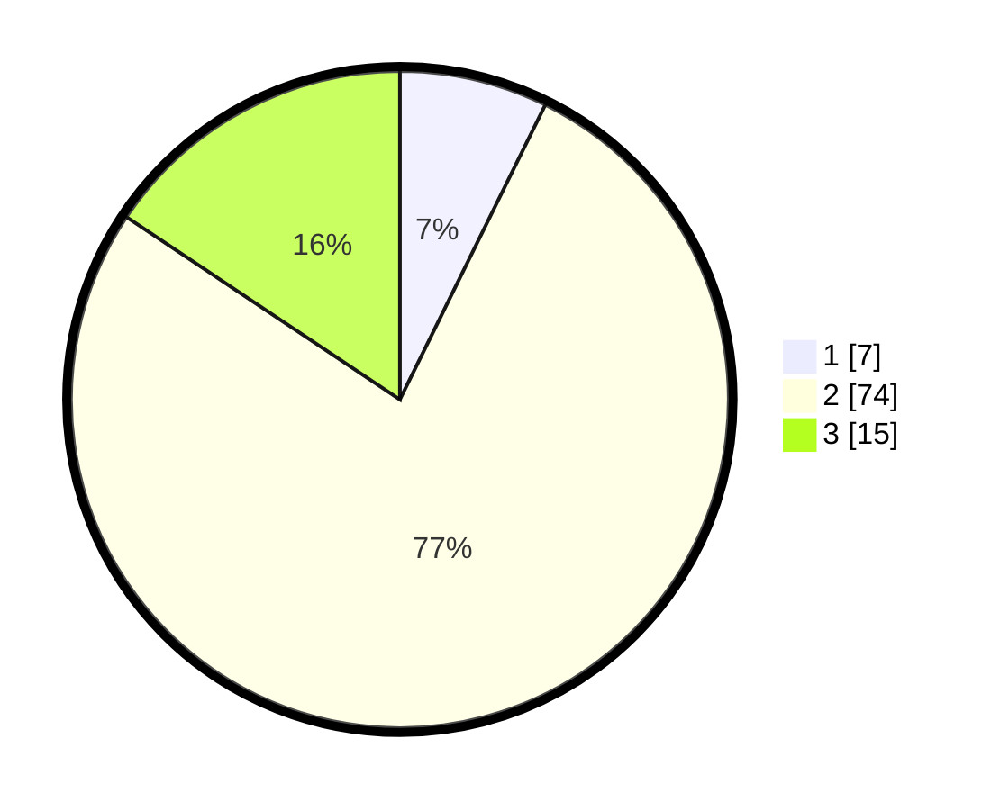

# Hasil

## Grafik

## Tabel

| No. | Nama Paslon    | Suara | Suara (raw) | Persentase |
|:--- |:-------------- | -----:| -----------:| ----------:|
| 1   | ANIES MUHAIMIN | 7     | [7][p-1]    | 7,29       |
| 2   | PRABOWO GIBRAN | 74    | [74][p-2]   | 77,08      |
| 3   | GANJAR MAHFUD  | 15    | [15][p-3]   | 15,63      |

[p-1]: https://github.com/gigit-pemilu/pemilu-2024-51-bali/blob/main/pilpres/hitung-suara/sub/51-bali/sub/02-tabanan/sub/04-kerambitan/sub/2008-samsam/sub/902-tps/sub/paslon-1.txt
[p-2]: https://github.com/gigit-pemilu/pemilu-2024-51-bali/blob/main/pilpres/hitung-suara/sub/51-bali/sub/02-tabanan/sub/04-kerambitan/sub/2008-samsam/sub/902-tps/sub/paslon-2.txt
[p-3]: https://github.com/gigit-pemilu/pemilu-2024-51-bali/blob/main/pilpres/hitung-suara/sub/51-bali/sub/02-tabanan/sub/04-kerambitan/sub/2008-samsam/sub/902-tps/sub/paslon-3.txt

## Foto C Plano

https://sirekap-obj-formc.kpu.go.id/d4e7/pemilu/ppwp/51/02/04/20/08/5102042008902-20240214-131718--56e6ed0a-3e9a-48eb-9f43-2239b7da0962.jpg

https://sirekap-obj-formc.kpu.go.id/d4e7/pemilu/ppwp/51/02/04/20/08/5102042008902-20240214-131620--5c869bba-ddcb-44f1-982f-ec9f1a67e0f4.jpg

https://sirekap-obj-formc.kpu.go.id/d4e7/pemilu/ppwp/51/02/04/20/08/5102042008902-20240214-131757--231c5893-0e14-42d3-9581-65c8d2044bd7.jpg

## Metadata

| Key        | Value               |
| ---------- | ------------------- |
| Time Stamp | 2024-02-14 21:46:01 |

## DATA PEMILIH TETAP

Jumlah pemilih dalam DPT: **151**.
 * L: **91**.
 * P: **60**.

## DATA PENGGUNA HAK PILIH

Jumlah pengguna hak pilih dalam DPT: **97**.
 * L: **59**.
 * P: **38**.

Jumlah pengguna hak pilih dalam DPTb: **0**.
 * L: **0**.
 * P: **0**.

Jumlah pengguna hak pilih dalam DPK: **0**.
 * L: **0**.
 * P: **0**.

Jumlah pengguna hak pilih: **97**.
 * L: **59**.
 * P: **38**.

## JUMLAH SUARA SAH DAN TIDAK SAH

JUMLAH SELURUH SUARA SAH: **96**.

JUMLAH SUARA TIDAK SAH: **1**.

JUMLAH SELURUH SUARA SAH DAN SUARA TIDAK SAH: **97**.

