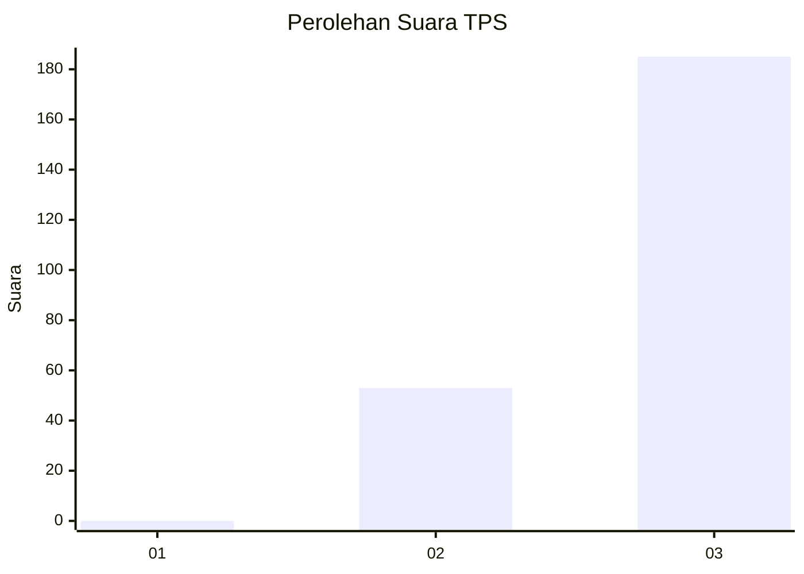
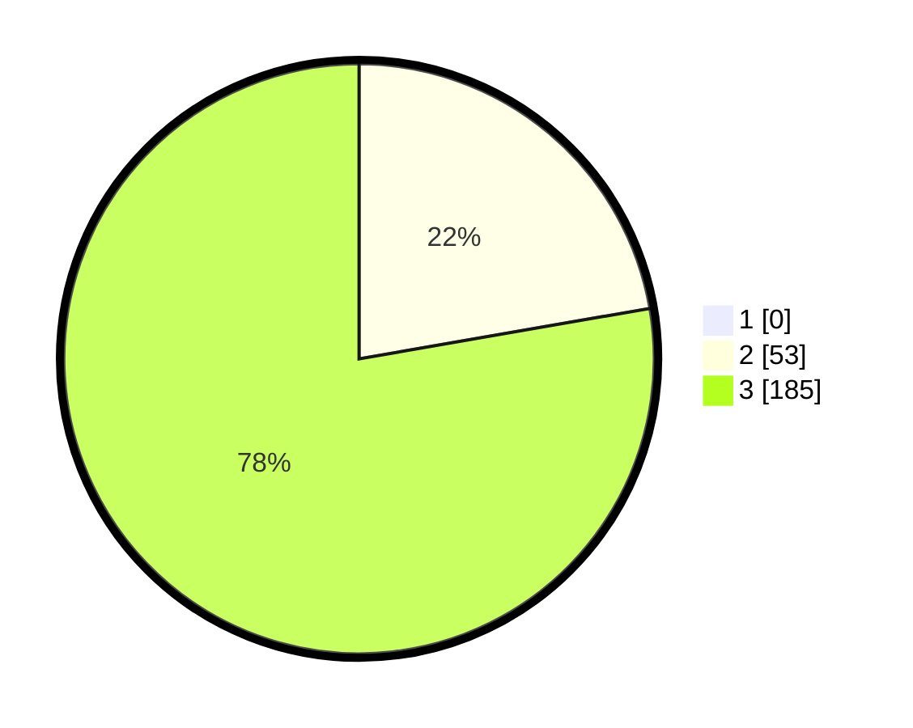

# Hasil

## Grafik

## Tabel

| No. | Nama Paslon    | Suara | Suara (raw) | Persentase |
|:--- |:-------------- | -----:| -----------:| ----------:|
| 1   | ANIES MUHAIMIN | 0     | [0][p-1]    | 0,00       |
| 2   | PRABOWO GIBRAN | 53    | [53][p-2]   | 22,27      |
| 3   | GANJAR MAHFUD  | 185   | [185][p-3]  | 77,73      |

[p-1]: https://github.com/gigit-pemilu/pemilu-2024-51-bali/blob/main/pilpres/hitung-suara/sub/51-bali/sub/02-tabanan/sub/04-kerambitan/sub/2009-kukuh/sub/002-tps/sub/paslon-1.txt
[p-2]: https://github.com/gigit-pemilu/pemilu-2024-51-bali/blob/main/pilpres/hitung-suara/sub/51-bali/sub/02-tabanan/sub/04-kerambitan/sub/2009-kukuh/sub/002-tps/sub/paslon-2.txt
[p-3]: https://github.com/gigit-pemilu/pemilu-2024-51-bali/blob/main/pilpres/hitung-suara/sub/51-bali/sub/02-tabanan/sub/04-kerambitan/sub/2009-kukuh/sub/002-tps/sub/paslon-3.txt

## Foto C Plano

https://sirekap-obj-formc.kpu.go.id/6438/pemilu/ppwp/51/02/04/20/09/5102042009002-20240215-193927--7d4f7bb2-1c10-4d18-adc3-4e482150fedd.jpg

https://sirekap-obj-formc.kpu.go.id/6438/pemilu/ppwp/51/02/04/20/09/5102042009002-20240215-194101--1a0eb26a-5f67-4abe-aee1-b28816b6af74.jpg

https://sirekap-obj-formc.kpu.go.id/6438/pemilu/ppwp/51/02/04/20/09/5102042009002-20240215-194307--221e4373-277e-4482-9e01-263de2c7b169.jpg

## Metadata

| Key        | Value               |
| ---------- | ------------------- |
| Time Stamp | 2024-02-15 22:30:27 |

