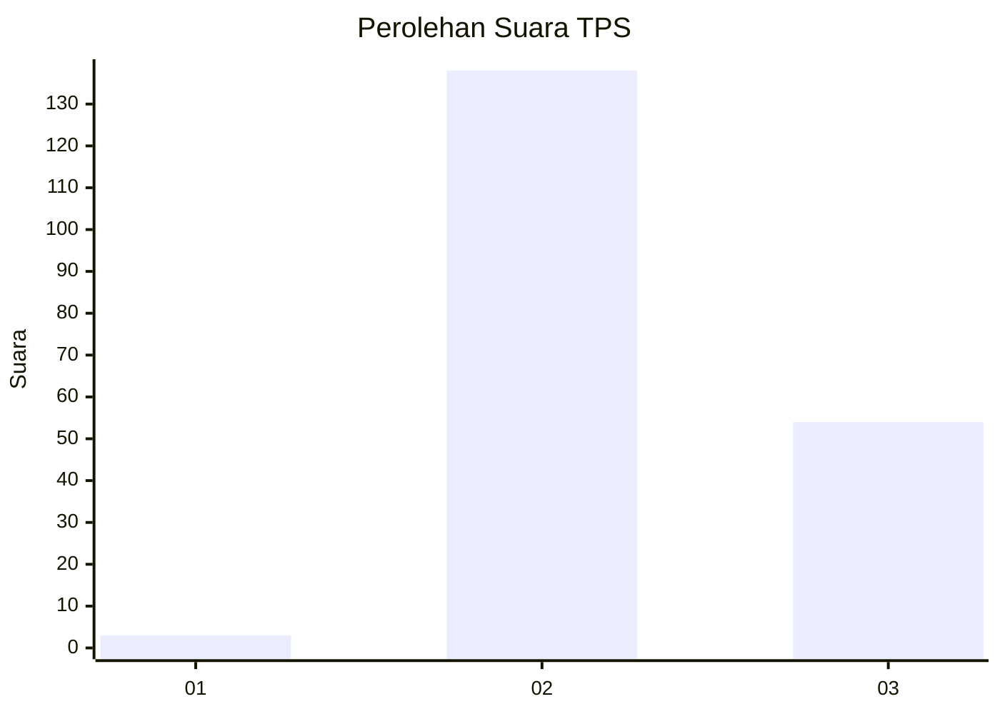
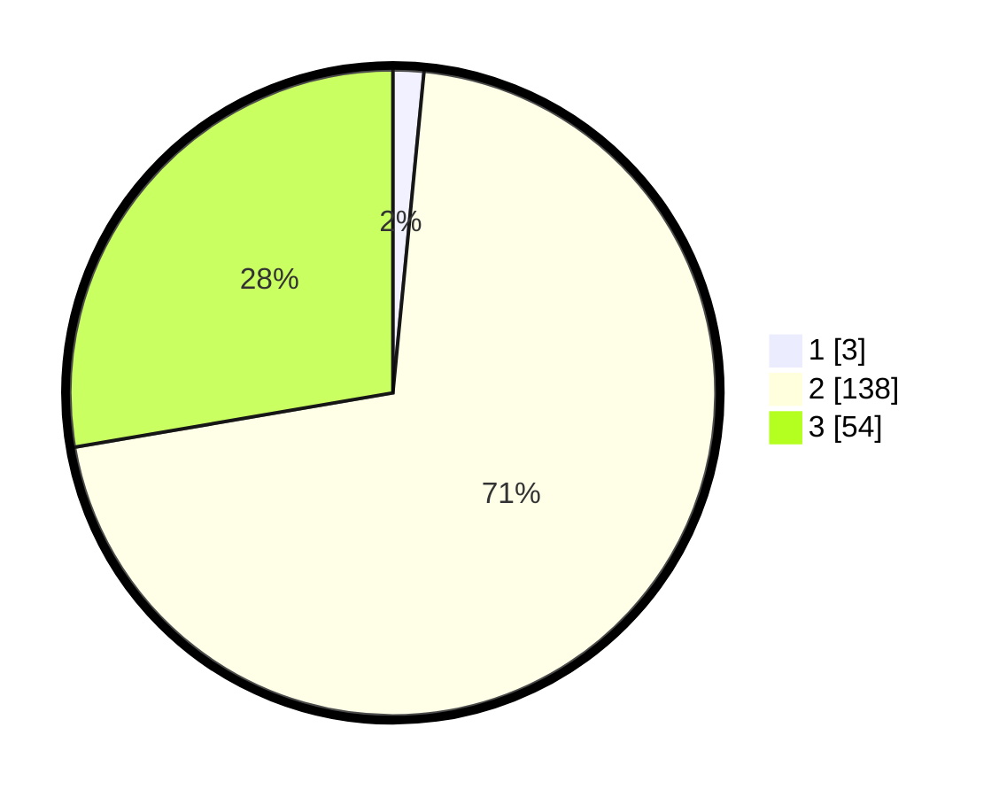

# Hasil

## Grafik

## Tabel

| No. | Nama Paslon    | Suara | Suara (raw) | Persentase |
|:--- |:-------------- | -----:| -----------:| ----------:|
| 1   | ANIES MUHAIMIN | 3     | [3][p-1]    | 1,54       |
| 2   | PRABOWO GIBRAN | 138   | [138][p-2]  | 70,77      |
| 3   | GANJAR MAHFUD  | 54    | [54][p-3]   | 27,69      |

[p-1]: https://github.com/gigit-pemilu/pemilu-2024-51-bali/blob/main/pilpres/hitung-suara/sub/51-bali/sub/02-tabanan/sub/04-kerambitan/sub/2009-kukuh/sub/006-tps/sub/paslon-1.txt
[p-2]: https://github.com/gigit-pemilu/pemilu-2024-51-bali/blob/main/pilpres/hitung-suara/sub/51-bali/sub/02-tabanan/sub/04-kerambitan/sub/2009-kukuh/sub/006-tps/sub/paslon-2.txt
[p-3]: https://github.com/gigit-pemilu/pemilu-2024-51-bali/blob/main/pilpres/hitung-suara/sub/51-bali/sub/02-tabanan/sub/04-kerambitan/sub/2009-kukuh/sub/006-tps/sub/paslon-3.txt

## Foto C Plano

https://sirekap-obj-formc.kpu.go.id/a910/pemilu/ppwp/51/02/04/20/09/5102042009006-20240214-194952--1e8c8ebd-40a3-4c4f-80e7-945f196f423f.jpg

https://sirekap-obj-formc.kpu.go.id/a910/pemilu/ppwp/51/02/04/20/09/5102042009006-20240214-195342--c8fef74e-b72f-4f77-a3a1-6d3a532096cb.jpg

https://sirekap-obj-formc.kpu.go.id/a910/pemilu/ppwp/51/02/04/20/09/5102042009006-20240214-195539--50d9817b-b23f-4f32-8ec1-c1a5534a4bce.jpg

## Metadata

| Key        | Value               |
| ---------- | ------------------- |
| Time Stamp | 2024-02-24 22:31:28 |

