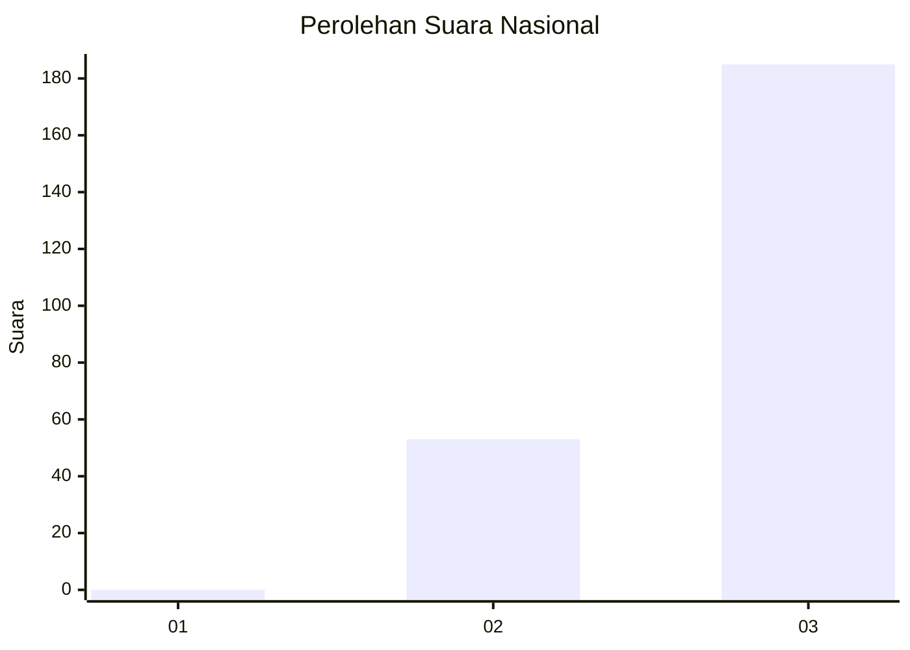
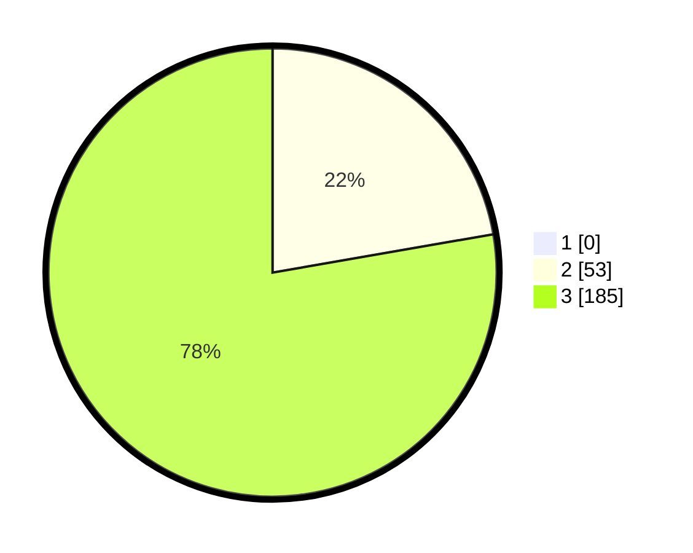

# Hasil

## Grafik

## Tabel

| No. | Nama Paslon    | Suara | Suara (raw) | Persentase |
|:--- |:-------------- | -----:| -----------:| ----------:|
| 1   | ANIES MUHAIMIN | 0     | [0][p-1]    | 0,00       |
| 2   | PRABOWO GIBRAN | 53    | [53][p-2]   | 22,27      |
| 3   | GANJAR MAHFUD  | 185   | [185][p-3]  | 77,73      |

[p-1]: https://github.com/gigit-pemilu/pemilu-2024/blob/main/pilpres/hitung-suara/sub/51-bali/sub/02-tabanan/sub/04-kerambitan/sub/2009-kukuh/sub/007-tps/sub/paslon-1.txt
[p-2]: https://github.com/gigit-pemilu/pemilu-2024/blob/main/pilpres/hitung-suara/sub/51-bali/sub/02-tabanan/sub/04-kerambitan/sub/2009-kukuh/sub/007-tps/sub/paslon-2.txt
[p-3]: https://github.com/gigit-pemilu/pemilu-2024/blob/main/pilpres/hitung-suara/sub/51-bali/sub/02-tabanan/sub/04-kerambitan/sub/2009-kukuh/sub/007-tps/sub/paslon-3.txt

## Foto C Plano

https://sirekap-obj-formc.kpu.go.id/998f/pemilu/ppwp/51/02/04/20/09/5102042009007-20240217-072707--e4c1b3b9-a3c2-4dc0-b0db-4e4001e51f0c.jpg

https://sirekap-obj-formc.kpu.go.id/998f/pemilu/ppwp/51/02/04/20/09/5102042009007-20240217-073426--ab1289f9-c2bb-4dc3-b85f-93a8a3c2b655.jpg

https://sirekap-obj-formc.kpu.go.id/998f/pemilu/ppwp/51/02/04/20/09/5102042009007-20240217-073617--b5edc6cd-bca4-49bd-9748-33bea87b75e9.jpg

## Metadata

| Key        | Value               |
| ---------- | ------------------- |
| Time Stamp | 2024-02-24 22:31:28 |

## DATA PEMILIH TETAP

Jumlah pemilih dalam DPT: **241**.
 * L: **115**.
 * P: **126**.

## DATA PENGGUNA HAK PILIH

Jumlah pengguna hak pilih dalam DPT: **195**.
 * L: **96**.
 * P: **99**.

Jumlah pengguna hak pilih dalam DPTb: **2**.
 * L: **0**.
 * P: **2**.

Jumlah pengguna hak pilih dalam DPK: **1**.
 * L: **1**.
 * P: **0**.

Jumlah pengguna hak pilih: **198**.
 * L: **97**.
 * P: **101**.

## JUMLAH SUARA SAH DAN TIDAK SAH

JUMLAH SELURUH SUARA SAH: **238**.

JUMLAH SUARA TIDAK SAH: **7**.

JUMLAH SELURUH SUARA SAH DAN SUARA TIDAK SAH: **245**.

