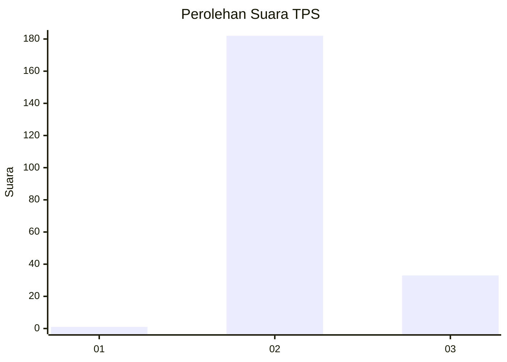
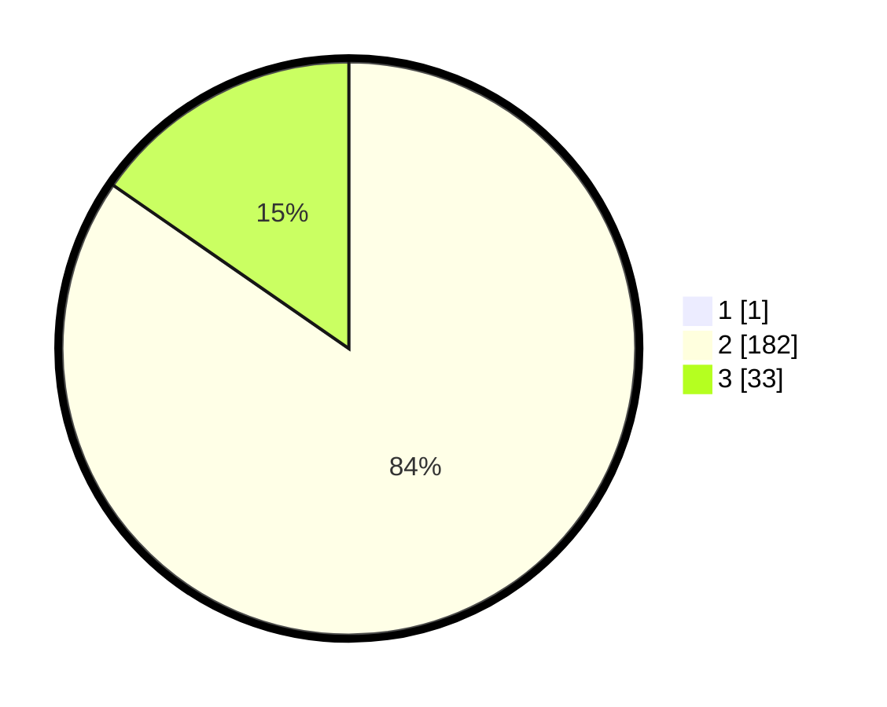

# Hasil

## Grafik

## Tabel

| No. | Nama Paslon    | Suara | Suara (raw) | Persentase |
|:--- |:-------------- | -----:| -----------:| ----------:|
| 1   | ANIES MUHAIMIN | 1     | [1][p-1]    | 0,46       |
| 2   | PRABOWO GIBRAN | 182   | [182][p-2]  | 84,26      |
| 3   | GANJAR MAHFUD  | 33    | [33][p-3]   | 15,28      |

[p-1]: https://github.com/gigit-pemilu/pemilu-2024-51-bali/blob/main/pilpres/hitung-suara/sub/51-bali/sub/02-tabanan/sub/04-kerambitan/sub/2009-kukuh/sub/008-tps/sub/paslon-1.txt
[p-2]: https://github.com/gigit-pemilu/pemilu-2024-51-bali/blob/main/pilpres/hitung-suara/sub/51-bali/sub/02-tabanan/sub/04-kerambitan/sub/2009-kukuh/sub/008-tps/sub/paslon-2.txt
[p-3]: https://github.com/gigit-pemilu/pemilu-2024-51-bali/blob/main/pilpres/hitung-suara/sub/51-bali/sub/02-tabanan/sub/04-kerambitan/sub/2009-kukuh/sub/008-tps/sub/paslon-3.txt

## Foto C Plano

https://sirekap-obj-formc.kpu.go.id/3bef/pemilu/ppwp/51/02/04/20/09/5102042009008-20240217-112411--45d78afe-3cef-4331-aa5a-8cb0d0f9ee9d.jpg

https://sirekap-obj-formc.kpu.go.id/3bef/pemilu/ppwp/51/02/04/20/09/5102042009008-20240217-112412--569ba78a-e15b-4087-ab17-1445cb816b12.jpg

https://sirekap-obj-formc.kpu.go.id/3bef/pemilu/ppwp/51/02/04/20/09/5102042009008-20240217-112412--90a7f209-7fa0-4d77-9ab5-d5f768548d81.jpg

## Metadata

| Key        | Value               |
| ---------- | ------------------- |
| Time Stamp | 2024-02-21 16:00:00 |

## DATA PEMILIH TETAP

Jumlah pemilih dalam DPT: **246**.
 * L: **117**.
 * P: **129**.

## DATA PENGGUNA HAK PILIH

Jumlah pengguna hak pilih dalam DPT: **218**.
 * L: **105**.
 * P: **113**.

Jumlah pengguna hak pilih dalam DPTb: **0**.
 * L: **0**.
 * P: **0**.

Jumlah pengguna hak pilih dalam DPK: **0**.
 * L: **0**.
 * P: **0**.

Jumlah pengguna hak pilih: **218**.
 * L: **105**.
 * P: **113**.

## JUMLAH SUARA SAH DAN TIDAK SAH

JUMLAH SELURUH SUARA SAH: **216**.

JUMLAH SUARA TIDAK SAH: **2**.

JUMLAH SELURUH SUARA SAH DAN SUARA TIDAK SAH: **218**.

