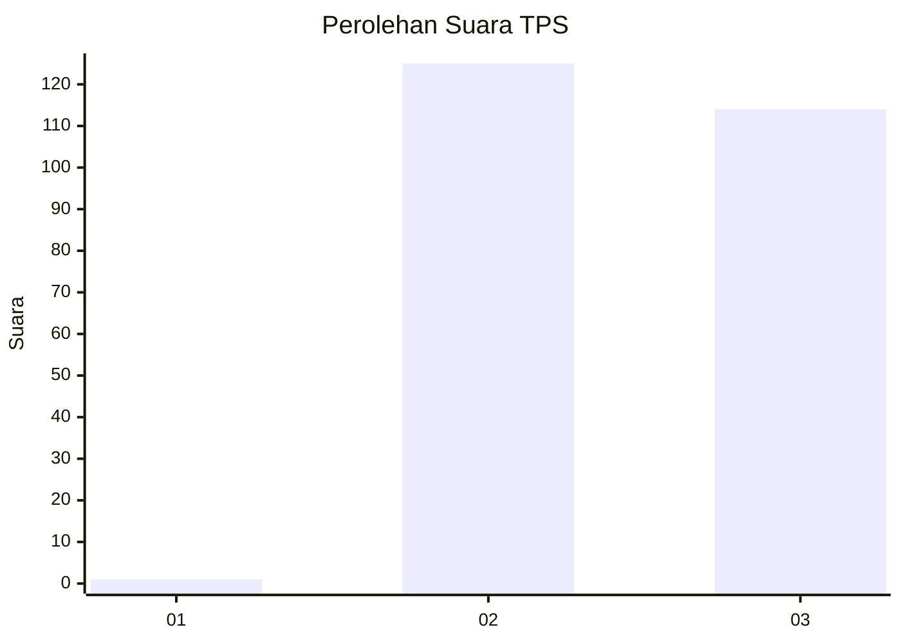
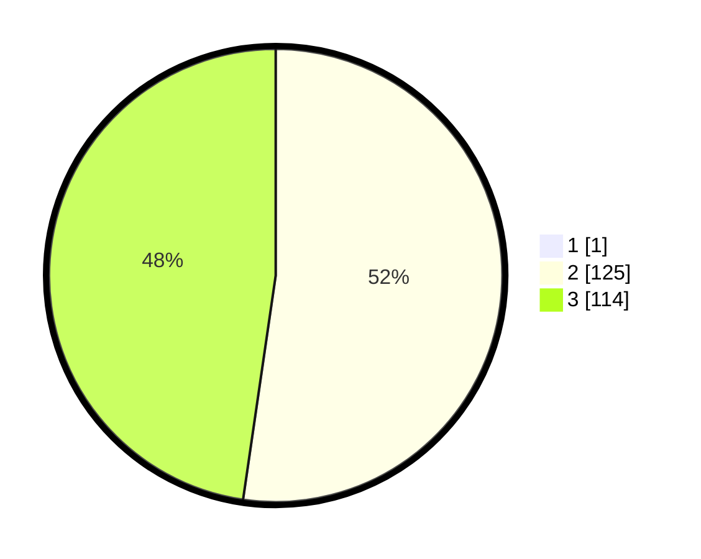

# Hasil

## Grafik

## Tabel

| No. | Nama Paslon    | Suara | Suara (raw) | Persentase |
|:--- |:-------------- | -----:| -----------:| ----------:|
| 1   | ANIES MUHAIMIN | 1     | [1][p-1]    | 0,42       |
| 2   | PRABOWO GIBRAN | 125   | [125][p-2]  | 52,08      |
| 3   | GANJAR MAHFUD  | 114   | [114][p-3]  | 47,50      |

[p-1]: https://github.com/gigit-pemilu/pemilu-2024-51-bali/blob/main/pilpres/hitung-suara/sub/51-bali/sub/02-tabanan/sub/04-kerambitan/sub/2010-baturiti/sub/002-tps/sub/paslon-1.txt
[p-2]: https://github.com/gigit-pemilu/pemilu-2024-51-bali/blob/main/pilpres/hitung-suara/sub/51-bali/sub/02-tabanan/sub/04-kerambitan/sub/2010-baturiti/sub/002-tps/sub/paslon-2.txt
[p-3]: https://github.com/gigit-pemilu/pemilu-2024-51-bali/blob/main/pilpres/hitung-suara/sub/51-bali/sub/02-tabanan/sub/04-kerambitan/sub/2010-baturiti/sub/002-tps/sub/paslon-3.txt

## Foto C Plano

https://sirekap-obj-formc.kpu.go.id/225f/pemilu/ppwp/51/02/04/20/10/5102042010002-20240214-141402--4c713c52-d4bb-4396-88e0-825bb7bea873.jpg

https://sirekap-obj-formc.kpu.go.id/225f/pemilu/ppwp/51/02/04/20/10/5102042010002-20240214-141413--042fc14c-56f9-4d1d-9906-e1a59136c348.jpg

https://sirekap-obj-formc.kpu.go.id/225f/pemilu/ppwp/51/02/04/20/10/5102042010002-20240214-141423--308a3817-8463-46c8-a5a3-f2ef38b45d91.jpg

## Metadata

| Key        | Value               |
| ---------- | ------------------- |
| Time Stamp | 2024-02-15 22:00:27 |

## DATA PEMILIH TETAP

Jumlah pemilih dalam DPT: **266**.
 * L: **130**.
 * P: **136**.

## DATA PENGGUNA HAK PILIH

Jumlah pengguna hak pilih dalam DPT: **243**.
 * L: **118**.
 * P: **125**.

Jumlah pengguna hak pilih dalam DPTb: **0**.
 * L: **0**.
 * P: **0**.

Jumlah pengguna hak pilih dalam DPK: **2**.
 * L: **1**.
 * P: **1**.

Jumlah pengguna hak pilih: **245**.
 * L: **119**.
 * P: **126**.

## JUMLAH SUARA SAH DAN TIDAK SAH

JUMLAH SELURUH SUARA SAH: **240**.

JUMLAH SUARA TIDAK SAH: **5**.

JUMLAH SELURUH SUARA SAH DAN SUARA TIDAK SAH: **245**.

