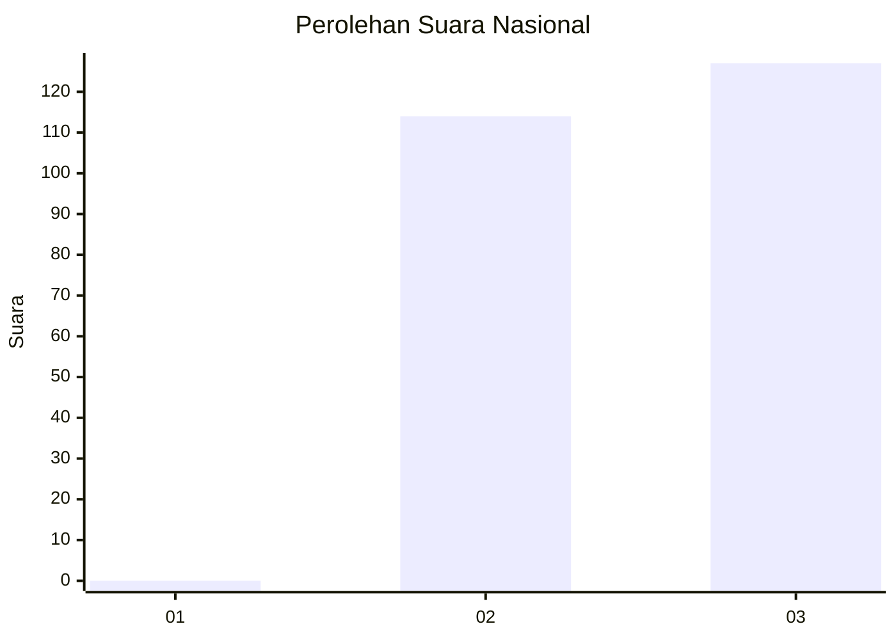
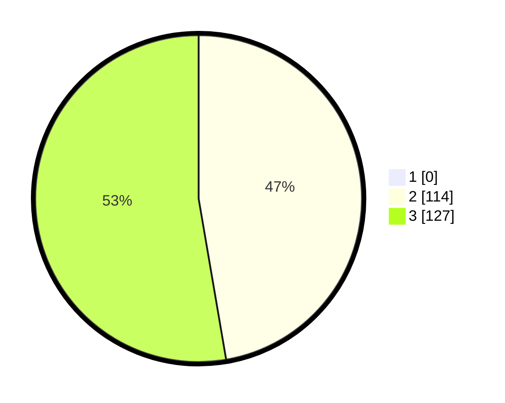

# Hasil

## Grafik

## Tabel

| No. | Nama Paslon    | Suara | Suara (raw) | Persentase |
|:--- |:-------------- | -----:| -----------:| ----------:|
| 1   | ANIES MUHAIMIN | 0     | [0][p-1]    | 0,00       |
| 2   | PRABOWO GIBRAN | 114   | [114][p-2]  | 47,30      |
| 3   | GANJAR MAHFUD  | 127   | [127][p-3]  | 52,70      |

[p-1]: https://github.com/gigit-pemilu/pemilu-2024/blob/main/pilpres/hitung-suara/sub/51-bali/sub/02-tabanan/sub/04-kerambitan/sub/2010-baturiti/sub/006-tps/sub/paslon-1.txt
[p-2]: https://github.com/gigit-pemilu/pemilu-2024/blob/main/pilpres/hitung-suara/sub/51-bali/sub/02-tabanan/sub/04-kerambitan/sub/2010-baturiti/sub/006-tps/sub/paslon-2.txt
[p-3]: https://github.com/gigit-pemilu/pemilu-2024/blob/main/pilpres/hitung-suara/sub/51-bali/sub/02-tabanan/sub/04-kerambitan/sub/2010-baturiti/sub/006-tps/sub/paslon-3.txt

## Foto C Plano

https://sirekap-obj-formc.kpu.go.id/c5cf/pemilu/ppwp/51/02/04/20/10/5102042010006-20240214-155737--8c6efa18-d86a-4b1d-8ec4-5abbdee82b0a.jpg

https://sirekap-obj-formc.kpu.go.id/c5cf/pemilu/ppwp/51/02/04/20/10/5102042010006-20240214-155740--587015ae-4c23-414a-b16d-1354787b797b.jpg

https://sirekap-obj-formc.kpu.go.id/c5cf/pemilu/ppwp/51/02/04/20/10/5102042010006-20240214-155742--58977d4a-b296-46ec-9dee-c0cc6bf5e24f.jpg

## Metadata

| Key        | Value               |
| ---------- | ------------------- |
| Time Stamp | 2024-02-15 22:00:27 |

