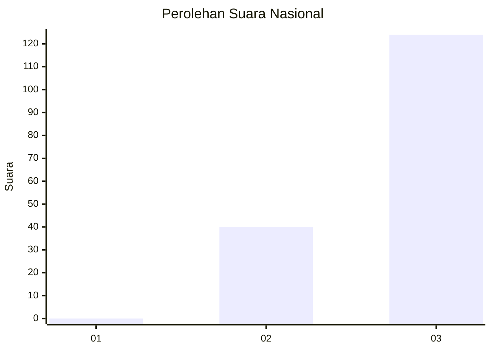
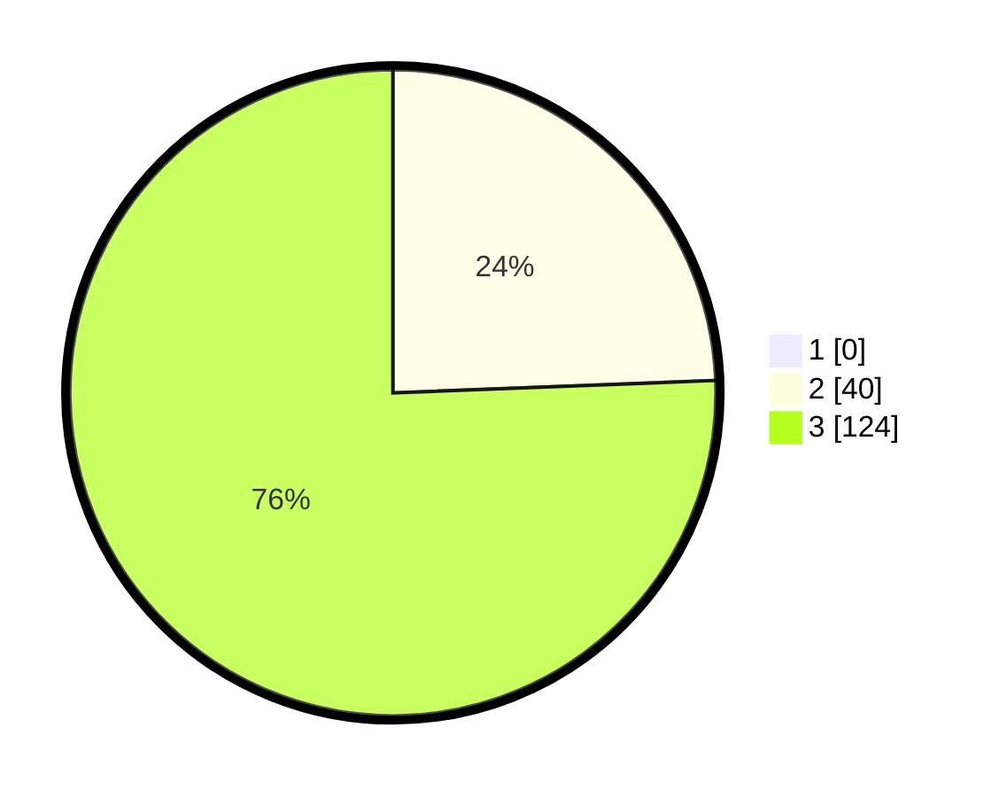

# Hasil

## Grafik

## Tabel

| No. | Nama Paslon    | Suara | Suara (raw) | Persentase |
|:--- |:-------------- | -----:| -----------:| ----------:|
| 1   | ANIES MUHAIMIN | 0     | [0][p-1]    | 0,00       |
| 2   | PRABOWO GIBRAN | 40    | [40][p-2]   | 24,39      |
| 3   | GANJAR MAHFUD  | 124   | [124][p-3]  | 75,61      |

[p-1]: https://github.com/gigit-pemilu/pemilu-2024/blob/main/pilpres/hitung-suara/sub/51-bali/sub/02-tabanan/sub/04-kerambitan/sub/2010-baturiti/sub/009-tps/sub/paslon-1.txt
[p-2]: https://github.com/gigit-pemilu/pemilu-2024/blob/main/pilpres/hitung-suara/sub/51-bali/sub/02-tabanan/sub/04-kerambitan/sub/2010-baturiti/sub/009-tps/sub/paslon-2.txt
[p-3]: https://github.com/gigit-pemilu/pemilu-2024/blob/main/pilpres/hitung-suara/sub/51-bali/sub/02-tabanan/sub/04-kerambitan/sub/2010-baturiti/sub/009-tps/sub/paslon-3.txt

## Foto C Plano

https://sirekap-obj-formc.kpu.go.id/9c85/pemilu/ppwp/51/02/04/20/10/5102042010009-20240214-155914--976342b2-c740-48bb-967a-6fa621995021.jpg

https://sirekap-obj-formc.kpu.go.id/9c85/pemilu/ppwp/51/02/04/20/10/5102042010009-20240214-155818--5d9c31c6-69aa-4017-8deb-487a743c2969.jpg

https://sirekap-obj-formc.kpu.go.id/9c85/pemilu/ppwp/51/02/04/20/10/5102042010009-20240214-155850--ef598aad-da32-4bcb-ae9e-9be301eddc6b.jpg

## Metadata

| Key        | Value               |
| ---------- | ------------------- |
| Time Stamp | 2024-02-14 21:46:01 |

## DATA PEMILIH TETAP

Jumlah pemilih dalam DPT: **165**.
 * L: **83**.
 * P: **82**.

## DATA PENGGUNA HAK PILIH

Jumlah pengguna hak pilih dalam DPT: **163**.
 * L: **82**.
 * P: **81**.

Jumlah pengguna hak pilih dalam DPTb: **1**.
 * L: **0**.
 * P: **1**.

Jumlah pengguna hak pilih dalam DPK: **0**.
 * L: **0**.
 * P: **0**.

Jumlah pengguna hak pilih: **164**.
 * L: **82**.
 * P: **82**.

## JUMLAH SUARA SAH DAN TIDAK SAH

JUMLAH SELURUH SUARA SAH: **164**.

JUMLAH SUARA TIDAK SAH: **0**.

JUMLAH SELURUH SUARA SAH DAN SUARA TIDAK SAH: **164**.

