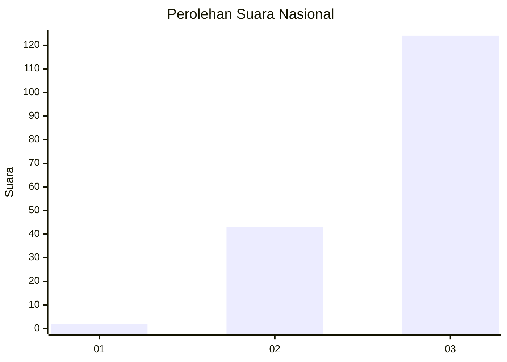
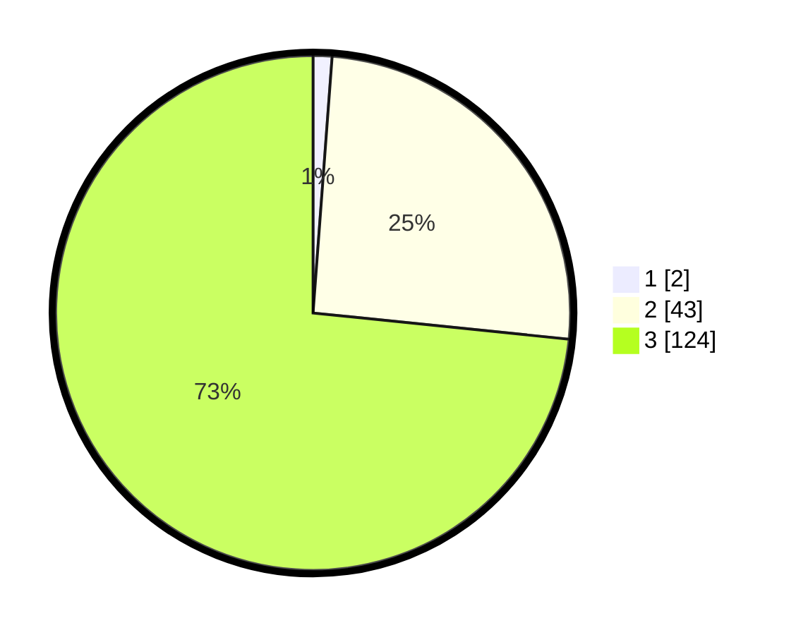

# Hasil

## Grafik

## Tabel

| No. | Nama Paslon    | Suara | Suara (raw) | Persentase |
|:--- |:-------------- | -----:| -----------:| ----------:|
| 1   | ANIES MUHAIMIN | 2     | [2][p-1]    | 1,18       |
| 2   | PRABOWO GIBRAN | 43    | [43][p-2]   | 25,44      |
| 3   | GANJAR MAHFUD  | 124   | [124][p-3]  | 73,37      |

[p-1]: https://github.com/gigit-pemilu/pemilu-2024/blob/main/pilpres/hitung-suara/sub/51-bali/sub/02-tabanan/sub/04-kerambitan/sub/2010-baturiti/sub/010-tps/sub/paslon-1.txt
[p-2]: https://github.com/gigit-pemilu/pemilu-2024/blob/main/pilpres/hitung-suara/sub/51-bali/sub/02-tabanan/sub/04-kerambitan/sub/2010-baturiti/sub/010-tps/sub/paslon-2.txt
[p-3]: https://github.com/gigit-pemilu/pemilu-2024/blob/main/pilpres/hitung-suara/sub/51-bali/sub/02-tabanan/sub/04-kerambitan/sub/2010-baturiti/sub/010-tps/sub/paslon-3.txt

## Foto C Plano

https://sirekap-obj-formc.kpu.go.id/ec12/pemilu/ppwp/51/02/04/20/10/5102042010010-20240214-131757--364da963-5702-41f5-a783-a7b696ad4cbd.jpg

https://sirekap-obj-formc.kpu.go.id/ec12/pemilu/ppwp/51/02/04/20/10/5102042010010-20240214-131501--c5a45432-bd42-4e8c-94d0-50427698da7f.jpg

https://sirekap-obj-formc.kpu.go.id/ec12/pemilu/ppwp/51/02/04/20/10/5102042010010-20240214-132348--9cca3760-20ed-41ca-b07c-5a0045bb0f5f.jpg

## Metadata

| Key        | Value               |
| ---------- | ------------------- |
| Time Stamp | 2024-02-14 21:46:01 |

## DATA PEMILIH TETAP

Jumlah pemilih dalam DPT: **172**.
 * L: **83**.
 * P: **89**.

## DATA PENGGUNA HAK PILIH

Jumlah pengguna hak pilih dalam DPT: **169**.
 * L: **83**.
 * P: **86**.

Jumlah pengguna hak pilih dalam DPTb: **0**.
 * L: **0**.
 * P: **0**.

Jumlah pengguna hak pilih dalam DPK: **1**.
 * L: **0**.
 * P: **1**.

Jumlah pengguna hak pilih: **170**.
 * L: **83**.
 * P: **87**.

## JUMLAH SUARA SAH DAN TIDAK SAH

JUMLAH SELURUH SUARA SAH: **169**.

JUMLAH SUARA TIDAK SAH: **1**.

JUMLAH SELURUH SUARA SAH DAN SUARA TIDAK SAH: **170**.

