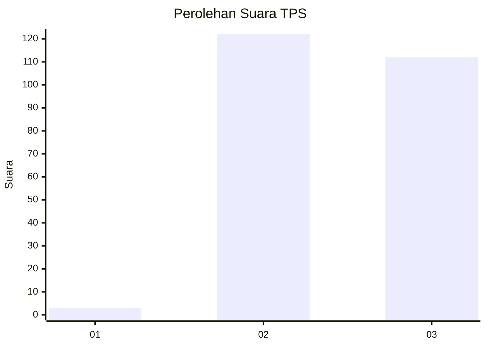
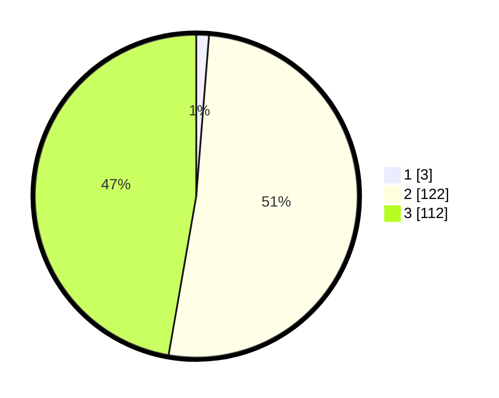

# Hasil

## Grafik

## Tabel

| No. | Nama Paslon    | Suara | Suara (raw) | Persentase |
|:--- |:-------------- | -----:| -----------:| ----------:|
| 1   | ANIES MUHAIMIN | 3     | [3][p-1]    | 1,27       |
| 2   | PRABOWO GIBRAN | 122   | [122][p-2]  | 51,48      |
| 3   | GANJAR MAHFUD  | 112   | [112][p-3]  | 47,26      |

[p-1]: https://github.com/gigit-pemilu/pemilu-2024-51-bali/blob/main/pilpres/hitung-suara/sub/51-bali/sub/02-tabanan/sub/04-kerambitan/sub/2011-meliling/sub/004-tps/sub/paslon-1.txt
[p-2]: https://github.com/gigit-pemilu/pemilu-2024-51-bali/blob/main/pilpres/hitung-suara/sub/51-bali/sub/02-tabanan/sub/04-kerambitan/sub/2011-meliling/sub/004-tps/sub/paslon-2.txt
[p-3]: https://github.com/gigit-pemilu/pemilu-2024-51-bali/blob/main/pilpres/hitung-suara/sub/51-bali/sub/02-tabanan/sub/04-kerambitan/sub/2011-meliling/sub/004-tps/sub/paslon-3.txt

## Foto C Plano

https://sirekap-obj-formc.kpu.go.id/94a4/pemilu/ppwp/51/02/04/20/11/5102042011004-20240218-145534--1d7287e7-a982-4757-a696-26de2edc6aa7.jpg

https://sirekap-obj-formc.kpu.go.id/94a4/pemilu/ppwp/51/02/04/20/11/5102042011004-20240218-145535--b10870ea-49e4-429e-99fc-f680a4c83a19.jpg

https://sirekap-obj-formc.kpu.go.id/94a4/pemilu/ppwp/51/02/04/20/11/5102042011004-20240218-145534--cfde7c6c-9bf6-4478-a258-30bcd6399dfc.jpg

## Metadata

| Key        | Value               |
| ---------- | ------------------- |
| Time Stamp | 2024-02-21 14:00:00 |

## DATA PEMILIH TETAP

Jumlah pemilih dalam DPT: **273**.
 * L: **138**.
 * P: **135**.

## DATA PENGGUNA HAK PILIH

Jumlah pengguna hak pilih dalam DPT: **236**.
 * L: **119**.
 * P: **117**.

Jumlah pengguna hak pilih dalam DPTb: **4**.
 * L: **2**.
 * P: **2**.

Jumlah pengguna hak pilih dalam DPK: **0**.
 * L: **0**.
 * P: **0**.

Jumlah pengguna hak pilih: **240**.
 * L: **121**.
 * P: **119**.

## JUMLAH SUARA SAH DAN TIDAK SAH

JUMLAH SELURUH SUARA SAH: **237**.

JUMLAH SUARA TIDAK SAH: **3**.

JUMLAH SELURUH SUARA SAH DAN SUARA TIDAK SAH: **240**.

