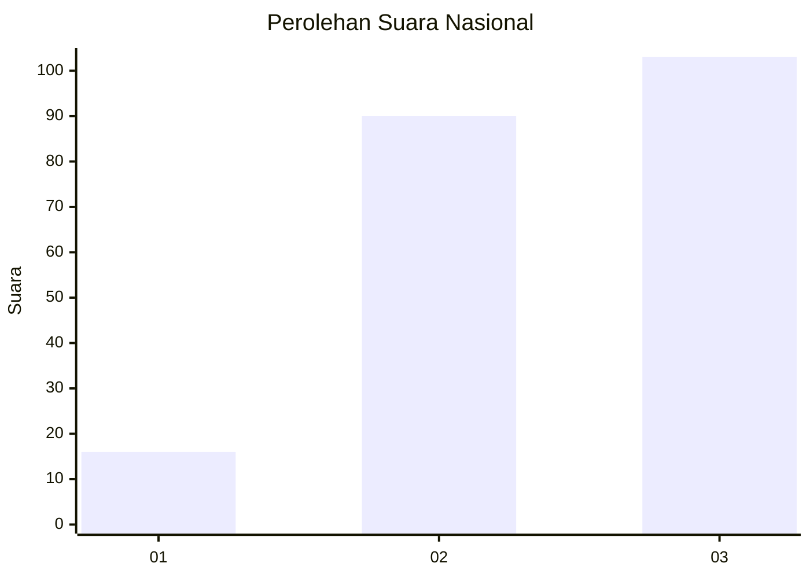
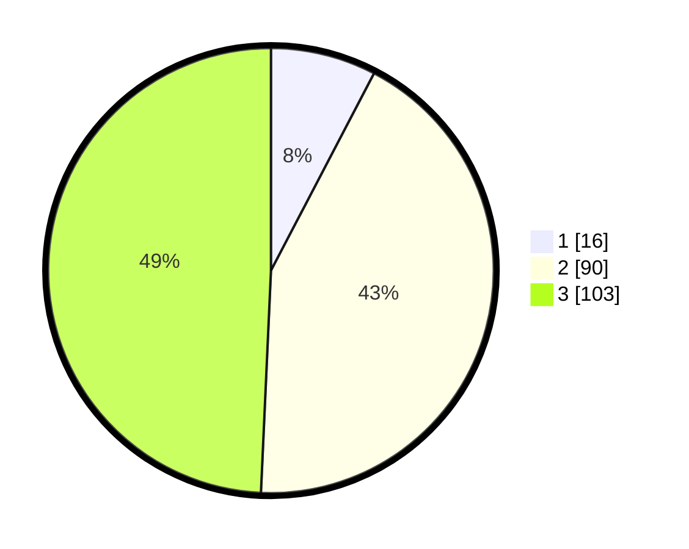

# Hasil

## Grafik

## Tabel

| No. | Nama Paslon    | Suara | Suara (raw) | Persentase |
|:--- |:-------------- | -----:| -----------:| ----------:|
| 1   | ANIES MUHAIMIN | 16    | [16][p-1]   | 7,66       |
| 2   | PRABOWO GIBRAN | 90    | [90][p-2]   | 43,06      |
| 3   | GANJAR MAHFUD  | 103   | [103][p-3]  | 49,28      |

[p-1]: https://github.com/gigit-pemilu/pemilu-2024/blob/main/pilpres/hitung-suara/sub/51-bali/sub/02-tabanan/sub/04-kerambitan/sub/2011-meliling/sub/006-tps/sub/paslon-1.txt
[p-2]: https://github.com/gigit-pemilu/pemilu-2024/blob/main/pilpres/hitung-suara/sub/51-bali/sub/02-tabanan/sub/04-kerambitan/sub/2011-meliling/sub/006-tps/sub/paslon-2.txt
[p-3]: https://github.com/gigit-pemilu/pemilu-2024/blob/main/pilpres/hitung-suara/sub/51-bali/sub/02-tabanan/sub/04-kerambitan/sub/2011-meliling/sub/006-tps/sub/paslon-3.txt

## Foto C Plano

https://sirekap-obj-formc.kpu.go.id/666b/pemilu/ppwp/51/02/04/20/11/5102042011006-20240216-155240--3fc82c8a-87f0-4a18-b4a4-6c65ac9c1366.jpg

https://sirekap-obj-formc.kpu.go.id/666b/pemilu/ppwp/51/02/04/20/11/5102042011006-20240216-155308--df97c878-3178-4b83-b500-5aa4a2b44c08.jpg

https://sirekap-obj-formc.kpu.go.id/666b/pemilu/ppwp/51/02/04/20/11/5102042011006-20240216-155323--a3186104-790b-40eb-b5ad-7b8eb8dc957e.jpg

## Metadata

| Key        | Value               |
| ---------- | ------------------- |
| Time Stamp | 2024-02-24 22:31:28 |

