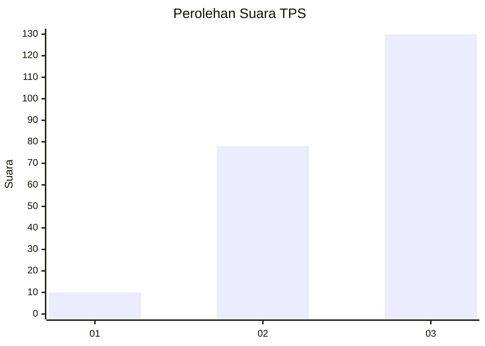
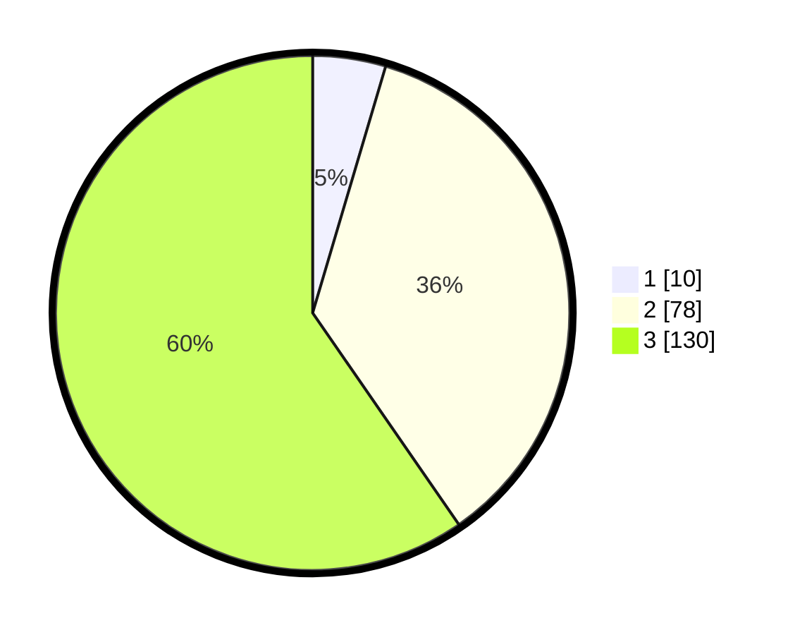

# Hasil

## Grafik

## Tabel

| No. | Nama Paslon    | Suara | Suara (raw) | Persentase |
|:--- |:-------------- | -----:| -----------:| ----------:|
| 1   | ANIES MUHAIMIN | 10    | [10][p-1]   | 4,59       |
| 2   | PRABOWO GIBRAN | 78    | [78][p-2]   | 35,78      |
| 3   | GANJAR MAHFUD  | 130   | [130][p-3]  | 59,63      |

[p-1]: https://github.com/gigit-pemilu/pemilu-2024-51-bali/blob/main/pilpres/hitung-suara/sub/51-bali/sub/02-tabanan/sub/04-kerambitan/sub/2011-meliling/sub/007-tps/sub/paslon-1.txt
[p-2]: https://github.com/gigit-pemilu/pemilu-2024-51-bali/blob/main/pilpres/hitung-suara/sub/51-bali/sub/02-tabanan/sub/04-kerambitan/sub/2011-meliling/sub/007-tps/sub/paslon-2.txt
[p-3]: https://github.com/gigit-pemilu/pemilu-2024-51-bali/blob/main/pilpres/hitung-suara/sub/51-bali/sub/02-tabanan/sub/04-kerambitan/sub/2011-meliling/sub/007-tps/sub/paslon-3.txt

## Foto C Plano

https://sirekap-obj-formc.kpu.go.id/5161/pemilu/ppwp/51/02/04/20/11/5102042011007-20240214-213602--51c07ac4-b038-4542-8932-09eeb91911e8.jpg

https://sirekap-obj-formc.kpu.go.id/5161/pemilu/ppwp/51/02/04/20/11/5102042011007-20240214-213642--3769aa8c-0b12-43ee-9534-34b83ed4a21f.jpg

https://sirekap-obj-formc.kpu.go.id/5161/pemilu/ppwp/51/02/04/20/11/5102042011007-20240214-213736--c1cb83b3-4087-4305-a14b-f77134538564.jpg

## Metadata

| Key        | Value               |
| ---------- | ------------------- |
| Time Stamp | 2024-02-15 22:00:27 |

## DATA PEMILIH TETAP

Jumlah pemilih dalam DPT: **237**.
 * L: **127**.
 * P: **110**.

## DATA PENGGUNA HAK PILIH

Jumlah pengguna hak pilih dalam DPT: **214**.
 * L: **113**.
 * P: **101**.

Jumlah pengguna hak pilih dalam DPTb: **6**.
 * L: **3**.
 * P: **3**.

Jumlah pengguna hak pilih dalam DPK: **2**.
 * L: **1**.
 * P: **1**.

Jumlah pengguna hak pilih: **222**.
 * L: **117**.
 * P: **105**.

## JUMLAH SUARA SAH DAN TIDAK SAH

JUMLAH SELURUH SUARA SAH: **218**.

JUMLAH SUARA TIDAK SAH: **4**.

JUMLAH SELURUH SUARA SAH DAN SUARA TIDAK SAH: **222**.

