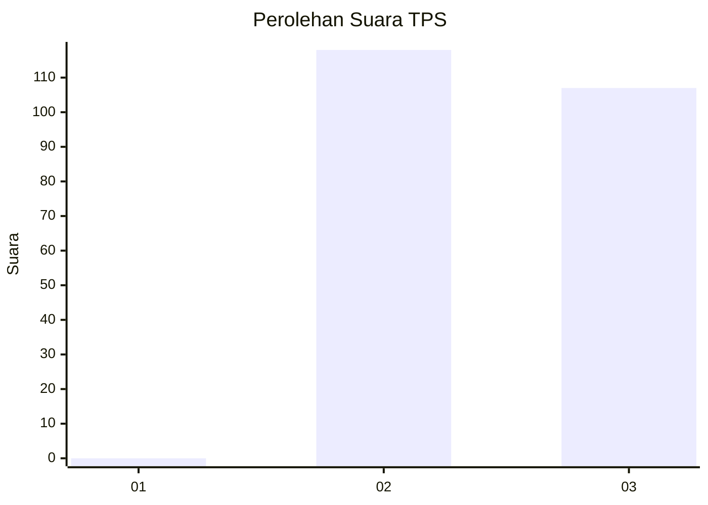
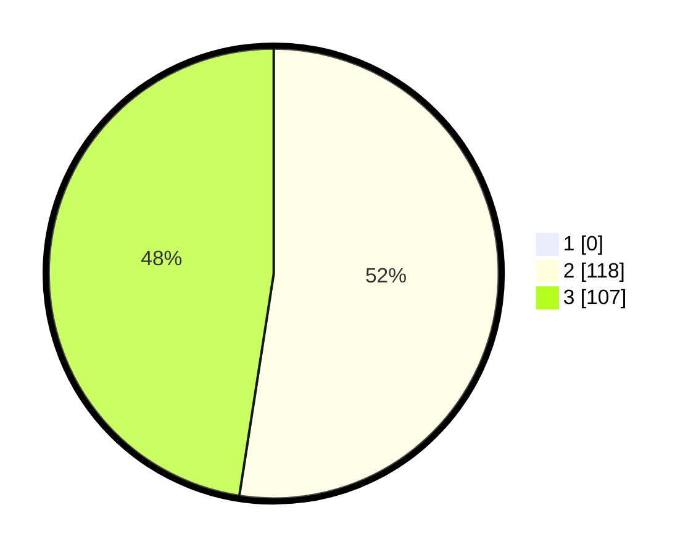

# Hasil

## Grafik

## Tabel

| No. | Nama Paslon    | Suara | Suara (raw) | Persentase |
|:--- |:-------------- | -----:| -----------:| ----------:|
| 1   | ANIES MUHAIMIN | 0     | [0][p-1]    | 0,00       |
| 2   | PRABOWO GIBRAN | 118   | [118][p-2]  | 52,44      |
| 3   | GANJAR MAHFUD  | 107   | [107][p-3]  | 47,56      |

[p-1]: https://github.com/gigit-pemilu/pemilu-2024-51-bali/blob/main/pilpres/hitung-suara/sub/51-bali/sub/02-tabanan/sub/04-kerambitan/sub/2011-meliling/sub/008-tps/sub/paslon-1.txt
[p-2]: https://github.com/gigit-pemilu/pemilu-2024-51-bali/blob/main/pilpres/hitung-suara/sub/51-bali/sub/02-tabanan/sub/04-kerambitan/sub/2011-meliling/sub/008-tps/sub/paslon-2.txt
[p-3]: https://github.com/gigit-pemilu/pemilu-2024-51-bali/blob/main/pilpres/hitung-suara/sub/51-bali/sub/02-tabanan/sub/04-kerambitan/sub/2011-meliling/sub/008-tps/sub/paslon-3.txt

## Foto C Plano

https://sirekap-obj-formc.kpu.go.id/a605/pemilu/ppwp/51/02/04/20/11/5102042011008-20240214-133111--77613eb9-1104-4636-bd24-c5e77e40bb84.jpg

https://sirekap-obj-formc.kpu.go.id/a605/pemilu/ppwp/51/02/04/20/11/5102042011008-20240214-133402--fb8b5a98-d20f-4417-a136-7bc3c956d26b.jpg

https://sirekap-obj-formc.kpu.go.id/a605/pemilu/ppwp/51/02/04/20/11/5102042011008-20240214-213501--094362cd-a372-4dfc-b336-b611146df822.jpg

## Metadata

| Key        | Value               |
| ---------- | ------------------- |
| Time Stamp | 2024-02-15 22:00:27 |

## DATA PEMILIH TETAP

Jumlah pemilih dalam DPT: **250**.
 * L: **120**.
 * P: **130**.

## DATA PENGGUNA HAK PILIH

Jumlah pengguna hak pilih dalam DPT: **225**.
 * L: **106**.
 * P: **119**.

Jumlah pengguna hak pilih dalam DPTb: **3**.
 * L: **0**.
 * P: **3**.

Jumlah pengguna hak pilih dalam DPK: **0**.
 * L: **0**.
 * P: **0**.

Jumlah pengguna hak pilih: **228**.
 * L: **106**.
 * P: **122**.

## JUMLAH SUARA SAH DAN TIDAK SAH

JUMLAH SELURUH SUARA SAH: **225**.

JUMLAH SUARA TIDAK SAH: **3**.

JUMLAH SELURUH SUARA SAH DAN SUARA TIDAK SAH: **228**.

