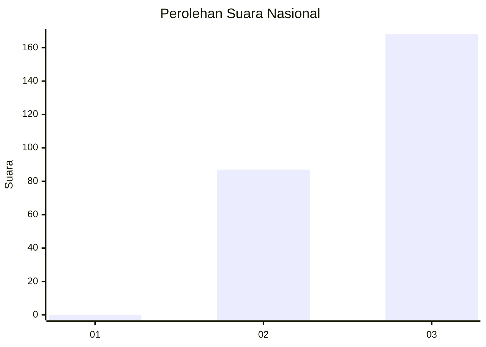
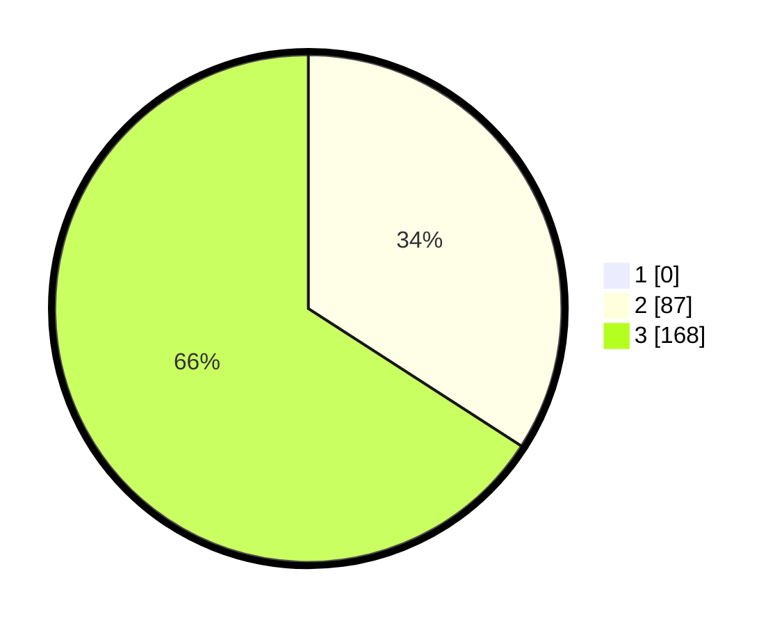

# Hasil

## Grafik

## Tabel

| No. | Nama Paslon    | Suara | Suara (raw) | Persentase |
|:--- |:-------------- | -----:| -----------:| ----------:|
| 1   | ANIES MUHAIMIN | 0     | [0][p-1]    | 0,00       |
| 2   | PRABOWO GIBRAN | 87    | [87][p-2]   | 34,12      |
| 3   | GANJAR MAHFUD  | 168   | [168][p-3]  | 65,88      |

[p-1]: https://github.com/gigit-pemilu/pemilu-2024/blob/main/pilpres/hitung-suara/sub/51-bali/sub/02-tabanan/sub/04-kerambitan/sub/2012-sembung-gede/sub/001-tps/sub/paslon-1.txt
[p-2]: https://github.com/gigit-pemilu/pemilu-2024/blob/main/pilpres/hitung-suara/sub/51-bali/sub/02-tabanan/sub/04-kerambitan/sub/2012-sembung-gede/sub/001-tps/sub/paslon-2.txt
[p-3]: https://github.com/gigit-pemilu/pemilu-2024/blob/main/pilpres/hitung-suara/sub/51-bali/sub/02-tabanan/sub/04-kerambitan/sub/2012-sembung-gede/sub/001-tps/sub/paslon-3.txt

## Foto C Plano

https://sirekap-obj-formc.kpu.go.id/6c4f/pemilu/ppwp/51/02/04/20/12/5102042012001-20240214-141939--29b0efd3-4284-4bd0-a03e-c561eece17e8.jpg

https://sirekap-obj-formc.kpu.go.id/6c4f/pemilu/ppwp/51/02/04/20/12/5102042012001-20240214-141930--7a9586e3-c6bc-4ed7-ab1e-9ade6586d304.jpg

https://sirekap-obj-formc.kpu.go.id/6c4f/pemilu/ppwp/51/02/04/20/12/5102042012001-20240214-185307--817946f1-0f56-47bf-9318-1c5dac2ceea8.jpg

## Metadata

| Key        | Value               |
| ---------- | ------------------- |
| Time Stamp | 2024-02-15 16:00:26 |

## DATA PEMILIH TETAP

Jumlah pemilih dalam DPT: **263**.
 * L: **127**.
 * P: **136**.

## DATA PENGGUNA HAK PILIH

Jumlah pengguna hak pilih dalam DPT: **258**.
 * L: **123**.
 * P: **135**.

Jumlah pengguna hak pilih dalam DPTb: **0**.
 * L: **0**.
 * P: **0**.

Jumlah pengguna hak pilih dalam DPK: **0**.
 * L: **0**.
 * P: **0**.

Jumlah pengguna hak pilih: **258**.
 * L: **523**.
 * P: **135**.

## JUMLAH SUARA SAH DAN TIDAK SAH

JUMLAH SELURUH SUARA SAH: **255**.

JUMLAH SUARA TIDAK SAH: **3**.

JUMLAH SELURUH SUARA SAH DAN SUARA TIDAK SAH: **258**.

