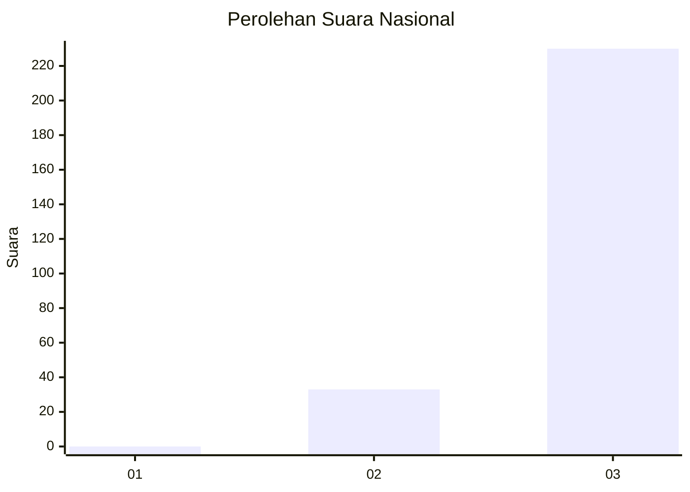
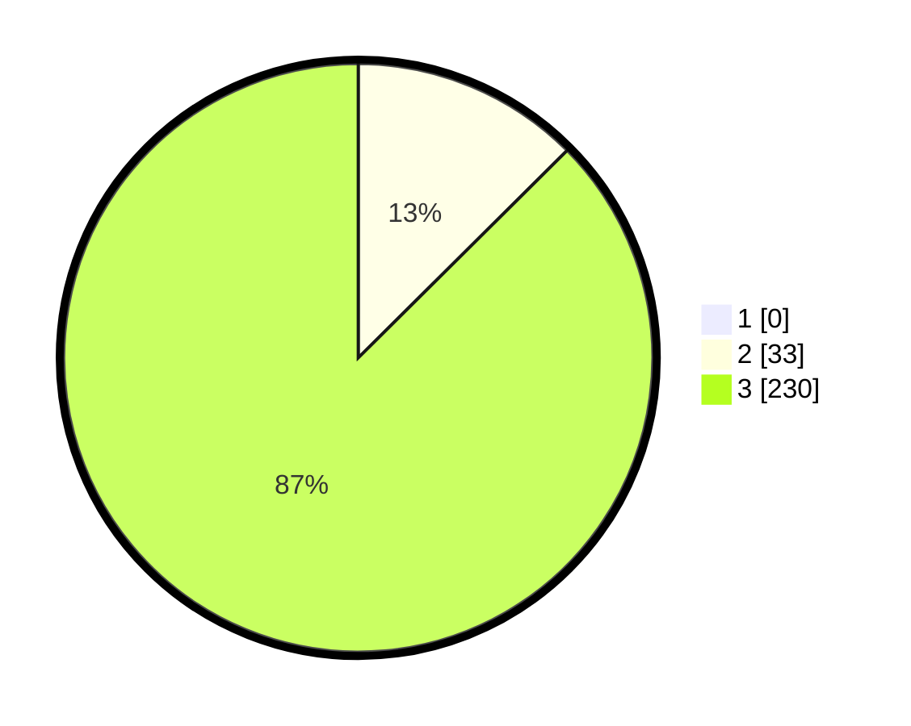

# Hasil

## Grafik

## Tabel

| No. | Nama Paslon    | Suara | Suara (raw) | Persentase |
|:--- |:-------------- | -----:| -----------:| ----------:|
| 1   | ANIES MUHAIMIN | 0     | [0][p-1]    | 0,00       |
| 2   | PRABOWO GIBRAN | 33    | [33][p-2]   | 12,55      |
| 3   | GANJAR MAHFUD  | 230   | [230][p-3]  | 87,45      |

[p-1]: https://github.com/gigit-pemilu/pemilu-2024/blob/main/pilpres/hitung-suara/sub/51-bali/sub/02-tabanan/sub/04-kerambitan/sub/2012-sembung-gede/sub/002-tps/sub/paslon-1.txt
[p-2]: https://github.com/gigit-pemilu/pemilu-2024/blob/main/pilpres/hitung-suara/sub/51-bali/sub/02-tabanan/sub/04-kerambitan/sub/2012-sembung-gede/sub/002-tps/sub/paslon-2.txt
[p-3]: https://github.com/gigit-pemilu/pemilu-2024/blob/main/pilpres/hitung-suara/sub/51-bali/sub/02-tabanan/sub/04-kerambitan/sub/2012-sembung-gede/sub/002-tps/sub/paslon-3.txt

## Foto C Plano

https://sirekap-obj-formc.kpu.go.id/3fef/pemilu/ppwp/51/02/04/20/12/5102042012002-20240214-130255--37fd5dd7-db9a-4e59-9f24-e22660d04da0.jpg

https://sirekap-obj-formc.kpu.go.id/3fef/pemilu/ppwp/51/02/04/20/12/5102042012002-20240214-130738--3252e3ed-63b7-4bd6-bd7c-1b6867fb9072.jpg

https://sirekap-obj-formc.kpu.go.id/3fef/pemilu/ppwp/51/02/04/20/12/5102042012002-20240214-131147--ff654dbc-6778-4325-a093-d70a9cae3096.jpg

## Metadata

| Key        | Value               |
| ---------- | ------------------- |
| Time Stamp | 2024-02-14 21:46:01 |

## DATA PEMILIH TETAP

Jumlah pemilih dalam DPT: **263**.
 * L: **134**.
 * P: **129**.

## DATA PENGGUNA HAK PILIH

Jumlah pengguna hak pilih dalam DPT: **257**.
 * L: **134**.
 * P: **123**.

Jumlah pengguna hak pilih dalam DPTb: **3**.
 * L: **1**.
 * P: **2**.

Jumlah pengguna hak pilih dalam DPK: **3**.
 * L: **1**.
 * P: **2**.

Jumlah pengguna hak pilih: **263**.
 * L: **136**.
 * P: **127**.

## JUMLAH SUARA SAH DAN TIDAK SAH

JUMLAH SELURUH SUARA SAH: **263**.

JUMLAH SUARA TIDAK SAH: **0**.

JUMLAH SELURUH SUARA SAH DAN SUARA TIDAK SAH: **263**.

