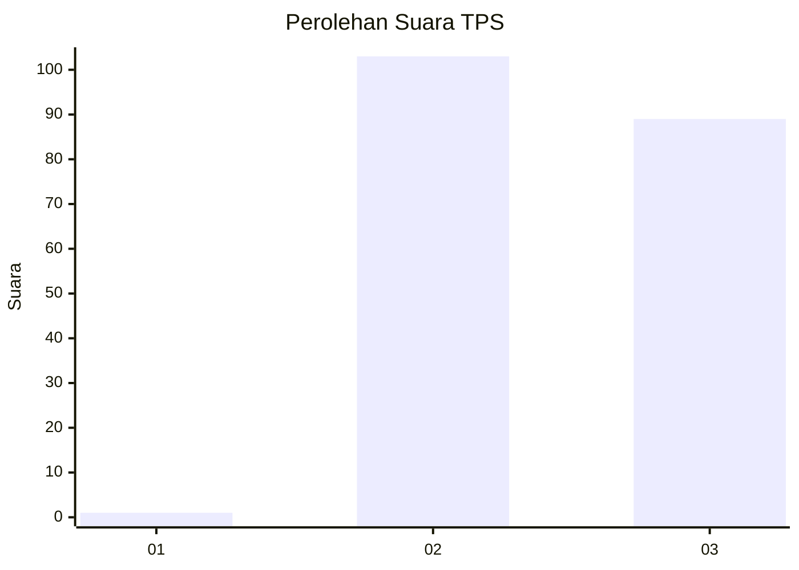
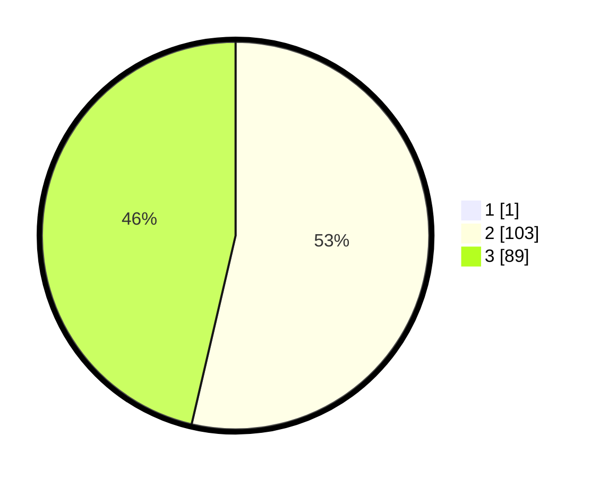

# Hasil

## Grafik

## Tabel

| No. | Nama Paslon    | Suara | Suara (raw) | Persentase |
|:--- |:-------------- | -----:| -----------:| ----------:|
| 1   | ANIES MUHAIMIN | 1     | [1][p-1]    | 0,52       |
| 2   | PRABOWO GIBRAN | 103   | [103][p-2]  | 53,37      |
| 3   | GANJAR MAHFUD  | 89    | [89][p-3]   | 46,11      |

[p-1]: https://github.com/gigit-pemilu/pemilu-2024-51-bali/blob/main/pilpres/hitung-suara/sub/51-bali/sub/02-tabanan/sub/04-kerambitan/sub/2012-sembung-gede/sub/003-tps/sub/paslon-1.txt
[p-2]: https://github.com/gigit-pemilu/pemilu-2024-51-bali/blob/main/pilpres/hitung-suara/sub/51-bali/sub/02-tabanan/sub/04-kerambitan/sub/2012-sembung-gede/sub/003-tps/sub/paslon-2.txt
[p-3]: https://github.com/gigit-pemilu/pemilu-2024-51-bali/blob/main/pilpres/hitung-suara/sub/51-bali/sub/02-tabanan/sub/04-kerambitan/sub/2012-sembung-gede/sub/003-tps/sub/paslon-3.txt

## Foto C Plano

https://sirekap-obj-formc.kpu.go.id/cf68/pemilu/ppwp/51/02/04/20/12/5102042012003-20240216-145809--5415299d-794f-483d-9058-c4b2e555707a.jpg

https://sirekap-obj-formc.kpu.go.id/cf68/pemilu/ppwp/51/02/04/20/12/5102042012003-20240216-145811--28918e9b-0980-468b-b5a8-c4f4f42cbb6d.jpg

https://sirekap-obj-formc.kpu.go.id/cf68/pemilu/ppwp/51/02/04/20/12/5102042012003-20240216-145810--44cf9768-df7a-447d-b4fa-d35cc6f052d8.jpg

## Metadata

| Key        | Value               |
| ---------- | ------------------- |
| Time Stamp | 2024-02-24 22:31:28 |

## DATA PEMILIH TETAP

Jumlah pemilih dalam DPT: **229**.
 * L: **110**.
 * P: **119**.

## DATA PENGGUNA HAK PILIH

Jumlah pengguna hak pilih dalam DPT: **190**.
 * L: **90**.
 * P: **100**.

Jumlah pengguna hak pilih dalam DPTb: **0**.
 * L: **0**.
 * P: **0**.

Jumlah pengguna hak pilih dalam DPK: **4**.
 * L: **1**.
 * P: **3**.

Jumlah pengguna hak pilih: **194**.
 * L: **91**.
 * P: **103**.

## JUMLAH SUARA SAH DAN TIDAK SAH

JUMLAH SELURUH SUARA SAH: **193**.

JUMLAH SUARA TIDAK SAH: **1**.

JUMLAH SELURUH SUARA SAH DAN SUARA TIDAK SAH: **194**.

