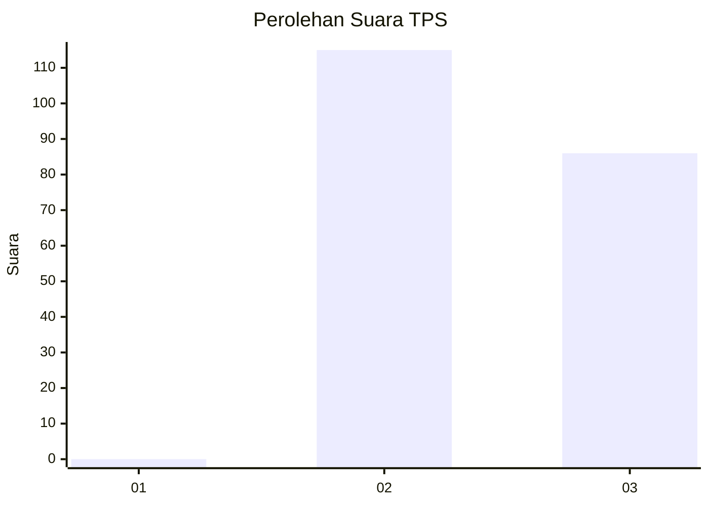
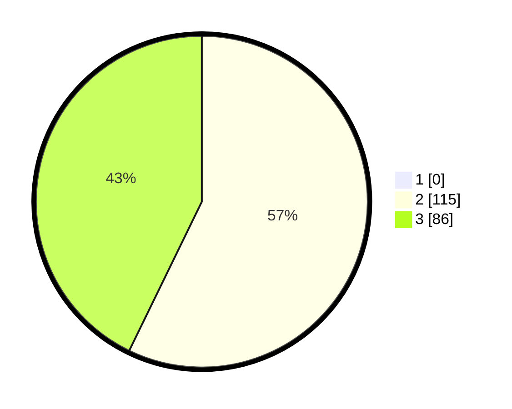

# Hasil

## Grafik

## Tabel

| No. | Nama Paslon    | Suara | Suara (raw) | Persentase |
|:--- |:-------------- | -----:| -----------:| ----------:|
| 1   | ANIES MUHAIMIN | 0     | [0][p-1]    | 0,00       |
| 2   | PRABOWO GIBRAN | 115   | [115][p-2]  | 57,21      |
| 3   | GANJAR MAHFUD  | 86    | [86][p-3]   | 42,79      |

[p-1]: https://github.com/gigit-pemilu/pemilu-2024-51-bali/blob/main/pilpres/hitung-suara/sub/51-bali/sub/02-tabanan/sub/04-kerambitan/sub/2012-sembung-gede/sub/004-tps/sub/paslon-1.txt
[p-2]: https://github.com/gigit-pemilu/pemilu-2024-51-bali/blob/main/pilpres/hitung-suara/sub/51-bali/sub/02-tabanan/sub/04-kerambitan/sub/2012-sembung-gede/sub/004-tps/sub/paslon-2.txt
[p-3]: https://github.com/gigit-pemilu/pemilu-2024-51-bali/blob/main/pilpres/hitung-suara/sub/51-bali/sub/02-tabanan/sub/04-kerambitan/sub/2012-sembung-gede/sub/004-tps/sub/paslon-3.txt

## Foto C Plano

https://sirekap-obj-formc.kpu.go.id/0d6d/pemilu/ppwp/51/02/04/20/12/5102042012004-20240217-202341--c609bea0-6f7b-4824-8673-c4da9b6d024c.jpg

https://sirekap-obj-formc.kpu.go.id/0d6d/pemilu/ppwp/51/02/04/20/12/5102042012004-20240217-202343--f99d5198-8940-4ef4-9174-4e223e20d00e.jpg

https://sirekap-obj-formc.kpu.go.id/0d6d/pemilu/ppwp/51/02/04/20/12/5102042012004-20240217-202342--e94da0cc-1056-4827-ae55-8045b350b9a7.jpg

## Metadata

| Key        | Value               |
| ---------- | ------------------- |
| Time Stamp | 2024-02-24 22:31:28 |

## DATA PEMILIH TETAP

Jumlah pemilih dalam DPT: **227**.
 * L: **115**.
 * P: **112**.

## DATA PENGGUNA HAK PILIH

Jumlah pengguna hak pilih dalam DPT: **200**.
 * L: **101**.
 * P: **99**.

Jumlah pengguna hak pilih dalam DPTb: **2**.
 * L: **1**.
 * P: **1**.

Jumlah pengguna hak pilih dalam DPK: **0**.
 * L: **0**.
 * P: **0**.

Jumlah pengguna hak pilih: **202**.
 * L: **102**.
 * P: **100**.

## JUMLAH SUARA SAH DAN TIDAK SAH

JUMLAH SELURUH SUARA SAH: **201**.

JUMLAH SUARA TIDAK SAH: **1**.

JUMLAH SELURUH SUARA SAH DAN SUARA TIDAK SAH: **202**.

