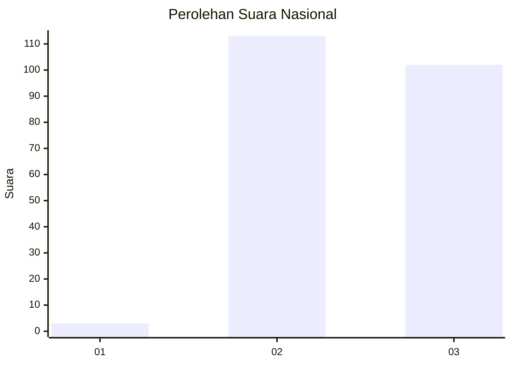
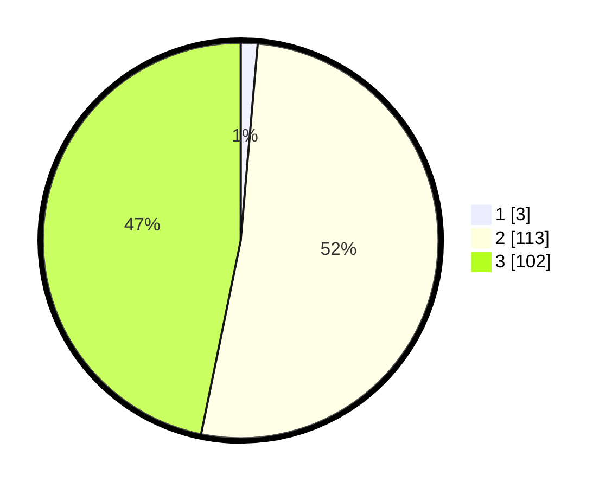

# Hasil

## Grafik

## Tabel

| No. | Nama Paslon    | Suara | Suara (raw) | Persentase |
|:--- |:-------------- | -----:| -----------:| ----------:|
| 1   | ANIES MUHAIMIN | 3     | [3][p-1]    | 1,38       |
| 2   | PRABOWO GIBRAN | 113   | [113][p-2]  | 51,83      |
| 3   | GANJAR MAHFUD  | 102   | [102][p-3]  | 46,79      |

[p-1]: https://github.com/gigit-pemilu/pemilu-2024/blob/main/pilpres/hitung-suara/sub/51-bali/sub/02-tabanan/sub/04-kerambitan/sub/2012-sembung-gede/sub/005-tps/sub/paslon-1.txt
[p-2]: https://github.com/gigit-pemilu/pemilu-2024/blob/main/pilpres/hitung-suara/sub/51-bali/sub/02-tabanan/sub/04-kerambitan/sub/2012-sembung-gede/sub/005-tps/sub/paslon-2.txt
[p-3]: https://github.com/gigit-pemilu/pemilu-2024/blob/main/pilpres/hitung-suara/sub/51-bali/sub/02-tabanan/sub/04-kerambitan/sub/2012-sembung-gede/sub/005-tps/sub/paslon-3.txt

## Foto C Plano

https://sirekap-obj-formc.kpu.go.id/bc3c/pemilu/ppwp/51/02/04/20/12/5102042012005-20240214-214925--246abaa3-49d7-41d5-9c0b-6e5d9473d340.jpg

https://sirekap-obj-formc.kpu.go.id/bc3c/pemilu/ppwp/51/02/04/20/12/5102042012005-20240214-215118--dfc19155-2ac3-4cc1-adb2-152fb638d38d.jpg

https://sirekap-obj-formc.kpu.go.id/bc3c/pemilu/ppwp/51/02/04/20/12/5102042012005-20240214-215431--c6885622-de0f-4fb0-a0ce-91cc077ee2b8.jpg

## Metadata

| Key        | Value               |
| ---------- | ------------------- |
| Time Stamp | 2024-02-15 23:29:50 |

