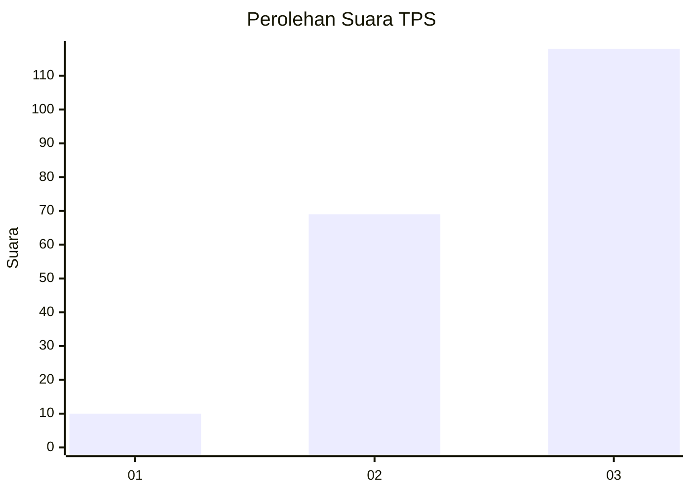
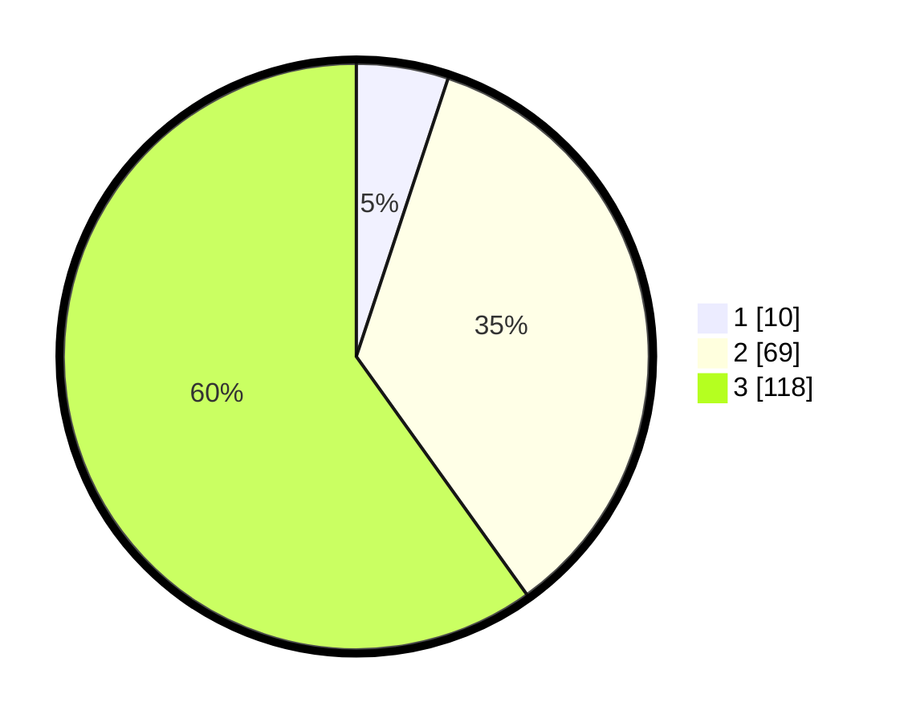

# Hasil

## Grafik

## Tabel

| No. | Nama Paslon    | Suara | Suara (raw) | Persentase |
|:--- |:-------------- | -----:| -----------:| ----------:|
| 1   | ANIES MUHAIMIN | 10    | [10][p-1]   | 5,08       |
| 2   | PRABOWO GIBRAN | 69    | [69][p-2]   | 35,03      |
| 3   | GANJAR MAHFUD  | 118   | [118][p-3]  | 59,90      |

[p-1]: https://github.com/gigit-pemilu/pemilu-2024-51-bali/blob/main/pilpres/hitung-suara/sub/51-bali/sub/02-tabanan/sub/04-kerambitan/sub/2012-sembung-gede/sub/006-tps/sub/paslon-1.txt
[p-2]: https://github.com/gigit-pemilu/pemilu-2024-51-bali/blob/main/pilpres/hitung-suara/sub/51-bali/sub/02-tabanan/sub/04-kerambitan/sub/2012-sembung-gede/sub/006-tps/sub/paslon-2.txt
[p-3]: https://github.com/gigit-pemilu/pemilu-2024-51-bali/blob/main/pilpres/hitung-suara/sub/51-bali/sub/02-tabanan/sub/04-kerambitan/sub/2012-sembung-gede/sub/006-tps/sub/paslon-3.txt

## Foto C Plano

https://sirekap-obj-formc.kpu.go.id/3b40/pemilu/ppwp/51/02/04/20/12/5102042012006-20240217-063006--2d5fed95-49ad-47af-88b8-611cbcb85cac.jpg

https://sirekap-obj-formc.kpu.go.id/3b40/pemilu/ppwp/51/02/04/20/12/5102042012006-20240217-063008--b508ee25-00bd-4a78-a293-05093d7617f9.jpg

https://sirekap-obj-formc.kpu.go.id/3b40/pemilu/ppwp/51/02/04/20/12/5102042012006-20240217-063007--d5adb7ad-de4a-413d-a575-154fc5a1a535.jpg

## Metadata

| Key        | Value               |
| ---------- | ------------------- |
| Time Stamp | 2024-02-24 22:31:28 |

## DATA PEMILIH TETAP

Jumlah pemilih dalam DPT: **226**.
 * L: **108**.
 * P: **118**.

## DATA PENGGUNA HAK PILIH

Jumlah pengguna hak pilih dalam DPT: **197**.
 * L: **93**.
 * P: **104**.

Jumlah pengguna hak pilih dalam DPTb: **0**.
 * L: **0**.
 * P: **0**.

Jumlah pengguna hak pilih dalam DPK: **0**.
 * L: **0**.
 * P: **0**.

Jumlah pengguna hak pilih: **197**.
 * L: **93**.
 * P: **104**.

## JUMLAH SUARA SAH DAN TIDAK SAH

JUMLAH SELURUH SUARA SAH: **197**.

JUMLAH SUARA TIDAK SAH: **0**.

JUMLAH SELURUH SUARA SAH DAN SUARA TIDAK SAH: **197**.

