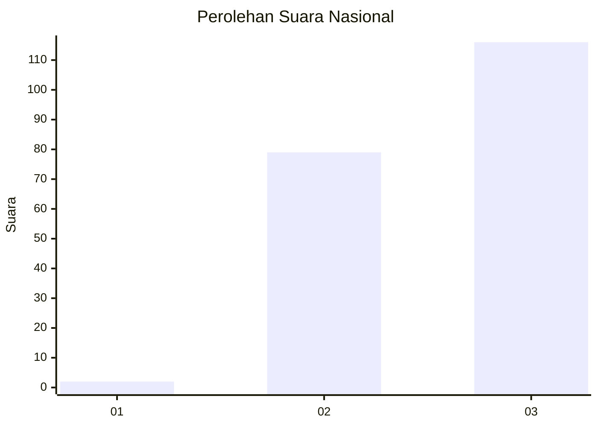
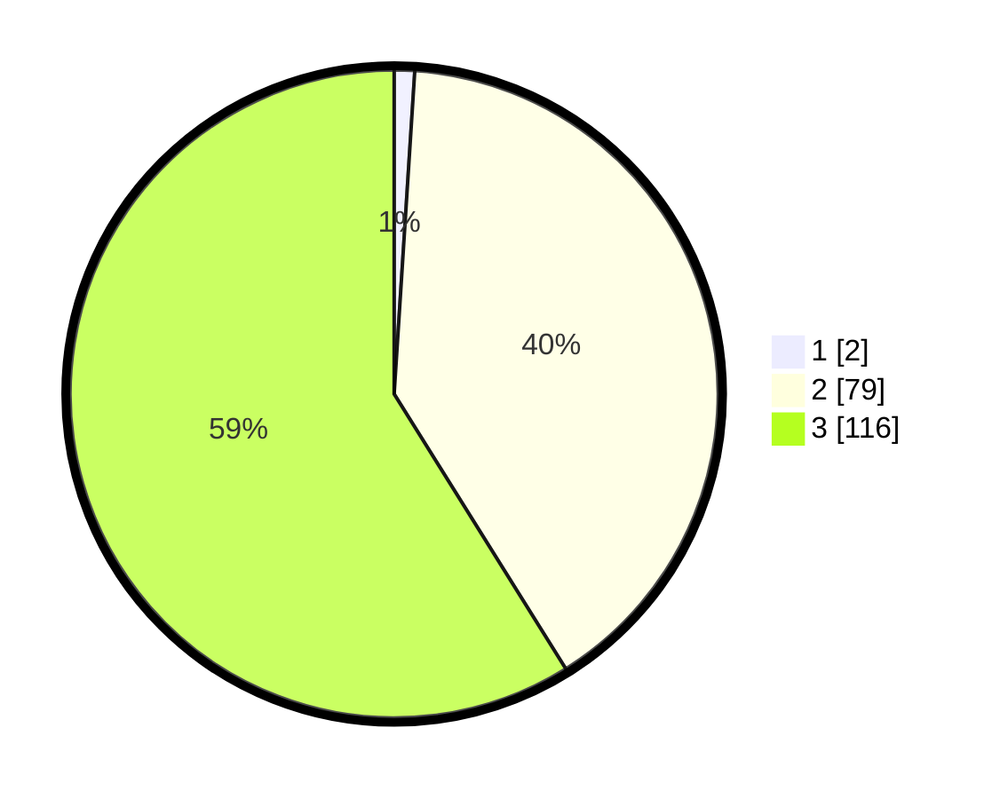

# Hasil

## Grafik

## Tabel

| No. | Nama Paslon    | Suara | Suara (raw) | Persentase |
|:--- |:-------------- | -----:| -----------:| ----------:|
| 1   | ANIES MUHAIMIN | 2     | [2][p-1]    | 1,02       |
| 2   | PRABOWO GIBRAN | 79    | [79][p-2]   | 40,10      |
| 3   | GANJAR MAHFUD  | 116   | [116][p-3]  | 58,88      |

[p-1]: https://github.com/gigit-pemilu/pemilu-2024/blob/main/pilpres/hitung-suara/sub/51-bali/sub/02-tabanan/sub/04-kerambitan/sub/2012-sembung-gede/sub/007-tps/sub/paslon-1.txt
[p-2]: https://github.com/gigit-pemilu/pemilu-2024/blob/main/pilpres/hitung-suara/sub/51-bali/sub/02-tabanan/sub/04-kerambitan/sub/2012-sembung-gede/sub/007-tps/sub/paslon-2.txt
[p-3]: https://github.com/gigit-pemilu/pemilu-2024/blob/main/pilpres/hitung-suara/sub/51-bali/sub/02-tabanan/sub/04-kerambitan/sub/2012-sembung-gede/sub/007-tps/sub/paslon-3.txt

## Foto C Plano

https://sirekap-obj-formc.kpu.go.id/5c27/pemilu/ppwp/51/02/04/20/12/5102042012007-20240216-172921--31271ead-0ed9-4c6d-b38f-a192ee76904a.jpg

https://sirekap-obj-formc.kpu.go.id/5c27/pemilu/ppwp/51/02/04/20/12/5102042012007-20240216-180410--056130d4-78ca-4a38-804e-a725cdcaeafa.jpg

https://sirekap-obj-formc.kpu.go.id/5c27/pemilu/ppwp/51/02/04/20/12/5102042012007-20240217-163911--47cfed1e-f06c-4d46-aef0-fdb635c57612.jpg

## Metadata

| Key        | Value               |
| ---------- | ------------------- |
| Time Stamp | 2024-02-21 13:00:00 |

## DATA PEMILIH TETAP

Jumlah pemilih dalam DPT: **225**.
 * L: **111**.
 * P: **114**.

## DATA PENGGUNA HAK PILIH

Jumlah pengguna hak pilih dalam DPT: **197**.
 * L: **99**.
 * P: **98**.

Jumlah pengguna hak pilih dalam DPTb: **0**.
 * L: **0**.
 * P: **0**.

Jumlah pengguna hak pilih dalam DPK: **0**.
 * L: **0**.
 * P: **0**.

Jumlah pengguna hak pilih: **197**.
 * L: **99**.
 * P: **98**.

## JUMLAH SUARA SAH DAN TIDAK SAH

JUMLAH SELURUH SUARA SAH: **197**.

JUMLAH SUARA TIDAK SAH: **0**.

JUMLAH SELURUH SUARA SAH DAN SUARA TIDAK SAH: **197**.

