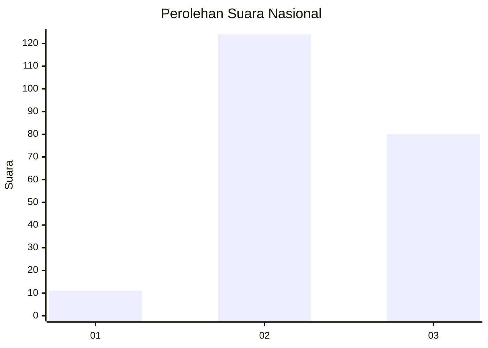
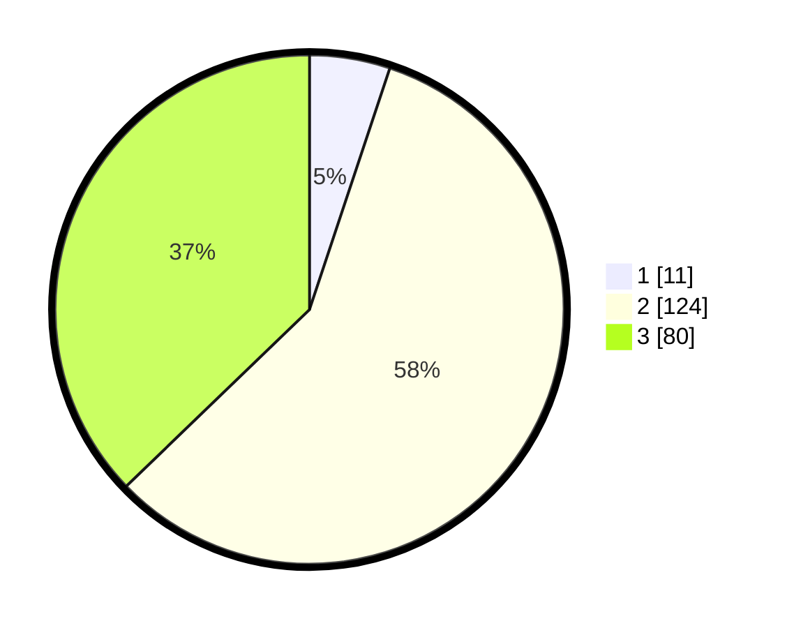

# Hasil

## Grafik

## Tabel

| No. | Nama Paslon    | Suara | Suara (raw) | Persentase |
|:--- |:-------------- | -----:| -----------:| ----------:|
| 1   | ANIES MUHAIMIN | 11    | [11][p-1]   | 5,12       |
| 2   | PRABOWO GIBRAN | 124   | [124][p-2]  | 57,67      |
| 3   | GANJAR MAHFUD  | 80    | [80][p-3]   | 37,21      |

[p-1]: https://github.com/gigit-pemilu/pemilu-2024/blob/main/pilpres/hitung-suara/sub/51-bali/sub/02-tabanan/sub/04-kerambitan/sub/2012-sembung-gede/sub/010-tps/sub/paslon-1.txt
[p-2]: https://github.com/gigit-pemilu/pemilu-2024/blob/main/pilpres/hitung-suara/sub/51-bali/sub/02-tabanan/sub/04-kerambitan/sub/2012-sembung-gede/sub/010-tps/sub/paslon-2.txt
[p-3]: https://github.com/gigit-pemilu/pemilu-2024/blob/main/pilpres/hitung-suara/sub/51-bali/sub/02-tabanan/sub/04-kerambitan/sub/2012-sembung-gede/sub/010-tps/sub/paslon-3.txt

## Foto C Plano

https://sirekap-obj-formc.kpu.go.id/cccf/pemilu/ppwp/51/02/04/20/12/5102042012010-20240218-182752--618c3bc7-6fcd-4aa9-9969-8917998b519a.jpg

https://sirekap-obj-formc.kpu.go.id/cccf/pemilu/ppwp/51/02/04/20/12/5102042012010-20240214-234205--1d2fefa2-a86c-4eb0-b473-665aec655bfb.jpg

https://sirekap-obj-formc.kpu.go.id/cccf/pemilu/ppwp/51/02/04/20/12/5102042012010-20240218-184227--fbcf1032-a90a-4e1f-9255-30e9876f8e36.jpg

## Metadata

| Key        | Value               |
| ---------- | ------------------- |
| Time Stamp | 2024-02-24 22:31:28 |

## DATA PEMILIH TETAP

Jumlah pemilih dalam DPT: **280**.
 * L: **139**.
 * P: **141**.

## DATA PENGGUNA HAK PILIH

Jumlah pengguna hak pilih dalam DPT: **217**.
 * L: **110**.
 * P: **107**.

Jumlah pengguna hak pilih dalam DPTb: **0**.
 * L: **0**.
 * P: **0**.

Jumlah pengguna hak pilih dalam DPK: **0**.
 * L: **0**.
 * P: **0**.

Jumlah pengguna hak pilih: **217**.
 * L: **110**.
 * P: **107**.

## JUMLAH SUARA SAH DAN TIDAK SAH

JUMLAH SELURUH SUARA SAH: **215**.

JUMLAH SUARA TIDAK SAH: **2**.

JUMLAH SELURUH SUARA SAH DAN SUARA TIDAK SAH: **217**.

