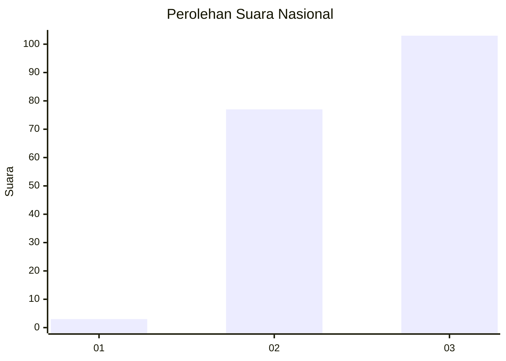
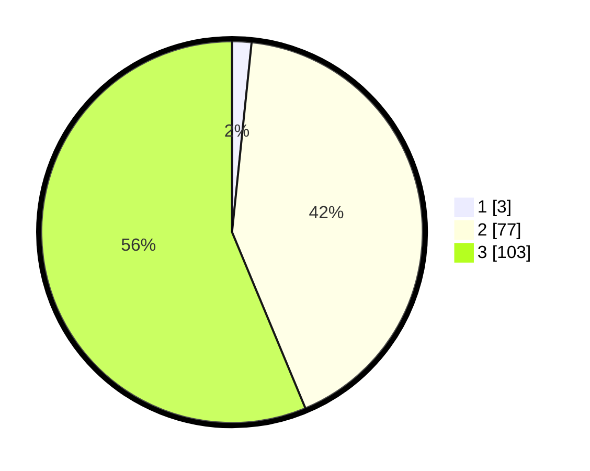

# Hasil

## Grafik

## Tabel

| No. | Nama Paslon    | Suara | Suara (raw) | Persentase |
|:--- |:-------------- | -----:| -----------:| ----------:|
| 1   | ANIES MUHAIMIN | 3     | [3][p-1]    | 1,64       |
| 2   | PRABOWO GIBRAN | 77    | [77][p-2]   | 42,08      |
| 3   | GANJAR MAHFUD  | 103   | [103][p-3]  | 56,28      |

[p-1]: https://github.com/gigit-pemilu/pemilu-2024/blob/main/pilpres/hitung-suara/sub/51-bali/sub/02-tabanan/sub/04-kerambitan/sub/2013-batuaji/sub/001-tps/sub/paslon-1.txt
[p-2]: https://github.com/gigit-pemilu/pemilu-2024/blob/main/pilpres/hitung-suara/sub/51-bali/sub/02-tabanan/sub/04-kerambitan/sub/2013-batuaji/sub/001-tps/sub/paslon-2.txt
[p-3]: https://github.com/gigit-pemilu/pemilu-2024/blob/main/pilpres/hitung-suara/sub/51-bali/sub/02-tabanan/sub/04-kerambitan/sub/2013-batuaji/sub/001-tps/sub/paslon-3.txt

## Foto C Plano

https://sirekap-obj-formc.kpu.go.id/4baa/pemilu/ppwp/51/02/04/20/13/5102042013001-20240214-191718--4a166dd7-c6a0-4bbf-ad43-bc1e0ec8a3f4.jpg

https://sirekap-obj-formc.kpu.go.id/4baa/pemilu/ppwp/51/02/04/20/13/5102042013001-20240214-191732--c1f32c47-653d-4220-b9e6-98d07b739e4c.jpg

https://sirekap-obj-formc.kpu.go.id/4baa/pemilu/ppwp/51/02/04/20/13/5102042013001-20240214-191739--00ec687a-aa35-4466-85cb-37df59569fdd.jpg

## Metadata

| Key        | Value               |
| ---------- | ------------------- |
| Time Stamp | 2024-02-15 12:00:28 |

## DATA PEMILIH TETAP

Jumlah pemilih dalam DPT: **199**.
 * L: **97**.
 * P: **102**.

## DATA PENGGUNA HAK PILIH

Jumlah pengguna hak pilih dalam DPT: **184**.
 * L: **90**.
 * P: **94**.

Jumlah pengguna hak pilih dalam DPTb: **3**.
 * L: **0**.
 * P: **3**.

Jumlah pengguna hak pilih dalam DPK: **0**.
 * L: **0**.
 * P: **0**.

Jumlah pengguna hak pilih: **187**.
 * L: **90**.
 * P: **97**.

## JUMLAH SUARA SAH DAN TIDAK SAH

JUMLAH SELURUH SUARA SAH: **183**.

JUMLAH SUARA TIDAK SAH: **2**.

JUMLAH SELURUH SUARA SAH DAN SUARA TIDAK SAH: **185**.

