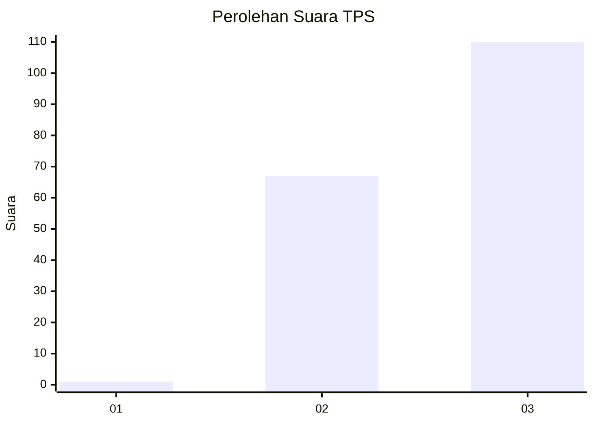
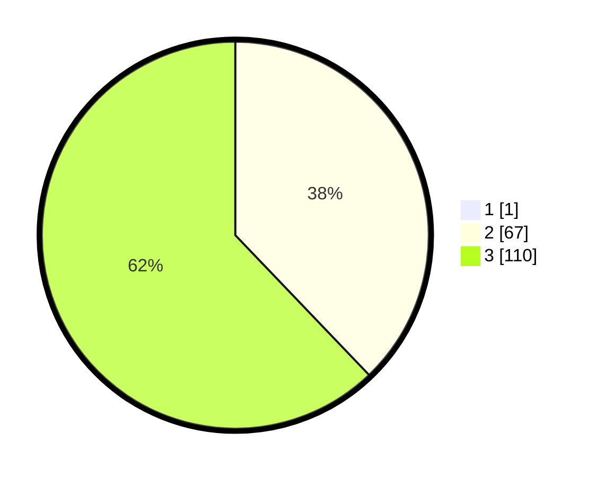

# Hasil

## Grafik

## Tabel

| No. | Nama Paslon    | Suara | Suara (raw) | Persentase |
|:--- |:-------------- | -----:| -----------:| ----------:|
| 1   | ANIES MUHAIMIN | 1     | [1][p-1]    | 0,56       |
| 2   | PRABOWO GIBRAN | 67    | [67][p-2]   | 37,64      |
| 3   | GANJAR MAHFUD  | 110   | [110][p-3]  | 61,80      |

[p-1]: https://github.com/gigit-pemilu/pemilu-2024-51-bali/blob/main/pilpres/hitung-suara/sub/51-bali/sub/02-tabanan/sub/04-kerambitan/sub/2013-batuaji/sub/002-tps/sub/paslon-1.txt
[p-2]: https://github.com/gigit-pemilu/pemilu-2024-51-bali/blob/main/pilpres/hitung-suara/sub/51-bali/sub/02-tabanan/sub/04-kerambitan/sub/2013-batuaji/sub/002-tps/sub/paslon-2.txt
[p-3]: https://github.com/gigit-pemilu/pemilu-2024-51-bali/blob/main/pilpres/hitung-suara/sub/51-bali/sub/02-tabanan/sub/04-kerambitan/sub/2013-batuaji/sub/002-tps/sub/paslon-3.txt

## Foto C Plano

https://sirekap-obj-formc.kpu.go.id/479d/pemilu/ppwp/51/02/04/20/13/5102042013002-20240214-132749--27e63d0d-0618-4743-ba66-e0c488b875b4.jpg

https://sirekap-obj-formc.kpu.go.id/479d/pemilu/ppwp/51/02/04/20/13/5102042013002-20240214-132958--5c9d1bef-3ab9-4e1b-bebd-592cb0e4833f.jpg

https://sirekap-obj-formc.kpu.go.id/479d/pemilu/ppwp/51/02/04/20/13/5102042013002-20240214-210133--02ece52f-dcfd-413e-b017-bb7466872c73.jpg

## Metadata

| Key        | Value               |
| ---------- | ------------------- |
| Time Stamp | 2024-02-15 22:30:27 |

