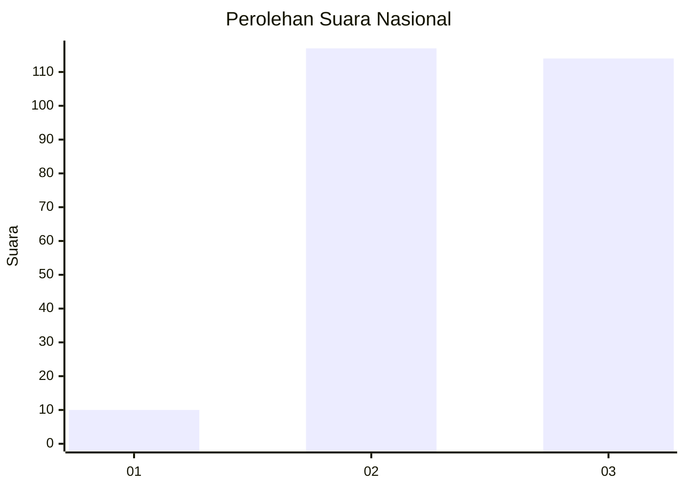
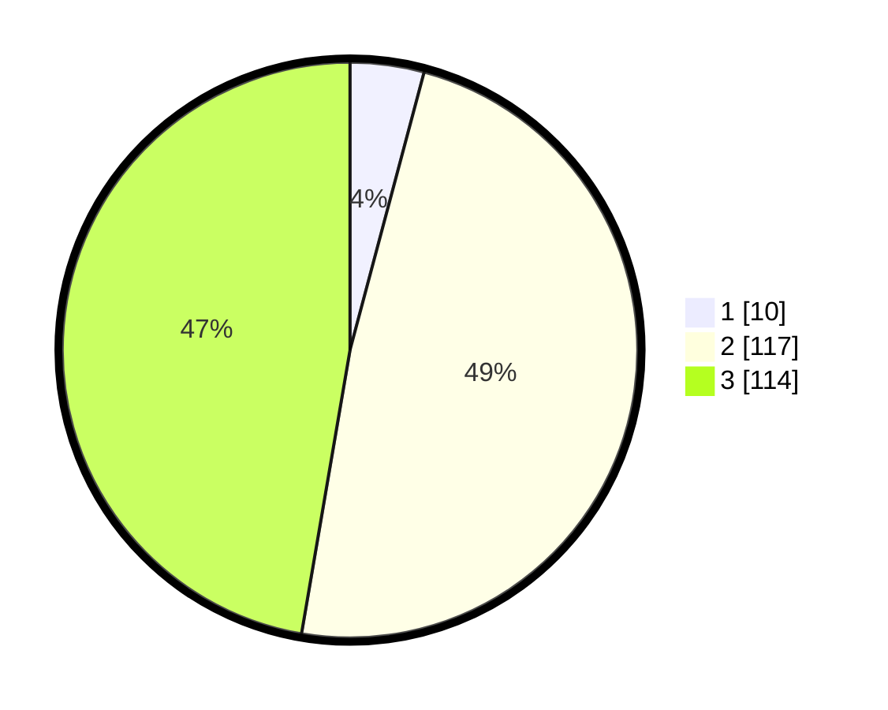

# Hasil

## Grafik

## Tabel

| No. | Nama Paslon    | Suara | Suara (raw) | Persentase |
|:--- |:-------------- | -----:| -----------:| ----------:|
| 1   | ANIES MUHAIMIN | 10    | [10][p-1]   | 4,15       |
| 2   | PRABOWO GIBRAN | 117   | [117][p-2]  | 48,55      |
| 3   | GANJAR MAHFUD  | 114   | [114][p-3]  | 47,30      |

[p-1]: https://github.com/gigit-pemilu/pemilu-2024/blob/main/pilpres/hitung-suara/sub/51-bali/sub/02-tabanan/sub/04-kerambitan/sub/2013-batuaji/sub/003-tps/sub/paslon-1.txt
[p-2]: https://github.com/gigit-pemilu/pemilu-2024/blob/main/pilpres/hitung-suara/sub/51-bali/sub/02-tabanan/sub/04-kerambitan/sub/2013-batuaji/sub/003-tps/sub/paslon-2.txt
[p-3]: https://github.com/gigit-pemilu/pemilu-2024/blob/main/pilpres/hitung-suara/sub/51-bali/sub/02-tabanan/sub/04-kerambitan/sub/2013-batuaji/sub/003-tps/sub/paslon-3.txt

## Foto C Plano

https://sirekap-obj-formc.kpu.go.id/4f8a/pemilu/ppwp/51/02/04/20/13/5102042013003-20240214-155047--53aa1212-f463-4f3e-a7d7-60bb60e3826d.jpg

https://sirekap-obj-formc.kpu.go.id/4f8a/pemilu/ppwp/51/02/04/20/13/5102042013003-20240214-155341--5f1f99f9-7a49-4bb5-bd28-1a7d6e6ee04f.jpg

https://sirekap-obj-formc.kpu.go.id/4f8a/pemilu/ppwp/51/02/04/20/13/5102042013003-20240214-155732--7c678b49-cac9-4c66-b77f-4c72a7927b20.jpg

## Metadata

| Key        | Value               |
| ---------- | ------------------- |
| Time Stamp | 2024-02-14 21:46:01 |

## DATA PEMILIH TETAP

Jumlah pemilih dalam DPT: **269**.
 * L: **131**.
 * P: **138**.

## DATA PENGGUNA HAK PILIH

Jumlah pengguna hak pilih dalam DPT: **241**.
 * L: **118**.
 * P: **123**.

Jumlah pengguna hak pilih dalam DPTb: **6**.
 * L: **3**.
 * P: **3**.

Jumlah pengguna hak pilih dalam DPK: **3**.
 * L: **0**.
 * P: **3**.

Jumlah pengguna hak pilih: **250**.
 * L: **121**.
 * P: **129**.

## JUMLAH SUARA SAH DAN TIDAK SAH

JUMLAH SELURUH SUARA SAH: **241**.

JUMLAH SUARA TIDAK SAH: **9**.

JUMLAH SELURUH SUARA SAH DAN SUARA TIDAK SAH: **250**.

