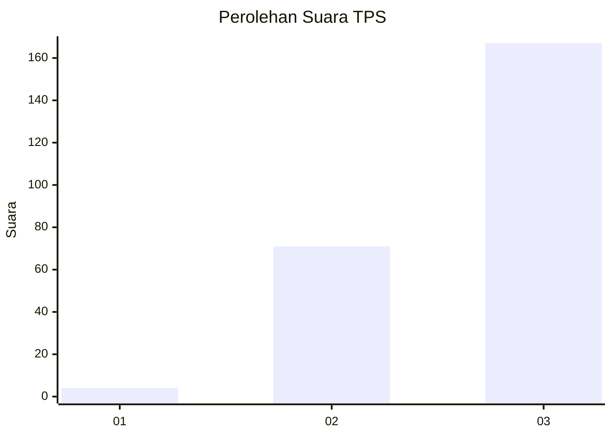
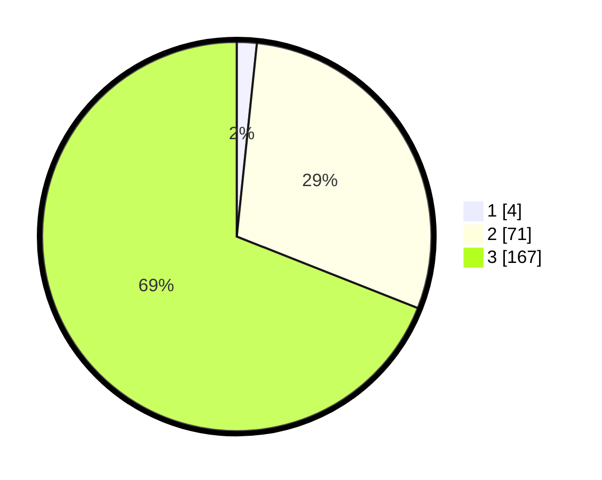

# Hasil

## Grafik

## Tabel

| No. | Nama Paslon    | Suara | Suara (raw) | Persentase |
|:--- |:-------------- | -----:| -----------:| ----------:|
| 1   | ANIES MUHAIMIN | 4     | [4][p-1]    | 1,65       |
| 2   | PRABOWO GIBRAN | 71    | [71][p-2]   | 29,34      |
| 3   | GANJAR MAHFUD  | 167   | [167][p-3]  | 69,01      |

[p-1]: https://github.com/gigit-pemilu/pemilu-2024-51-bali/blob/main/pilpres/hitung-suara/sub/51-bali/sub/02-tabanan/sub/04-kerambitan/sub/2013-batuaji/sub/004-tps/sub/paslon-1.txt
[p-2]: https://github.com/gigit-pemilu/pemilu-2024-51-bali/blob/main/pilpres/hitung-suara/sub/51-bali/sub/02-tabanan/sub/04-kerambitan/sub/2013-batuaji/sub/004-tps/sub/paslon-2.txt
[p-3]: https://github.com/gigit-pemilu/pemilu-2024-51-bali/blob/main/pilpres/hitung-suara/sub/51-bali/sub/02-tabanan/sub/04-kerambitan/sub/2013-batuaji/sub/004-tps/sub/paslon-3.txt

## Foto C Plano

https://sirekap-obj-formc.kpu.go.id/41ed/pemilu/ppwp/51/02/04/20/13/5102042013004-20240216-042835--5590fbde-db25-41c8-8a2a-68b7c0b5fa88.jpg

https://sirekap-obj-formc.kpu.go.id/41ed/pemilu/ppwp/51/02/04/20/13/5102042013004-20240216-042850--b374a4bd-e4ff-4348-80f2-6bc814224510.jpg

https://sirekap-obj-formc.kpu.go.id/41ed/pemilu/ppwp/51/02/04/20/13/5102042013004-20240216-042840--693439c8-ea27-4de7-a030-c8e9b857f218.jpg

## Metadata

| Key        | Value               |
| ---------- | ------------------- |
| Time Stamp | 2024-02-16 10:30:29 |

## DATA PEMILIH TETAP

Jumlah pemilih dalam DPT: **275**.
 * L: **140**.
 * P: **135**.

## DATA PENGGUNA HAK PILIH

Jumlah pengguna hak pilih dalam DPT: **237**.
 * L: **127**.
 * P: **110**.

Jumlah pengguna hak pilih dalam DPTb: **2**.
 * L: **1**.
 * P: **1**.

Jumlah pengguna hak pilih dalam DPK: **11**.
 * L: **6**.
 * P: **5**.

Jumlah pengguna hak pilih: **250**.
 * L: **134**.
 * P: **116**.

## JUMLAH SUARA SAH DAN TIDAK SAH

JUMLAH SELURUH SUARA SAH: **242**.

JUMLAH SUARA TIDAK SAH: **8**.

JUMLAH SELURUH SUARA SAH DAN SUARA TIDAK SAH: **250**.

