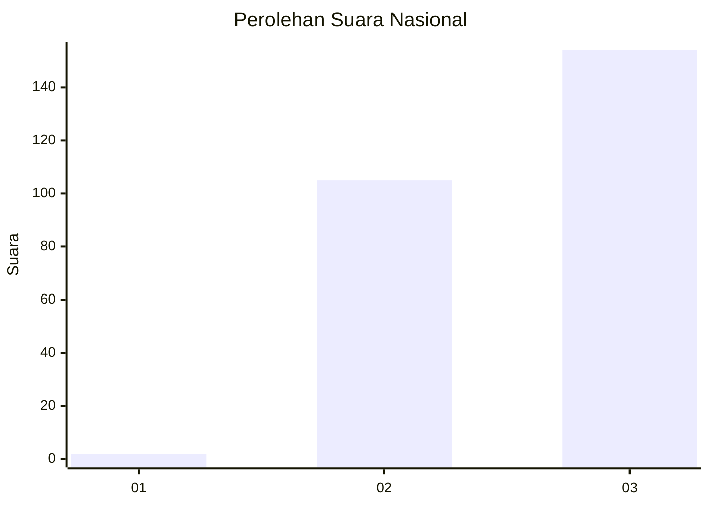
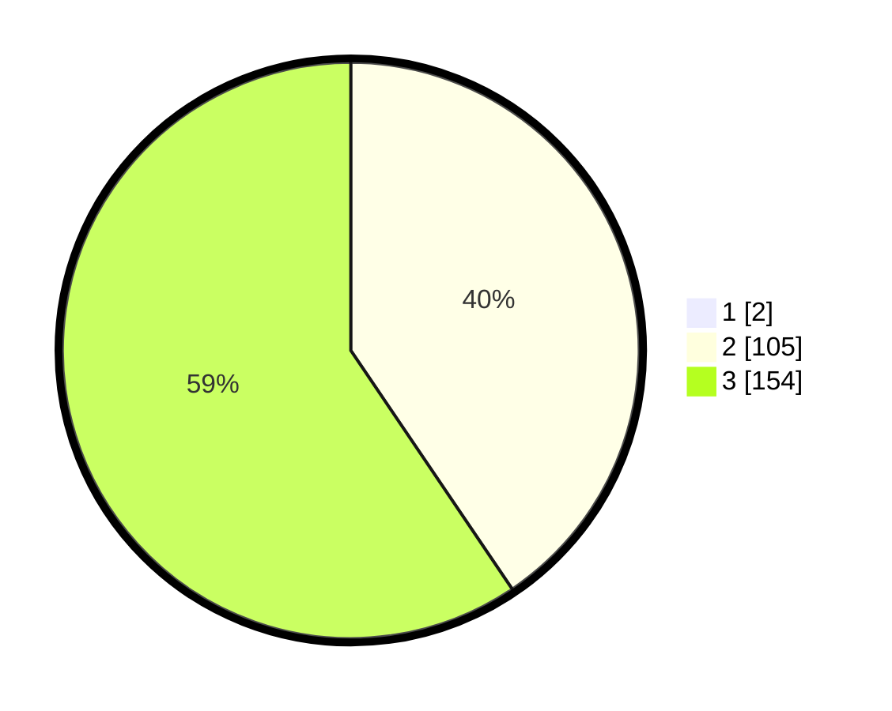

# Hasil

## Grafik

## Tabel

| No. | Nama Paslon    | Suara | Suara (raw) | Persentase |
|:--- |:-------------- | -----:| -----------:| ----------:|
| 1   | ANIES MUHAIMIN | 2     | [2][p-1]    | 0,77       |
| 2   | PRABOWO GIBRAN | 105   | [105][p-2]  | 40,23      |
| 3   | GANJAR MAHFUD  | 154   | [154][p-3]  | 59,00      |

[p-1]: https://github.com/gigit-pemilu/pemilu-2024/blob/main/pilpres/hitung-suara/sub/51-bali/sub/02-tabanan/sub/04-kerambitan/sub/2013-batuaji/sub/006-tps/sub/paslon-1.txt
[p-2]: https://github.com/gigit-pemilu/pemilu-2024/blob/main/pilpres/hitung-suara/sub/51-bali/sub/02-tabanan/sub/04-kerambitan/sub/2013-batuaji/sub/006-tps/sub/paslon-2.txt
[p-3]: https://github.com/gigit-pemilu/pemilu-2024/blob/main/pilpres/hitung-suara/sub/51-bali/sub/02-tabanan/sub/04-kerambitan/sub/2013-batuaji/sub/006-tps/sub/paslon-3.txt

## Foto C Plano

https://sirekap-obj-formc.kpu.go.id/cf35/pemilu/ppwp/51/02/04/20/13/5102042013006-20240214-141008--c212cf97-f69c-405e-91bd-19d9e747f528.jpg

https://sirekap-obj-formc.kpu.go.id/cf35/pemilu/ppwp/51/02/04/20/13/5102042013006-20240214-141057--0778de77-f94a-471b-9295-b43e23f79906.jpg

## Metadata

| Key        | Value               |
| ---------- | ------------------- |
| Time Stamp | 2024-02-15 22:00:27 |

