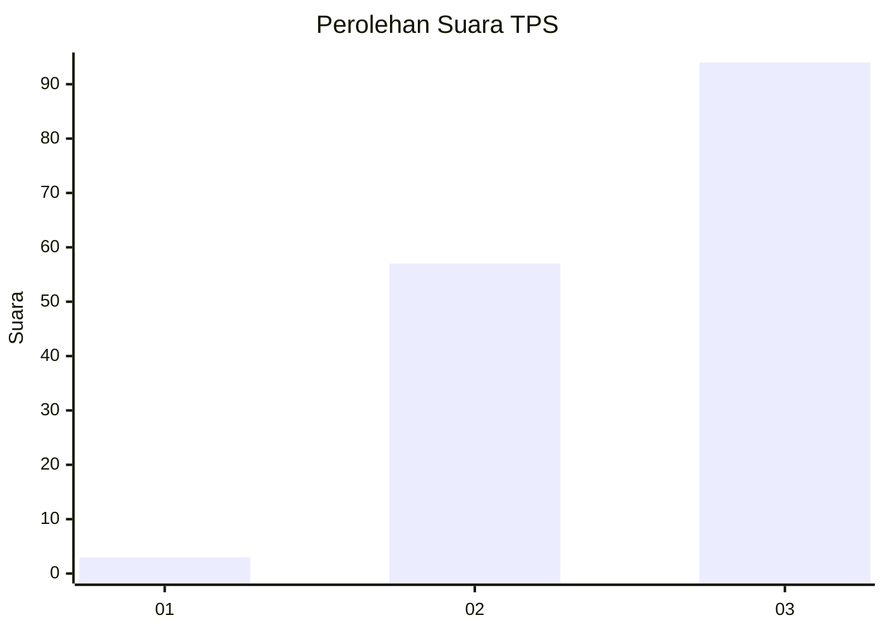
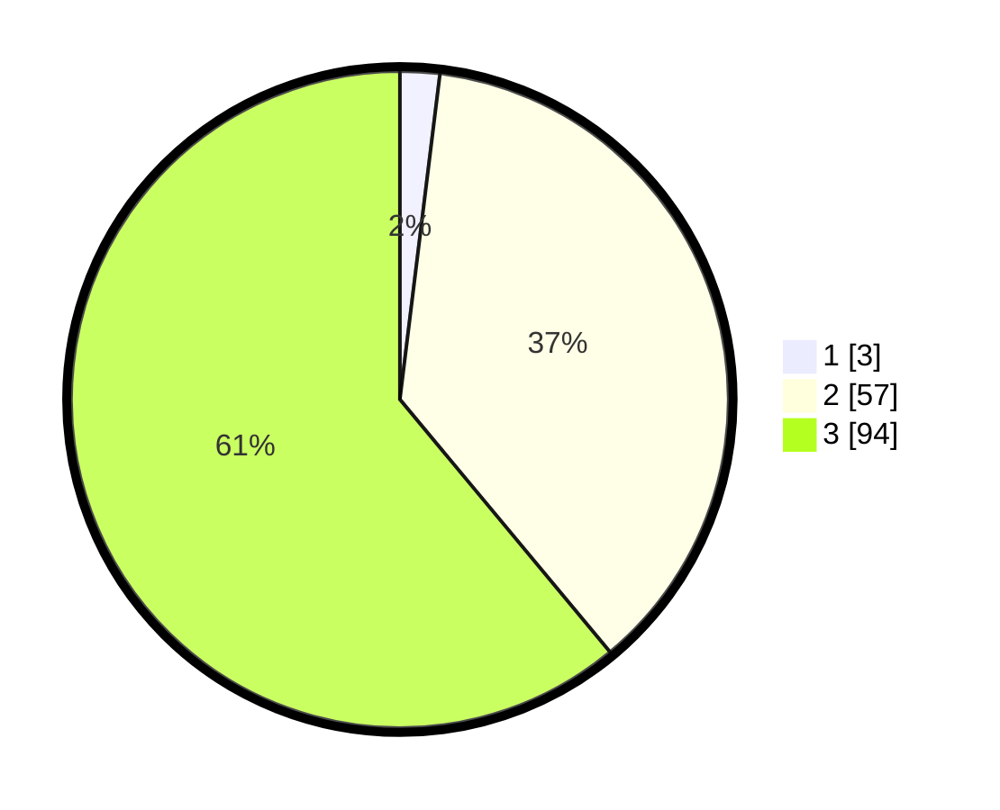

# Hasil

## Grafik

## Tabel

| No. | Nama Paslon    | Suara | Suara (raw) | Persentase |
|:--- |:-------------- | -----:| -----------:| ----------:|
| 1   | ANIES MUHAIMIN | 3     | [3][p-1]    | 1,95       |
| 2   | PRABOWO GIBRAN | 57    | [57][p-2]   | 37,01      |
| 3   | GANJAR MAHFUD  | 94    | [94][p-3]   | 61,04      |

[p-1]: https://github.com/gigit-pemilu/pemilu-2024-51-bali/blob/main/pilpres/hitung-suara/sub/51-bali/sub/02-tabanan/sub/04-kerambitan/sub/2014-kesiut/sub/002-tps/sub/paslon-1.txt
[p-2]: https://github.com/gigit-pemilu/pemilu-2024-51-bali/blob/main/pilpres/hitung-suara/sub/51-bali/sub/02-tabanan/sub/04-kerambitan/sub/2014-kesiut/sub/002-tps/sub/paslon-2.txt
[p-3]: https://github.com/gigit-pemilu/pemilu-2024-51-bali/blob/main/pilpres/hitung-suara/sub/51-bali/sub/02-tabanan/sub/04-kerambitan/sub/2014-kesiut/sub/002-tps/sub/paslon-3.txt

## Foto C Plano

https://sirekap-obj-formc.kpu.go.id/7465/pemilu/ppwp/51/02/04/20/14/5102042014002-20240214-232253--efd5317e-f7dc-4276-8279-79c9d9f40339.jpg

https://sirekap-obj-formc.kpu.go.id/7465/pemilu/ppwp/51/02/04/20/14/5102042014002-20240214-232305--ddd0966d-addb-4ce5-a36a-9ac2f86a78df.jpg

https://sirekap-obj-formc.kpu.go.id/7465/pemilu/ppwp/51/02/04/20/14/5102042014002-20240214-232313--33c4d5fb-0b7e-4260-84a6-f65c1d8b7df4.jpg

## Metadata

| Key        | Value               |
| ---------- | ------------------- |
| Time Stamp | 2024-02-15 22:30:27 |

