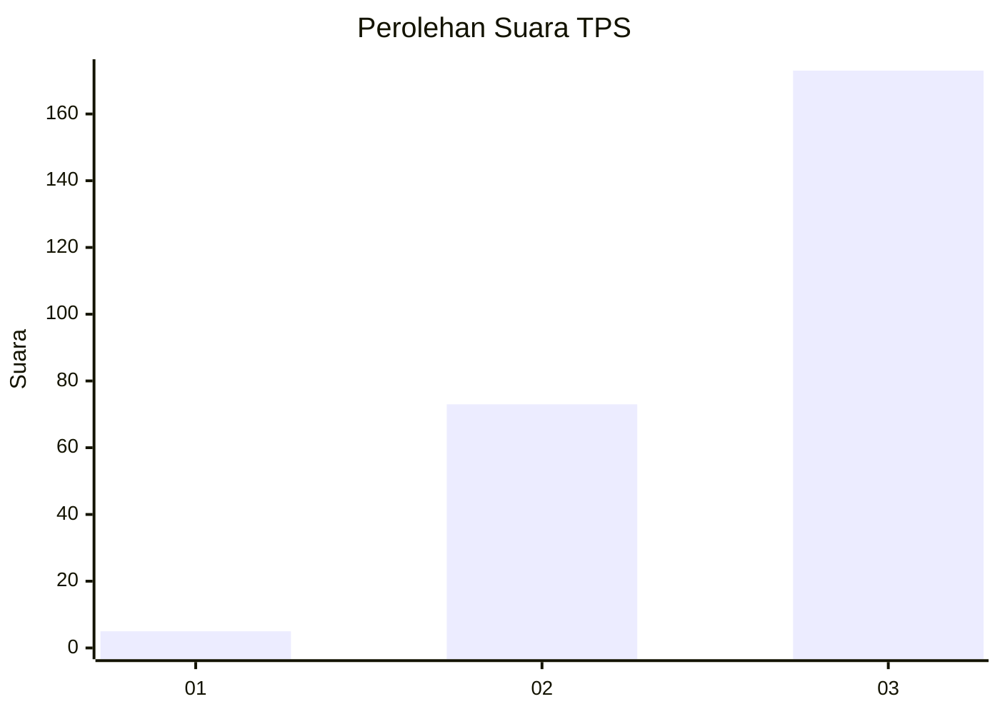
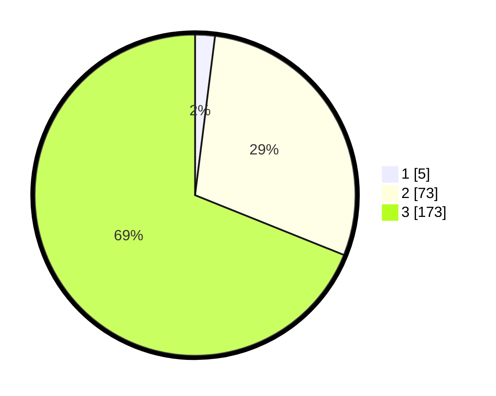

# Hasil

## Grafik

## Tabel

| No. | Nama Paslon    | Suara | Suara (raw) | Persentase |
|:--- |:-------------- | -----:| -----------:| ----------:|
| 1   | ANIES MUHAIMIN | 5     | [5][p-1]    | 1,99       |
| 2   | PRABOWO GIBRAN | 73    | [73][p-2]   | 29,08      |
| 3   | GANJAR MAHFUD  | 173   | [173][p-3]  | 68,92      |

[p-1]: https://github.com/gigit-pemilu/pemilu-2024-51-bali/blob/main/pilpres/hitung-suara/sub/51-bali/sub/02-tabanan/sub/04-kerambitan/sub/2014-kesiut/sub/004-tps/sub/paslon-1.txt
[p-2]: https://github.com/gigit-pemilu/pemilu-2024-51-bali/blob/main/pilpres/hitung-suara/sub/51-bali/sub/02-tabanan/sub/04-kerambitan/sub/2014-kesiut/sub/004-tps/sub/paslon-2.txt
[p-3]: https://github.com/gigit-pemilu/pemilu-2024-51-bali/blob/main/pilpres/hitung-suara/sub/51-bali/sub/02-tabanan/sub/04-kerambitan/sub/2014-kesiut/sub/004-tps/sub/paslon-3.txt

## Foto C Plano

https://sirekap-obj-formc.kpu.go.id/3973/pemilu/ppwp/51/02/04/20/14/5102042014004-20240215-011710--f850720c-427e-4439-98f0-b601bba28ce8.jpg

https://sirekap-obj-formc.kpu.go.id/3973/pemilu/ppwp/51/02/04/20/14/5102042014004-20240215-011730--2a26e23e-9d31-4d49-86d0-23bf173ffc4d.jpg

https://sirekap-obj-formc.kpu.go.id/3973/pemilu/ppwp/51/02/04/20/14/5102042014004-20240215-011735--2eb640b9-c90b-4855-8050-7964443b3ac2.jpg

## Metadata

| Key        | Value               |
| ---------- | ------------------- |
| Time Stamp | 2024-02-15 12:00:28 |

## DATA PEMILIH TETAP

Jumlah pemilih dalam DPT: **278**.
 * L: **139**.
 * P: **139**.

## DATA PENGGUNA HAK PILIH

Jumlah pengguna hak pilih dalam DPT: **251**.
 * L: **125**.
 * P: **126**.

Jumlah pengguna hak pilih dalam DPTb: **3**.
 * L: **1**.
 * P: **2**.

Jumlah pengguna hak pilih dalam DPK: **0**.
 * L: **0**.
 * P: **0**.

Jumlah pengguna hak pilih: **254**.
 * L: **126**.
 * P: **128**.

## JUMLAH SUARA SAH DAN TIDAK SAH

JUMLAH SELURUH SUARA SAH: **251**.

JUMLAH SUARA TIDAK SAH: **3**.

JUMLAH SELURUH SUARA SAH DAN SUARA TIDAK SAH: **254**.

