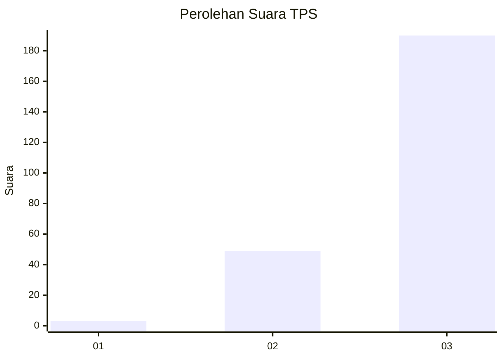
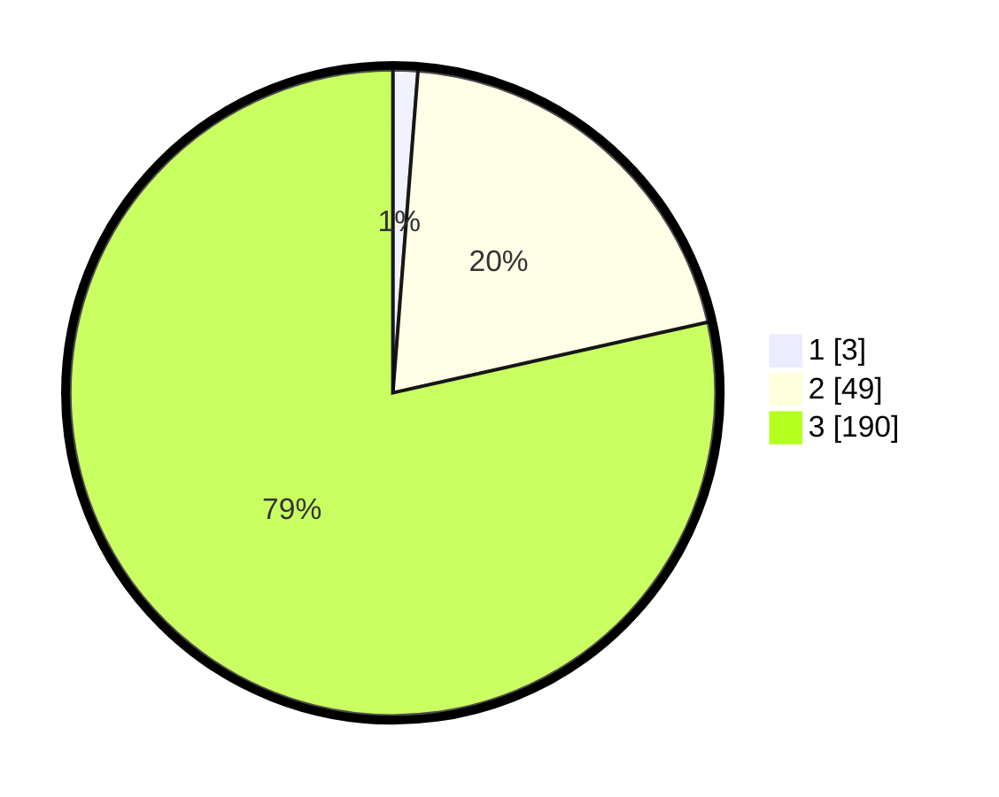

# Hasil

## Grafik

## Tabel

| No. | Nama Paslon    | Suara | Suara (raw) | Persentase |
|:--- |:-------------- | -----:| -----------:| ----------:|
| 1   | ANIES MUHAIMIN | 3     | [3][p-1]    | 1,24       |
| 2   | PRABOWO GIBRAN | 49    | [49][p-2]   | 20,25      |
| 3   | GANJAR MAHFUD  | 190   | [190][p-3]  | 78,51      |

[p-1]: https://github.com/gigit-pemilu/pemilu-2024-51-bali/blob/main/pilpres/hitung-suara/sub/51-bali/sub/02-tabanan/sub/04-kerambitan/sub/2014-kesiut/sub/005-tps/sub/paslon-1.txt
[p-2]: https://github.com/gigit-pemilu/pemilu-2024-51-bali/blob/main/pilpres/hitung-suara/sub/51-bali/sub/02-tabanan/sub/04-kerambitan/sub/2014-kesiut/sub/005-tps/sub/paslon-2.txt
[p-3]: https://github.com/gigit-pemilu/pemilu-2024-51-bali/blob/main/pilpres/hitung-suara/sub/51-bali/sub/02-tabanan/sub/04-kerambitan/sub/2014-kesiut/sub/005-tps/sub/paslon-3.txt

## Foto C Plano

https://sirekap-obj-formc.kpu.go.id/8e4c/pemilu/ppwp/51/02/04/20/14/5102042014005-20240214-155630--f886c333-af7b-4d2d-8937-59cf9d7cd593.jpg

https://sirekap-obj-formc.kpu.go.id/8e4c/pemilu/ppwp/51/02/04/20/14/5102042014005-20240214-155634--4fca458d-5255-4501-aaad-9fb6b1e95c0d.jpg

https://sirekap-obj-formc.kpu.go.id/8e4c/pemilu/ppwp/51/02/04/20/14/5102042014005-20240214-155638--6bdbf94b-eeda-44e4-8465-5e65160238ab.jpg

## Metadata

| Key        | Value               |
| ---------- | ------------------- |
| Time Stamp | 2024-02-15 00:41:44 |

## DATA PEMILIH TETAP

Jumlah pemilih dalam DPT: **277**.
 * L: **134**.
 * P: **143**.

## DATA PENGGUNA HAK PILIH

Jumlah pengguna hak pilih dalam DPT: **244**.
 * L: **121**.
 * P: **123**.

Jumlah pengguna hak pilih dalam DPTb: **2**.
 * L: **0**.
 * P: **2**.

Jumlah pengguna hak pilih dalam DPK: **0**.
 * L: **0**.
 * P: **0**.

Jumlah pengguna hak pilih: **246**.
 * L: **121**.
 * P: **125**.

## JUMLAH SUARA SAH DAN TIDAK SAH

JUMLAH SELURUH SUARA SAH: **242**.

JUMLAH SUARA TIDAK SAH: **4**.

JUMLAH SELURUH SUARA SAH DAN SUARA TIDAK SAH: **246**.

