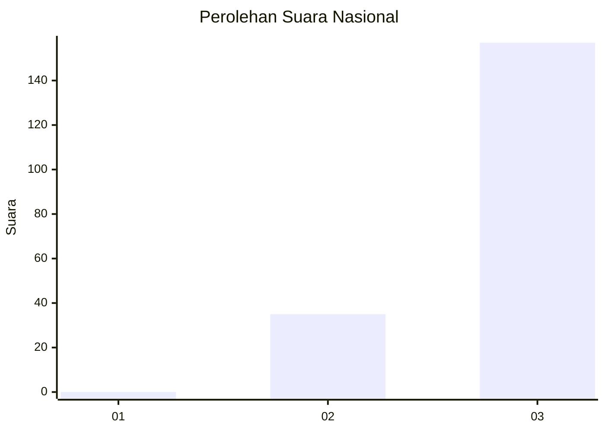
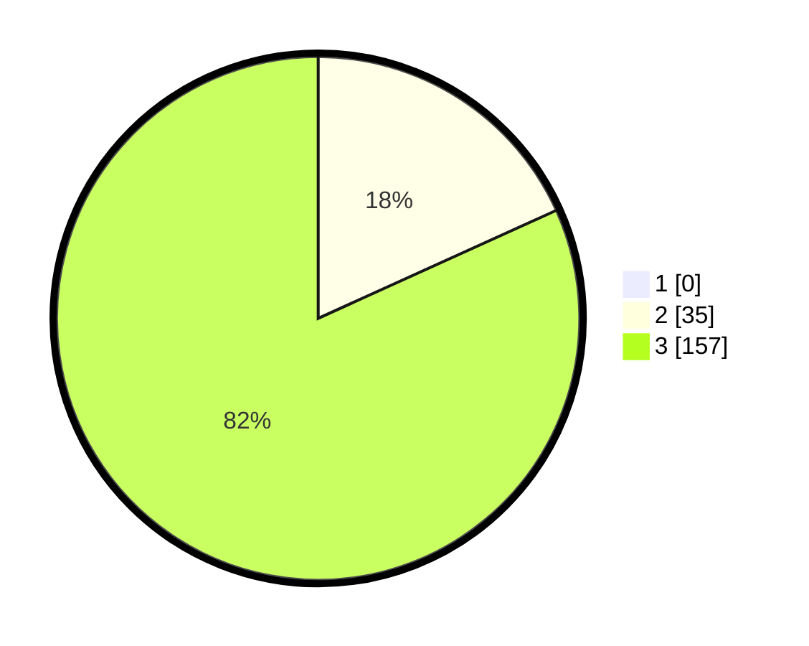

# Hasil

## Grafik

## Tabel

| No. | Nama Paslon    | Suara | Suara (raw) | Persentase |
|:--- |:-------------- | -----:| -----------:| ----------:|
| 1   | ANIES MUHAIMIN | 0     | [0][p-1]    | 0,00       |
| 2   | PRABOWO GIBRAN | 35    | [35][p-2]   | 18,23      |
| 3   | GANJAR MAHFUD  | 157   | [157][p-3]  | 81,77      |

[p-1]: https://github.com/gigit-pemilu/pemilu-2024/blob/main/pilpres/hitung-suara/sub/51-bali/sub/02-tabanan/sub/04-kerambitan/sub/2014-kesiut/sub/006-tps/sub/paslon-1.txt
[p-2]: https://github.com/gigit-pemilu/pemilu-2024/blob/main/pilpres/hitung-suara/sub/51-bali/sub/02-tabanan/sub/04-kerambitan/sub/2014-kesiut/sub/006-tps/sub/paslon-2.txt
[p-3]: https://github.com/gigit-pemilu/pemilu-2024/blob/main/pilpres/hitung-suara/sub/51-bali/sub/02-tabanan/sub/04-kerambitan/sub/2014-kesiut/sub/006-tps/sub/paslon-3.txt

## Foto C Plano

https://sirekap-obj-formc.kpu.go.id/ddef/pemilu/ppwp/51/02/04/20/14/5102042014006-20240214-220529--9c87acd6-cd6c-4e5e-849e-38d88bc99566.jpg

https://sirekap-obj-formc.kpu.go.id/ddef/pemilu/ppwp/51/02/04/20/14/5102042014006-20240214-220544--09739ff8-68ad-4e7a-9692-c28ba50e2f61.jpg

https://sirekap-obj-formc.kpu.go.id/ddef/pemilu/ppwp/51/02/04/20/14/5102042014006-20240214-220713--e5f20cbf-37d7-466e-a5e9-33aab898c4b1.jpg

## Metadata

| Key        | Value               |
| ---------- | ------------------- |
| Time Stamp | 2024-02-15 22:30:27 |

