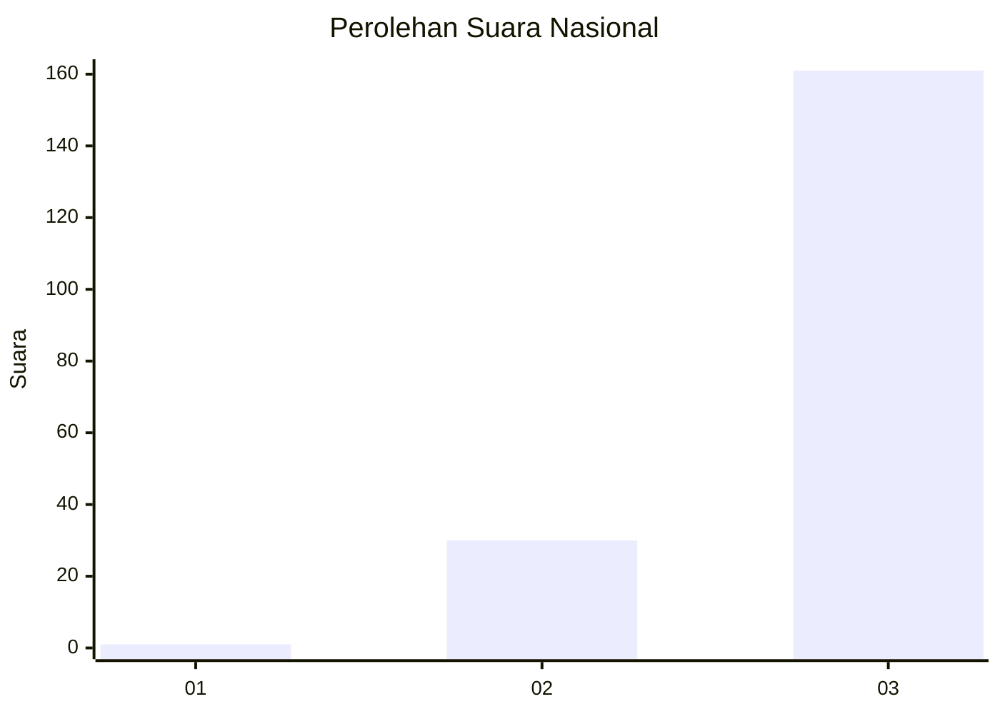
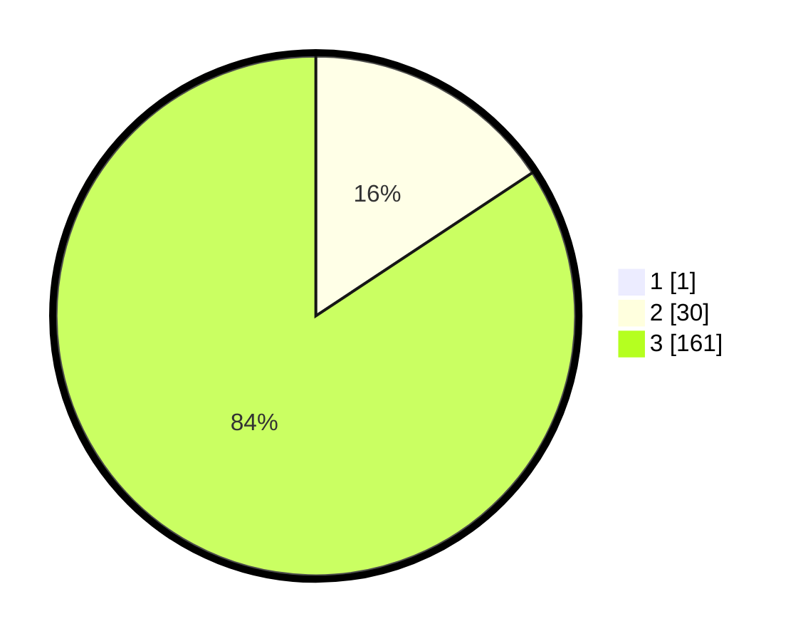

# Hasil

## Grafik

## Tabel

| No. | Nama Paslon    | Suara | Suara (raw) | Persentase |
|:--- |:-------------- | -----:| -----------:| ----------:|
| 1   | ANIES MUHAIMIN | 1     | [1][p-1]    | 0,52       |
| 2   | PRABOWO GIBRAN | 30    | [30][p-2]   | 15,63      |
| 3   | GANJAR MAHFUD  | 161   | [161][p-3]  | 83,85      |

[p-1]: https://github.com/gigit-pemilu/pemilu-2024/blob/main/pilpres/hitung-suara/sub/51-bali/sub/02-tabanan/sub/04-kerambitan/sub/2014-kesiut/sub/007-tps/sub/paslon-1.txt
[p-2]: https://github.com/gigit-pemilu/pemilu-2024/blob/main/pilpres/hitung-suara/sub/51-bali/sub/02-tabanan/sub/04-kerambitan/sub/2014-kesiut/sub/007-tps/sub/paslon-2.txt
[p-3]: https://github.com/gigit-pemilu/pemilu-2024/blob/main/pilpres/hitung-suara/sub/51-bali/sub/02-tabanan/sub/04-kerambitan/sub/2014-kesiut/sub/007-tps/sub/paslon-3.txt

## Foto C Plano

https://sirekap-obj-formc.kpu.go.id/ff64/pemilu/ppwp/51/02/04/20/14/5102042014007-20240214-230859--87adaae4-9251-4088-ad7e-67c991cfd2a3.jpg

https://sirekap-obj-formc.kpu.go.id/ff64/pemilu/ppwp/51/02/04/20/14/5102042014007-20240214-231014--82685ac4-3ac6-4f58-8384-d48a0b7217fa.jpg

https://sirekap-obj-formc.kpu.go.id/ff64/pemilu/ppwp/51/02/04/20/14/5102042014007-20240214-231026--2238da45-15ba-4243-a6bf-d17b061bd3ca.jpg

## Metadata

| Key        | Value               |
| ---------- | ------------------- |
| Time Stamp | 2024-02-15 22:30:27 |

