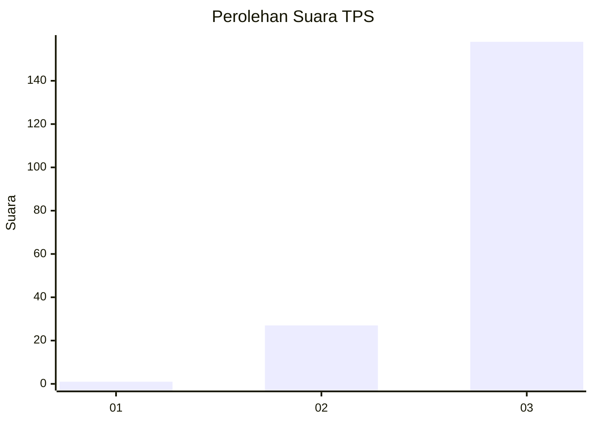
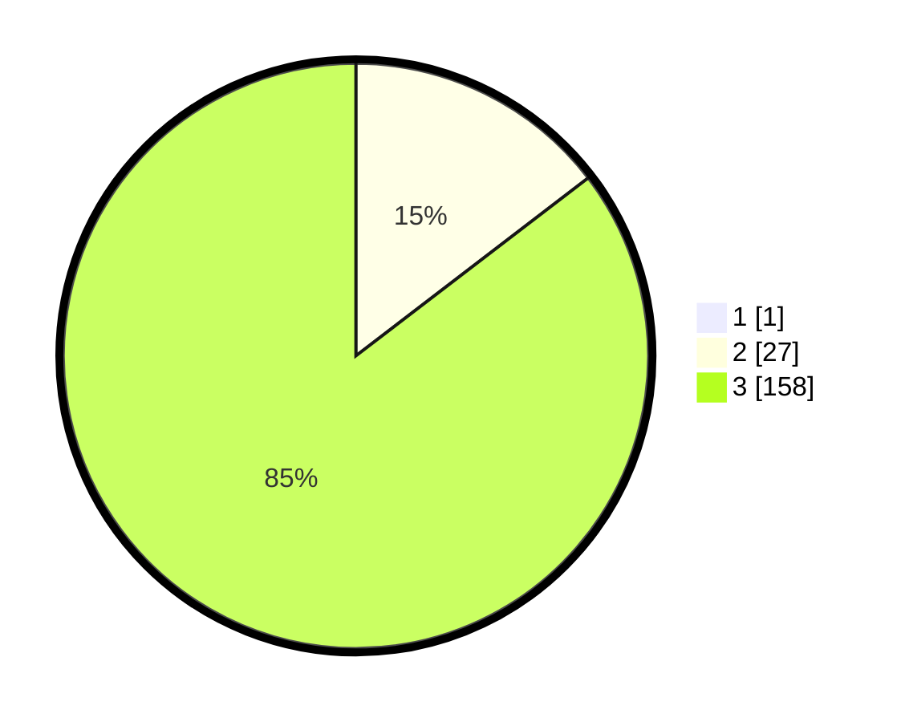

# Hasil

## Grafik

## Tabel

| No. | Nama Paslon    | Suara | Suara (raw) | Persentase |
|:--- |:-------------- | -----:| -----------:| ----------:|
| 1   | ANIES MUHAIMIN | 1     | [1][p-1]    | 0,54       |
| 2   | PRABOWO GIBRAN | 27    | [27][p-2]   | 14,52      |
| 3   | GANJAR MAHFUD  | 158   | [158][p-3]  | 84,95      |

[p-1]: https://github.com/gigit-pemilu/pemilu-2024-51-bali/blob/main/pilpres/hitung-suara/sub/51-bali/sub/02-tabanan/sub/04-kerambitan/sub/2014-kesiut/sub/008-tps/sub/paslon-1.txt
[p-2]: https://github.com/gigit-pemilu/pemilu-2024-51-bali/blob/main/pilpres/hitung-suara/sub/51-bali/sub/02-tabanan/sub/04-kerambitan/sub/2014-kesiut/sub/008-tps/sub/paslon-2.txt
[p-3]: https://github.com/gigit-pemilu/pemilu-2024-51-bali/blob/main/pilpres/hitung-suara/sub/51-bali/sub/02-tabanan/sub/04-kerambitan/sub/2014-kesiut/sub/008-tps/sub/paslon-3.txt

## Foto C Plano

https://sirekap-obj-formc.kpu.go.id/36c2/pemilu/ppwp/51/02/04/20/14/5102042014008-20240214-213819--396b2ee9-813f-4696-b0d1-b849914297b4.jpg

https://sirekap-obj-formc.kpu.go.id/36c2/pemilu/ppwp/51/02/04/20/14/5102042014008-20240214-202432--cde03044-e702-4f78-bb64-0adf7f3718f9.jpg

https://sirekap-obj-formc.kpu.go.id/36c2/pemilu/ppwp/51/02/04/20/14/5102042014008-20240214-202437--7afda4f9-6c8f-440a-bee4-607024af8f01.jpg

## Metadata

| Key        | Value               |
| ---------- | ------------------- |
| Time Stamp | 2024-02-15 18:00:26 |

## DATA PEMILIH TETAP

Jumlah pemilih dalam DPT: **200**.
 * L: **95**.
 * P: **105**.

## DATA PENGGUNA HAK PILIH

Jumlah pengguna hak pilih dalam DPT: **190**.
 * L: **93**.
 * P: **97**.

Jumlah pengguna hak pilih dalam DPTb: **0**.
 * L: **0**.
 * P: **0**.

Jumlah pengguna hak pilih dalam DPK: **0**.
 * L: **0**.
 * P: **0**.

Jumlah pengguna hak pilih: **190**.
 * L: **93**.
 * P: **97**.

## JUMLAH SUARA SAH DAN TIDAK SAH

JUMLAH SELURUH SUARA SAH: **186**.

JUMLAH SUARA TIDAK SAH: **4**.

JUMLAH SELURUH SUARA SAH DAN SUARA TIDAK SAH: **190**.

