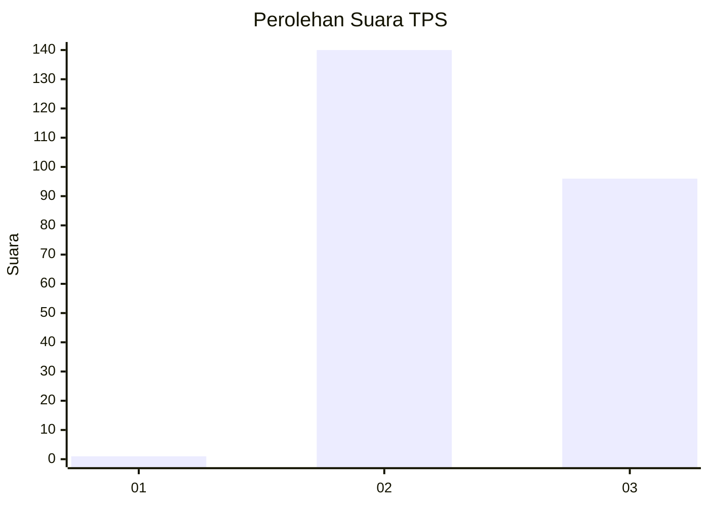
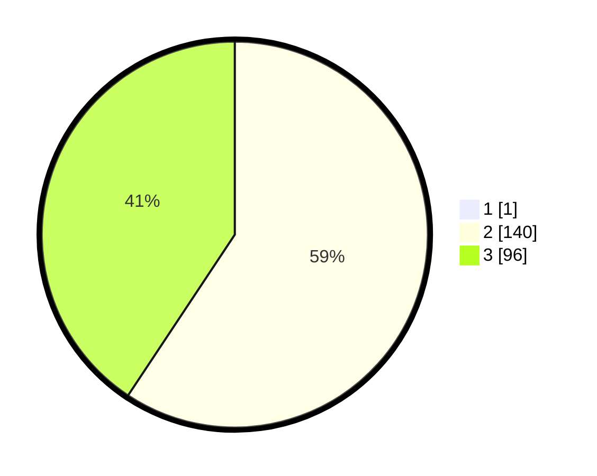

# Hasil

## Grafik

## Tabel

| No. | Nama Paslon    | Suara | Suara (raw) | Persentase |
|:--- |:-------------- | -----:| -----------:| ----------:|
| 1   | ANIES MUHAIMIN | 1     | [1][p-1]    | 0,42       |
| 2   | PRABOWO GIBRAN | 140   | [140][p-2]  | 59,07      |
| 3   | GANJAR MAHFUD  | 96    | [96][p-3]   | 40,51      |

[p-1]: https://github.com/gigit-pemilu/pemilu-2024-51-bali/blob/main/pilpres/hitung-suara/sub/51-bali/sub/02-tabanan/sub/04-kerambitan/sub/2015-timpag/sub/001-tps/sub/paslon-1.txt
[p-2]: https://github.com/gigit-pemilu/pemilu-2024-51-bali/blob/main/pilpres/hitung-suara/sub/51-bali/sub/02-tabanan/sub/04-kerambitan/sub/2015-timpag/sub/001-tps/sub/paslon-2.txt
[p-3]: https://github.com/gigit-pemilu/pemilu-2024-51-bali/blob/main/pilpres/hitung-suara/sub/51-bali/sub/02-tabanan/sub/04-kerambitan/sub/2015-timpag/sub/001-tps/sub/paslon-3.txt

## Foto C Plano

https://sirekap-obj-formc.kpu.go.id/0ffe/pemilu/ppwp/51/02/04/20/15/5102042015001-20240215-203913--b634da01-5cd6-4e08-ac45-237ce9bc91d0.jpg

https://sirekap-obj-formc.kpu.go.id/0ffe/pemilu/ppwp/51/02/04/20/15/5102042015001-20240215-203930--a4d3f6c9-725f-402b-a48f-d4ee6ac72b28.jpg

https://sirekap-obj-formc.kpu.go.id/0ffe/pemilu/ppwp/51/02/04/20/15/5102042015001-20240215-203922--c77ba98e-567f-4be0-b882-971e060d2694.jpg

## Metadata

| Key        | Value               |
| ---------- | ------------------- |
| Time Stamp | 2024-02-15 22:00:27 |

## DATA PEMILIH TETAP

Jumlah pemilih dalam DPT: **277**.
 * L: **128**.
 * P: **149**.

## DATA PENGGUNA HAK PILIH

Jumlah pengguna hak pilih dalam DPT: **239**.
 * L: **110**.
 * P: **129**.

Jumlah pengguna hak pilih dalam DPTb: **0**.
 * L: **0**.
 * P: **0**.

Jumlah pengguna hak pilih dalam DPK: **0**.
 * L: **0**.
 * P: **0**.

Jumlah pengguna hak pilih: **239**.
 * L: **110**.
 * P: **129**.

## JUMLAH SUARA SAH DAN TIDAK SAH

JUMLAH SELURUH SUARA SAH: **237**.

JUMLAH SUARA TIDAK SAH: **2**.

JUMLAH SELURUH SUARA SAH DAN SUARA TIDAK SAH: **239**.

