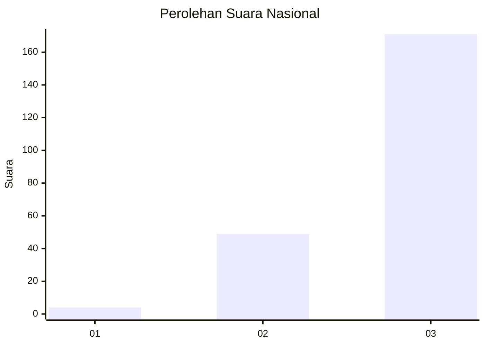
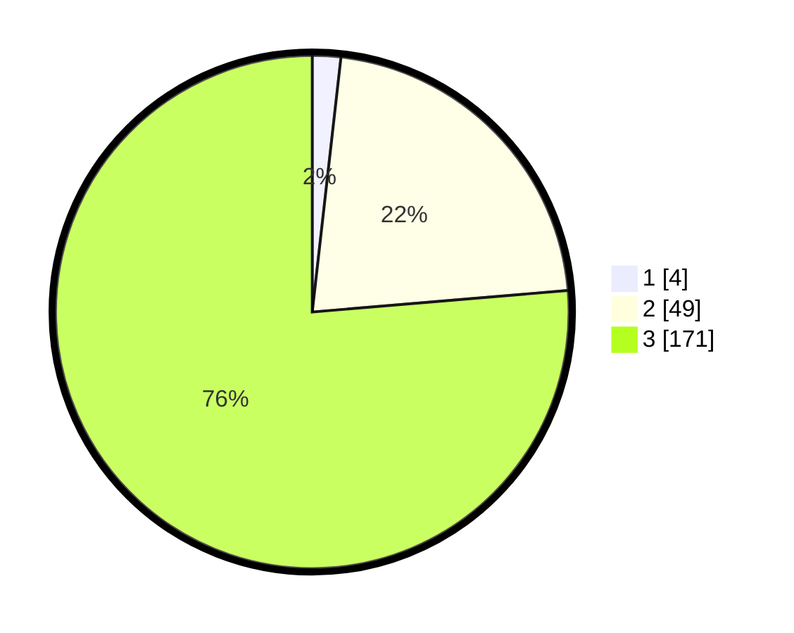

# Hasil

## Grafik

## Tabel

| No. | Nama Paslon    | Suara | Suara (raw) | Persentase |
|:--- |:-------------- | -----:| -----------:| ----------:|
| 1   | ANIES MUHAIMIN | 4     | [4][p-1]    | 1,79       |
| 2   | PRABOWO GIBRAN | 49    | [49][p-2]   | 21,88      |
| 3   | GANJAR MAHFUD  | 171   | [171][p-3]  | 76,34      |

[p-1]: https://github.com/gigit-pemilu/pemilu-2024/blob/main/pilpres/hitung-suara/sub/51-bali/sub/02-tabanan/sub/04-kerambitan/sub/2015-timpag/sub/002-tps/sub/paslon-1.txt
[p-2]: https://github.com/gigit-pemilu/pemilu-2024/blob/main/pilpres/hitung-suara/sub/51-bali/sub/02-tabanan/sub/04-kerambitan/sub/2015-timpag/sub/002-tps/sub/paslon-2.txt
[p-3]: https://github.com/gigit-pemilu/pemilu-2024/blob/main/pilpres/hitung-suara/sub/51-bali/sub/02-tabanan/sub/04-kerambitan/sub/2015-timpag/sub/002-tps/sub/paslon-3.txt

## Foto C Plano

https://sirekap-obj-formc.kpu.go.id/e9a5/pemilu/ppwp/51/02/04/20/15/5102042015002-20240214-193118--7c39f85b-7ba4-4c12-86c3-5e2d12887c07.jpg

https://sirekap-obj-formc.kpu.go.id/e9a5/pemilu/ppwp/51/02/04/20/15/5102042015002-20240214-194121--8f620332-55f1-45a1-8981-7ab1a8bafea9.jpg

https://sirekap-obj-formc.kpu.go.id/e9a5/pemilu/ppwp/51/02/04/20/15/5102042015002-20240214-194100--864cc211-1041-424c-a84e-14dfc910be53.jpg

## Metadata

| Key        | Value               |
| ---------- | ------------------- |
| Time Stamp | 2024-02-15 22:00:27 |

## DATA PEMILIH TETAP

Jumlah pemilih dalam DPT: **247**.
 * L: **123**.
 * P: **124**.

## DATA PENGGUNA HAK PILIH

Jumlah pengguna hak pilih dalam DPT: **225**.
 * L: **115**.
 * P: **110**.

Jumlah pengguna hak pilih dalam DPTb: **0**.
 * L: **0**.
 * P: **0**.

Jumlah pengguna hak pilih dalam DPK: **0**.
 * L: **0**.
 * P: **0**.

Jumlah pengguna hak pilih: **225**.
 * L: **115**.
 * P: **110**.

## JUMLAH SUARA SAH DAN TIDAK SAH

JUMLAH SELURUH SUARA SAH: **224**.

JUMLAH SUARA TIDAK SAH: **1**.

JUMLAH SELURUH SUARA SAH DAN SUARA TIDAK SAH: **225**.

