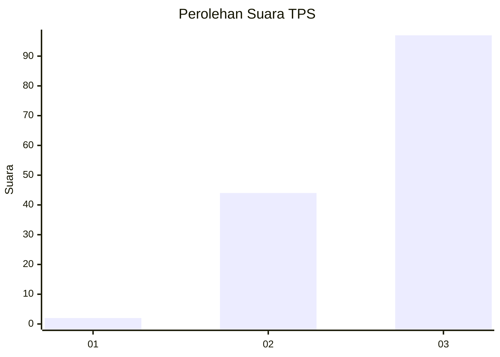
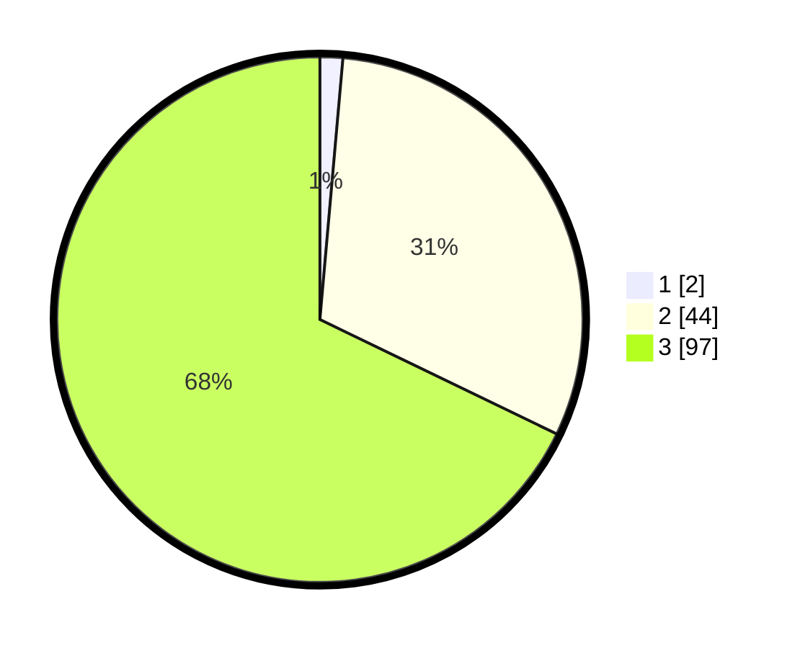

# Hasil

## Grafik

## Tabel

| No. | Nama Paslon    | Suara | Suara (raw) | Persentase |
|:--- |:-------------- | -----:| -----------:| ----------:|
| 1   | ANIES MUHAIMIN | 2     | [2][p-1]    | 1,40       |
| 2   | PRABOWO GIBRAN | 44    | [44][p-2]   | 30,77      |
| 3   | GANJAR MAHFUD  | 97    | [97][p-3]   | 67,83      |

[p-1]: https://github.com/gigit-pemilu/pemilu-2024-51-bali/blob/main/pilpres/hitung-suara/sub/51-bali/sub/02-tabanan/sub/04-kerambitan/sub/2015-timpag/sub/005-tps/sub/paslon-1.txt
[p-2]: https://github.com/gigit-pemilu/pemilu-2024-51-bali/blob/main/pilpres/hitung-suara/sub/51-bali/sub/02-tabanan/sub/04-kerambitan/sub/2015-timpag/sub/005-tps/sub/paslon-2.txt
[p-3]: https://github.com/gigit-pemilu/pemilu-2024-51-bali/blob/main/pilpres/hitung-suara/sub/51-bali/sub/02-tabanan/sub/04-kerambitan/sub/2015-timpag/sub/005-tps/sub/paslon-3.txt

## Foto C Plano

https://sirekap-obj-formc.kpu.go.id/4f35/pemilu/ppwp/51/02/04/20/15/5102042015005-20240214-160134--811eb547-bf3a-42d1-8e51-89ceff649ee3.jpg

https://sirekap-obj-formc.kpu.go.id/4f35/pemilu/ppwp/51/02/04/20/15/5102042015005-20240214-194013--0756d37b-fe1b-4dc7-81f8-234cd560df5f.jpg

https://sirekap-obj-formc.kpu.go.id/4f35/pemilu/ppwp/51/02/04/20/15/5102042015005-20240214-201624--093a5021-c2f2-4e4f-924f-e8252b9f4a2b.jpg

## Metadata

| Key        | Value               |
| ---------- | ------------------- |
| Time Stamp | 2024-02-14 21:46:01 |

## DATA PEMILIH TETAP

Jumlah pemilih dalam DPT: **165**.
 * L: **79**.
 * P: **86**.

## DATA PENGGUNA HAK PILIH

Jumlah pengguna hak pilih dalam DPT: **146**.
 * L: **70**.
 * P: **76**.

Jumlah pengguna hak pilih dalam DPTb: **0**.
 * L: **0**.
 * P: **0**.

Jumlah pengguna hak pilih dalam DPK: **1**.
 * L: **0**.
 * P: **1**.

Jumlah pengguna hak pilih: **147**.
 * L: **70**.
 * P: **77**.

## JUMLAH SUARA SAH DAN TIDAK SAH

JUMLAH SELURUH SUARA SAH: **143**.

JUMLAH SUARA TIDAK SAH: **4**.

JUMLAH SELURUH SUARA SAH DAN SUARA TIDAK SAH: **147**.

