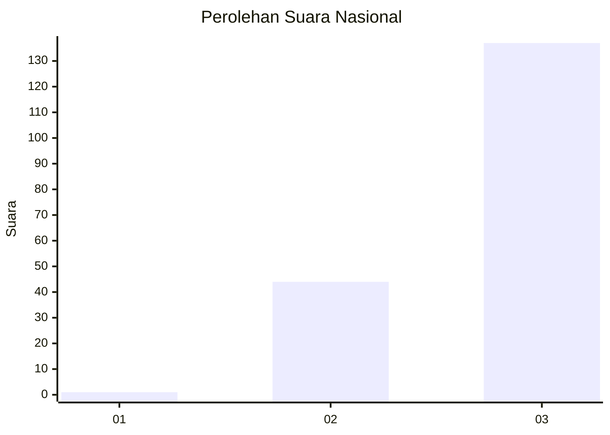
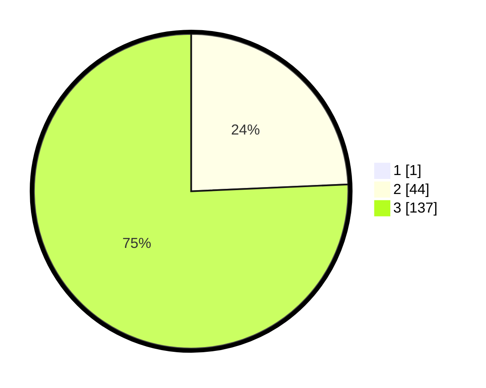

# Hasil

## Grafik

## Tabel

| No. | Nama Paslon    | Suara | Suara (raw) | Persentase |
|:--- |:-------------- | -----:| -----------:| ----------:|
| 1   | ANIES MUHAIMIN | 1     | [1][p-1]    | 0,55       |
| 2   | PRABOWO GIBRAN | 44    | [44][p-2]   | 24,18      |
| 3   | GANJAR MAHFUD  | 137   | [137][p-3]  | 75,27      |

[p-1]: https://github.com/gigit-pemilu/pemilu-2024/blob/main/pilpres/hitung-suara/sub/51-bali/sub/02-tabanan/sub/04-kerambitan/sub/2015-timpag/sub/009-tps/sub/paslon-1.txt
[p-2]: https://github.com/gigit-pemilu/pemilu-2024/blob/main/pilpres/hitung-suara/sub/51-bali/sub/02-tabanan/sub/04-kerambitan/sub/2015-timpag/sub/009-tps/sub/paslon-2.txt
[p-3]: https://github.com/gigit-pemilu/pemilu-2024/blob/main/pilpres/hitung-suara/sub/51-bali/sub/02-tabanan/sub/04-kerambitan/sub/2015-timpag/sub/009-tps/sub/paslon-3.txt

## Foto C Plano

https://sirekap-obj-formc.kpu.go.id/0c85/pemilu/ppwp/51/02/04/20/15/5102042015009-20240214-132211--5b1fa27d-7336-4740-8299-5a2f035813fa.jpg

https://sirekap-obj-formc.kpu.go.id/0c85/pemilu/ppwp/51/02/04/20/15/5102042015009-20240214-133352--04248b78-36a8-43e9-bb1f-83fd68e1db88.jpg

https://sirekap-obj-formc.kpu.go.id/0c85/pemilu/ppwp/51/02/04/20/15/5102042015009-20240214-132630--dd28ad95-ac03-4257-9b8d-143b0bc8a711.jpg

## Metadata

| Key        | Value               |
| ---------- | ------------------- |
| Time Stamp | 2024-02-14 21:46:01 |

## DATA PEMILIH TETAP

Jumlah pemilih dalam DPT: **222**.
 * L: **104**.
 * P: **118**.

## DATA PENGGUNA HAK PILIH

Jumlah pengguna hak pilih dalam DPT: **185**.
 * L: **92**.
 * P: **93**.

Jumlah pengguna hak pilih dalam DPTb: **0**.
 * L: **0**.
 * P: **0**.

Jumlah pengguna hak pilih dalam DPK: **0**.
 * L: **0**.
 * P: **0**.

Jumlah pengguna hak pilih: **185**.
 * L: **92**.
 * P: **93**.

## JUMLAH SUARA SAH DAN TIDAK SAH

JUMLAH SELURUH SUARA SAH: **182**.

JUMLAH SUARA TIDAK SAH: **3**.

JUMLAH SELURUH SUARA SAH DAN SUARA TIDAK SAH: **185**.

