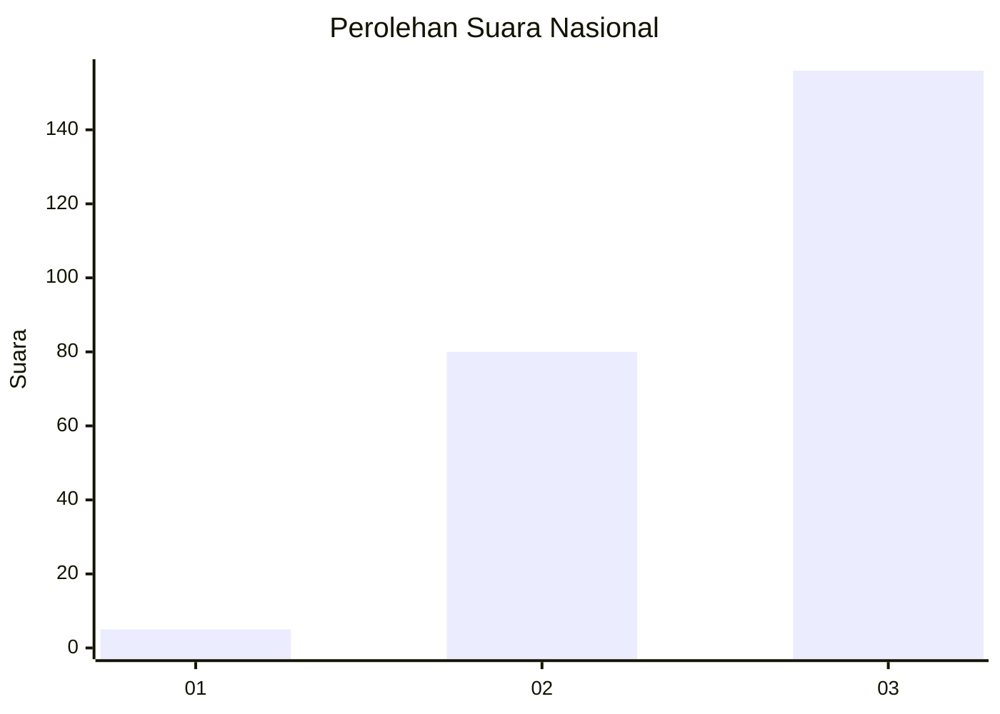
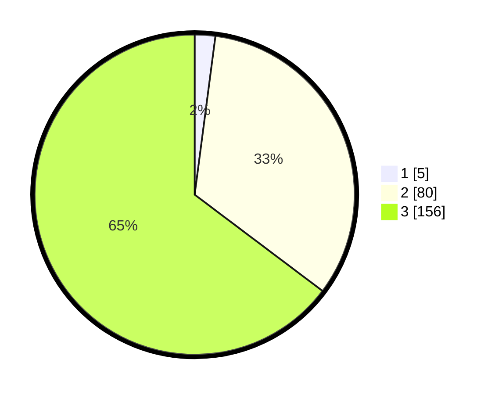

# Hasil

## Grafik

## Tabel

| No. | Nama Paslon    | Suara | Suara (raw) | Persentase |
|:--- |:-------------- | -----:| -----------:| ----------:|
| 1   | ANIES MUHAIMIN | 5     | [5][p-1]    | 2,07       |
| 2   | PRABOWO GIBRAN | 80    | [80][p-2]   | 33,20      |
| 3   | GANJAR MAHFUD  | 156   | [156][p-3]  | 64,73      |

[p-1]: https://github.com/gigit-pemilu/pemilu-2024/blob/main/pilpres/hitung-suara/sub/51-bali/sub/02-tabanan/sub/04-kerambitan/sub/2015-timpag/sub/011-tps/sub/paslon-1.txt
[p-2]: https://github.com/gigit-pemilu/pemilu-2024/blob/main/pilpres/hitung-suara/sub/51-bali/sub/02-tabanan/sub/04-kerambitan/sub/2015-timpag/sub/011-tps/sub/paslon-2.txt
[p-3]: https://github.com/gigit-pemilu/pemilu-2024/blob/main/pilpres/hitung-suara/sub/51-bali/sub/02-tabanan/sub/04-kerambitan/sub/2015-timpag/sub/011-tps/sub/paslon-3.txt

## Foto C Plano

https://sirekap-obj-formc.kpu.go.id/c4e2/pemilu/ppwp/51/02/04/20/15/5102042015011-20240214-203007--bd93393d-f7cb-4e83-817e-d09166f442fc.jpg

https://sirekap-obj-formc.kpu.go.id/c4e2/pemilu/ppwp/51/02/04/20/15/5102042015011-20240214-203541--c9c5f925-2e89-4eab-86c4-52f6c5355850.jpg

https://sirekap-obj-formc.kpu.go.id/c4e2/pemilu/ppwp/51/02/04/20/15/5102042015011-20240214-203651--9d1656b5-a14c-4bd4-8240-5047280ffede.jpg

## Metadata

| Key        | Value               |
| ---------- | ------------------- |
| Time Stamp | 2024-02-15 00:41:44 |

