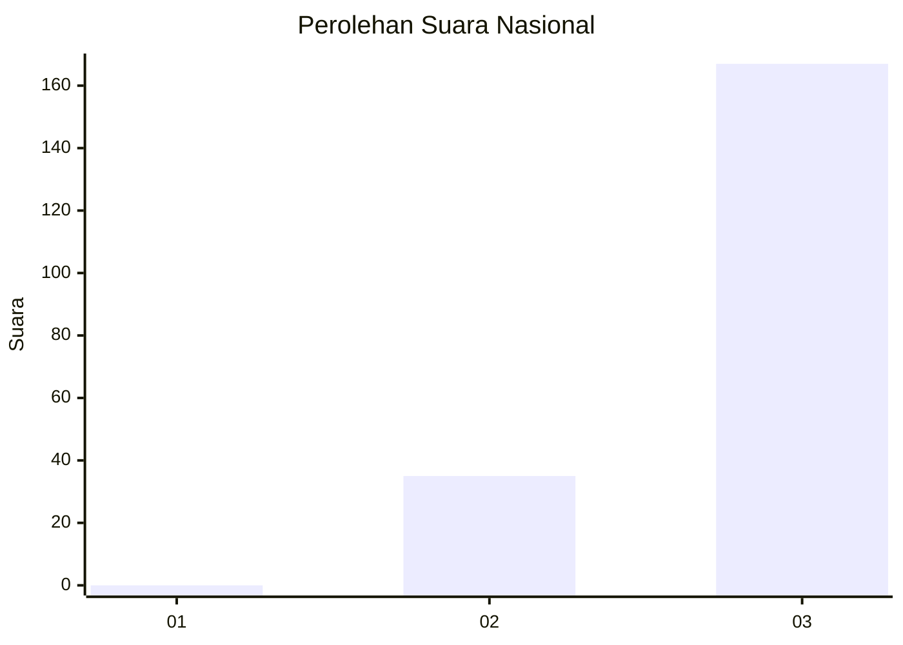
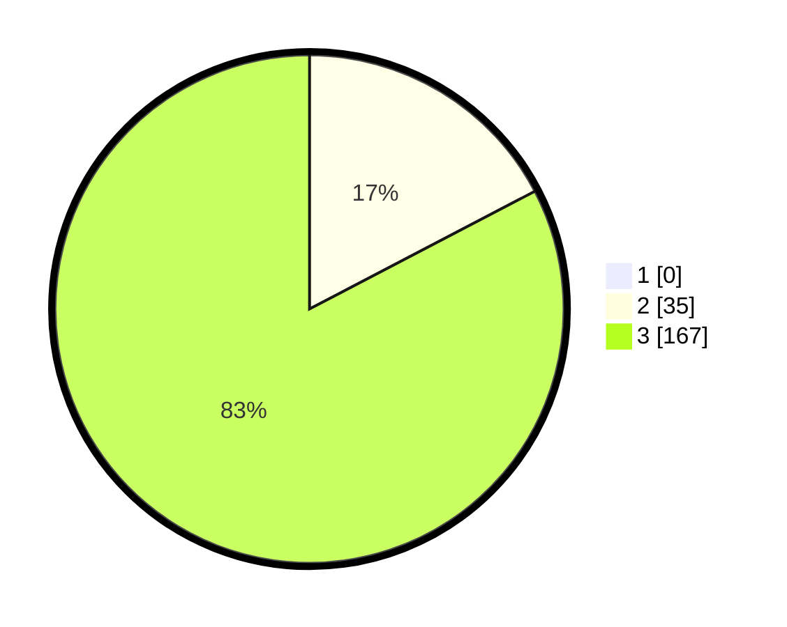

# Hasil

## Grafik

## Tabel

| No. | Nama Paslon    | Suara | Suara (raw) | Persentase |
|:--- |:-------------- | -----:| -----------:| ----------:|
| 1   | ANIES MUHAIMIN | 0     | [0][p-1]    | 0,00       |
| 2   | PRABOWO GIBRAN | 35    | [35][p-2]   | 17,33      |
| 3   | GANJAR MAHFUD  | 167   | [167][p-3]  | 82,67      |

[p-1]: https://github.com/gigit-pemilu/pemilu-2024/blob/main/pilpres/hitung-suara/sub/51-bali/sub/02-tabanan/sub/05-tabanan/sub/2001-sudimara/sub/005-tps/sub/paslon-1.txt
[p-2]: https://github.com/gigit-pemilu/pemilu-2024/blob/main/pilpres/hitung-suara/sub/51-bali/sub/02-tabanan/sub/05-tabanan/sub/2001-sudimara/sub/005-tps/sub/paslon-2.txt
[p-3]: https://github.com/gigit-pemilu/pemilu-2024/blob/main/pilpres/hitung-suara/sub/51-bali/sub/02-tabanan/sub/05-tabanan/sub/2001-sudimara/sub/005-tps/sub/paslon-3.txt

## Foto C Plano

https://sirekap-obj-formc.kpu.go.id/b695/pemilu/ppwp/51/02/05/20/01/5102052001005-20240214-141702--e7537a21-8e4c-482b-9f99-cb5168d529e3.jpg

https://sirekap-obj-formc.kpu.go.id/b695/pemilu/ppwp/51/02/05/20/01/5102052001005-20240214-141853--a402fd7e-854c-4afc-a948-0102594e2c10.jpg

## Metadata

| Key        | Value               |
| ---------- | ------------------- |
| Time Stamp | 2024-02-15 23:29:50 |

